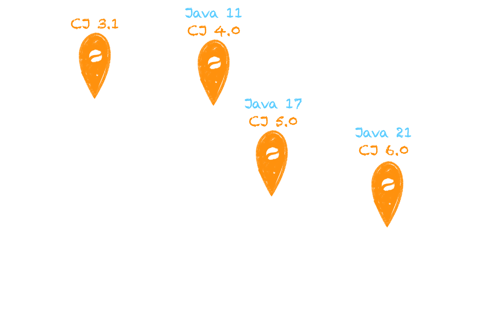

import LinkButton from "@leaningtech/astro-theme/components/LinkButton.astro";
import { DISCORD_URL } from "@/consts.ts";

In this post, we’ll provide an overview of CheerpJ, the capabilities of the current release, and our ambitious plans for the future of Java and OpenJDK on the browser.

<div class="flex items-center gap-2 flex-wrap">
  <LinkButton
    type="primary"
    href="/cheerpj3/getting-started"
    label="Get started"
    iconRight="mi:arrow-right"
  />

  <LinkButton
    type="discord"
    href={DISCORD_URL}
    iconLeft="fa-brands:discord"
    label="Join the Discord server"
  />
</div>

CheerpJ 3.1 is the latest stable release of the new CheerpJ architecture introduced as part of CheerpJ 3.0, first announced in [May 9th, 2023](/blog/announcing-cheerpj-3) and released in [February 1st, 2024](/blog/cheerpj-3.0).

The new architecture, built around a pure-JIT JVM in WebAssembly, has been an outstanding success, delivering on its promise of making CheerpJ faster, simpler to use and compatible with the vast majority of Java applications and applets. Virtually all users of CheerpJ core, as well as of our browser extensions, have seamlessly transitioned to the new architecture in the span of the last six months.

In CheerpJ 3.0, some features were still lacking compared to the legacy CheerpJ 2.3 release, with audio support being the most prominent. Moreover, notwithstanding our intense testing, several bugs and regressions were found by users.

CheerpJ 3.1 is a stability-focused release that restores support for all the features lost in the transition to the new architecture and fixes all the bugs we have found after exposing CheerpJ to large real-world workloads.

The end result is the most robust release of CheerpJ ever, and a stepping stone for the upcoming CheerpJ 4.0 release, that will bring Java 11+ support, loadable JNI modules, JavaFX support and improved mobile usability. And will even run Minecraft properly!

In combination with library mode, which enables direct usage of Java methods and objects from JavaScript, we believe CheerpJ is now closer than ever to our vision: Making Java a first-class programming language for the Web.

## What is CheerpJ?

CheerpJ is a full WebAssembly-based JVM for the browser, and comes with a complete OpenJDK runtime, as well as a powerful emulation layer to provide file system access, general networking support, as well as access to a collection of system devices.
CheerpJ is a complete, flexible solution to run Java on modern browsers. It is an extremely powerful tool, designed to work at the scale of real-world, large Enterprise applications.

### Features

CheerpJ’s main capabilities are:

- **Running unmodified Java applications on modern browsers without plugins, or a Java installation.** Stand-alone Java Applications, Java Web Start, Java Applets are supported. No server side component is required. All the code is run on the client via WebAssembly and JavaScript.
- **Works from unmodified JAR files (no need for source code)**, no need for any compilation or preprocessing step. Works with obfuscated bytecode, independently of the obfuscator being used.
- **Supports _very large_ applications**, our stress test is IntelliJ IDEA 2019 which ships ~400MBs of JARs. [Check it out](https://x.com/alexpignotti/status/1729915428258926713).
- **Supports graphical applications**, both AWT- and Swing-based ones are supported, including third-party Look&Feels. Multiple applications, each with multiple windows, can run at the same time.
- **Full support for reflection and classloaders**, including custom ones designed to support plugins or encrypted JARs.
- **Powerful interoperability with JavaScript**
  - [Library mode](https://cheerpj.com/docs/guides/library-mode): A new solution to integrate Java libraries into Web applications using a clean `async/await` interface
  - [JavaScript natives](https://cheerpj.com/docs/guides/implementing-native-methods), making it possible to implement Java `native` methods (JNI) directly in JavaScript with a convenient interface. This feature can also be used to interact with JavaScript and DOM APIs from Java.

In short, thanks to CheerpJ most Java applications and libraries can be run in the browser without any additional work or changes to the code.

CheerpJ 3.1 is the last release of CheerpJ to focus exclusively on Java 8 support. Support for modern versions of Java is already underway, and we are targeting support for Java 11 as part of the upcoming CheerpJ 4.0 release, with Java 17 following later in the year.

In the long term, we aim to reach parity with the most recent Java LTS version, while preserving support for Java 8 and all intermediate LTS versions.

CheerpJ is a commercial product and professionally supported, but it’s also free for personal use. View [licensing](https://cheerpj.com/docs/licensing) for more details.

### How does CheerpJ work?


CheerpJ is a Java Virtual Machine in WebAssembly for the browser, which JIT-compiles Java bytecode into JavaScript.
It is a sophisticated tool with many moving parts, the main ones being:

- A WebAssembly **JVM and Just-In-Time compiler for** Java bytecode. The code contained in class files is dynamically compiled and optimized. The JIT compiler supports advanced optimizations such as inlining and dynamic devirtualization.
- A complete and unmodified build of **OpenJDK**.
- **A virtualized system layer, including:**
  - [Virtualized file systems](https://cheerpj.com/docs/guides/File-System-support), providing access to assets over HTTP, local persistent R/W storage via IndexedDB and interaction with JavaScript data.
  - [Virtualized networking](https://cheerpj.com/docs/guides/Networking) support via Tailscale. Both server and client applications are supported.
  - Seamless clipboard integration using the [Clipboard API](https://cheerpj.com/docs/reference/cheerpjInit#clipboardmode).
  - A window manager, to support multiple Java windows and multiple Java applications in the same Web page.

For more details about the design of CheerpJ, please refer to [the deep dive](/blog/cheerpj-3-deep-dive) we published at the time of the initial CheerpJ 3.0 release. You can also read the [architecture page](https://cheerpj.com/docs/explanation/architecture) in the CheerpJ documentation.

## The Roadmap for Modern Java in the browser



Our vision for CheerpJ does not stop with Java 8, and is not limited to its role as a tool to run legacy Java applications.

We are finally ready to announce that plans are in place for CheerpJ to support more modern Java versions (and corresponding OpenJDK runtimes), with a long-term ambition to reach parity with latest LTS releases of Java.

Work to support Java 11+ is already well underway and will be merged to nightly builds as soon as possible after this release. This will constitute the key novel element of the next major release of CheerpJ, 4.0, which we expect between March and April 2025, with Java 17 support following later in the year. Support for Java 21 will be added in 2026, although the timeline might become more aggressive depending on commercial demand. In the longer term we plan to maintain LTS parity in CheerpJ, to fulfil our goal of making any Java applications run unmodified in the browser.

With these developments, we are on a course to realise the full ambition of CheerpJ: a full Java environment for modern browsers, centred around up-to-date builds of OpenJDK, and a JVM in WebAssembly.

Java developers will be able to look at the browser as just another target to distribute applications or libraries on, enabling a new generation of Web-enabled Java clients.

While all this sounds exciting, it’s not the end of the story. CheerpJ 4.0 and future releases will not only introduce support for modern Java, but also new functionality that will allow applications that are not written in pure Java to also run on the browser.

### What about Java apps with JNI components?

CheerpJ 3.1 can effectively run any Java application in the browser, but the reality is that many Java applications are not _actually_ 100% Java.

It’s fairly common to find Java applications that make extensive use of JNI code to access libraries or system capabilities that are not available to Java otherwise. This has historically been a considerable real-world limitation of CheerpJ, and up to CheerpJ 3.1 we could only offer the use of [JavaScript natives](https://cheerpj.com/docs/guides/implementing-native-libraries) as a workaround.

CheerpJ 4.0 will introduce support for WebAssembly JNI modules, providing a complete solution for all cases where the C/C++ JNI code is available.

To understand the promise and scope of this new feature, let’s consider a popular use case of CheerpJ: running Minecraft on the browser.

<video controls autoplay loop muted playsinline>
	<source src="./minecraft_video.mp4" type="video/mp4" />
</video>

To keep things simple let’s focus on the Minecraft 1.0 release. It was composed of `client.jar` containing all the game logic, and LWJGL: a Java library to access OpenGL rendering. All the logic in `client.jar` works correctly in CheerpJ, already in the 3.0 [release](https://browsercraft.cheerpj.com/).

LWJGL, on the other hand, it’s only superficially Java. Most of its value comes from JNI methods which provide direct access to each and every method exposed by OpenGL. These methods are written in C and automatically generated by the LWJGL build system from a declarative representation of the OpenGL API.

As of the 3.0 release we could get Minecraft to partially work by manually implementing a small subset of the LWJGL [JNI methods](https://cheerpj.com/docs/guides/implementing-native-methods) directly in JavaScript, but this method turned out to be extremely time consuming. Moreover, Minecraft is built on legacy OpenGL techniques which do not directly map to WebGL capabilities. The end result was promising but underwhelming, with lots of manual effort required to achieve a poorly rendered and slow version of the game.

The solution to all these problems is to simply compile more things to Wasm. CheerpJ 4.0 will support loading of WebAssembly modules at runtime. These modules can be generated from C/C++ code coming from either JNI modules or arbitrary libraries required by Java applications.

In the case of Minecraft there are several moving parts

- **lwjgl2.wasm**: Is generated from the unmodified C code generated by the LWJGL build system. It exposes all the native methods of LWJGL, completely removing the need to manually write any code in JavaScript.
- **gl4es.wasm**: Is a WebAssembly build of gl4es [LINK], a FOSS library that implements legacy GL on top of GLES
- **gles.wasm**: A WebAssembly module mapping GLES APIs to WebGL, which will be automatically provided by CheerpJ.
- **X11.wasm**: A background process providing X11 emulation to integrate native Java windows and windows created for OpenGL rendering.

The end result of this stack is Minecraft rendering correctly in the browser via CheerpJ, with the level of performance being already quite good and with more improvements planned before CheerpJ 4.0 is released.

All these WebAssembly modules can be generated without any change to the original code using Cheerp, our C/C++ to WebAssembly/JavaScript compiler. This is possible thanks to new Cheerp features that will soon support compiling any unmodified Linux C/C++ applications to WebAssembly. Stay tuned for more information and join our [Discord server](https://discord.leaningtech.com/) to be always updated on all our products.

### All of this, only for Minecraft?

As it often happens with our [development tools](https://labs.leaningtech.com/), solutions might be inspired by a specific use case, but are always designed to be generic.

Popular toolkits such as SWT and JavaFX, that are also not currently supported by CheerpJ, have very similar characteristics to the Minecraft/LWJGL use case:

- **Shallow Java surface** with lots of C/C++ JNI logic;
- **Dependency on large C libraries**, GTK in particular;
- **X11 requirement**, particularly for SWT;
- **OpenGL requirement**, particularly for JavaFX

It is quite clear that the building blocks to successfully run Minecraft in CheerpJ are the same required to achieve SWT and JavaFX support.

The timeline for supporting these toolkits is not yet finalised, and they might be included only after the CheerpJ 4.0 release, but the good news is that they can all be supported within the existing CheerpJ architecture.

### Our vision: Java as a first-class programming language in the browser

CheerpJ 3.1, released today, confirms our commitment to offer the best-in-class solution to run any pure Java 8 application on modern browsers.

The future of CheerpJ, starting from the release of CheerpJ 4.0,will greatly extend what can be achieved with CheerpJ, bringing support for modern Java (starting with Java 11), loadable JNI modules (for LWJGL, SWT and JavaFX) and improved support for mobile input handling.

In addition, CheerpJ is not limited to targeting existing Java applications. Thanks to [library mode](https://cheerpj.com/docs/guides/library-mode), it is possible to use Java libraries directly from JavaScript with natural async/await syntax, and embed them in Web applications.

We believe that CheerpJ and WebAssembly will enable Java to become a first-class programming language for the Web, opening the door to a new generation of Web native Java-powered client applications. We hope you find these possibilities as exciting as we do.

## Get started

### 1. Add the loader

```html
<script src="https://cjrtnc.leaningtech.com/3.1/cj3loader.js"></script>
```

### 2. Initialize the virtual machine

```js
await cheerpjInit();
```

CheerpJ is [extensively documented](/cheerpj3), ranging from basic tutorials to the detailed API reference.

<LinkButton
	type="primary"
	href="/cheerpj3/getting-started"
	label="Get started"
	iconRight="mi:arrow-right"
/>

## Community

For questions, discussion, and support, [join our Discord](https://discord.leaningtech.com). It’s an active community where both Leaning Technologies developers and experienced users can provide help.

---

CheerpJ is a product built with passion and a lot of coffee by Leaning Technologies, an international team of WebAssembly hackers based in Amsterdam (NL) and Leeds (UK). We hope you’ll find it as exciting as we do.

<LinkButton
	href="https://github.com/leaningtech/cheerpj-meta"
	type="secondary"
	label="Star CheerpJ on GitHub"
	iconLeft="fa:star"
/>
