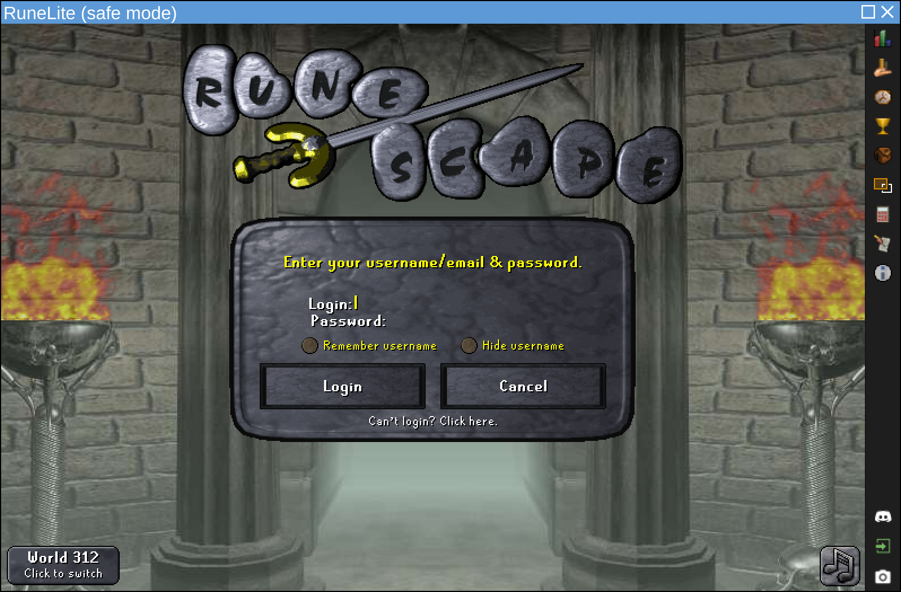

import { Icon } from "astro-icon/components";
import LinkButton from "@leaningtech/astro-theme/components/LinkButton.astro";
import { DISCORD_URL } from "@/consts.ts";

Around a month ago we announced [CheerpJ 4.0](https://labs.leaningtech.com/blog/cheerpj-4.0), the first release of our WebAssembly-based JVM with support for multiple versions of Java.

<div class="flex items-center gap-2 flex-wrap">
	<LinkButton
		type="primary"
		href="https://cheerpj.com/docs/getting-started"
		target="_blank"
		label="Get started"
		iconRight="mi:arrow-right"
	/>
	<LinkButton
		type="discord"
		href={DISCORD_URL}
		target="_blank"
		iconLeft="fa-brands:discord"
		label="Join us on Discord"
	/>
</div>

The release of CheerpJ 4.0 was focused on getting the infrastructure right, maintaining our long standing Java 8 support while introducing Java 11, and allowing further versions of Java to be supported.

As stated in our [roadmap](https://cheerpj.com/our-roadmap-for-modern-java-in-the-browser/), our plan was to introduce Java 17 support only later in the year. Thanks to faster than expected progress, we are now releasing this feature today, much earlier than we expected, as part of **CheerpJ 4.1**. This is intended to be a preview of the stable support that is still scheduled for a future CheerpJ 5.0 release, expected before the end of 2025.

Moreover, the initial support for Java 11 in the previous release received extensive testing by the developer community on a big variety of applications and libraries. Thanks to the help of our users, several critical bugs in the original release were found and fixed. This new 4.1 release also serves as an opportunity to bring much more stability to Java 11 support.

## What is new?

<figure class="w-full">
	
	<figcaption class="text-center">
		RuneLite running in the browser via CheerpJ in Java 11 mode
	</figcaption>
</figure>

Although not long has passed since the previous release, there are already many improvements in CheerpJ, across different subsystems.

CheerpJ 4.1 introduces:

- Support for SSL and Audio in Java 11
- Performance optimizations
- Improved networking stack
- Improvements to mobile usability, for both Swing and AWT
- Preview of Java 17 support

Feedback and testing from the community have been invaluable to help us improve the stability of CheerpJ. We expect that Java 17 will attract even more attention, resulting in a positive feedback loop that will bring CheerpJ ever closer to our vision of running modern Java in the browser.

## What can CheerpJ do?

CheerpJ is a full WebAssembly-based JVM for the browser, and comes with a complete OpenJDK runtime, as well as a powerful emulation layer to provide file system access, general networking support and other OS-level features. It works fully client-side, via WebAssembly, JavaScript and HTML5 technologies. It is, in essence, a JavaScript library, with no server-side or cloud-based component of any sort.

CheerpJ is a complete, flexible Java platform for modern browsers. It is an extremely powerful tool, designed and tested to work at the scale of real-world, large enterprise applications. Here is an overview of what CheerpJ can be used for.

### Running large-scale Swing / AWT applications

CheerpJ can run existing, full Java applications from unmodified JARs, with no recompilation or pre-processing, straight from bytecode. Obfuscated or encrypted JARs are supported irrespective of the obfuscator being used.

<figure class="w-full aspect-square">
	<div id="demodiv" class="w-full aspect-square relative">
		<iframe
			class="absolute w-full h-full focus:outline-none"
			src="https://cheerpj-example-swingset3.leaningtech.com/"
		></iframe>
		<div id="demofullscreen">
			<Icon
				class="absolute right-0 bottom-0 w-8 h-8 m-1 text-stone-900 cursor-pointer"
				name="fa-solid:expand"
			/>
			<Icon
				class="absolute right-0 bottom-0 w-8 h-8 m-1 text-stone-900 cursor-pointer animate-ping opacity-50"
				style="animation-duration: 3s; "
				name="fa-solid:expand"
			/>
		</div>
		<div id="demonormal" class="hidden">
			<Icon
				class="absolute right-0 bottom-0 w-8 h-8 m-1 text-stone-900 cursor-pointer"
				name="fa-solid:compress-arrows-alt"
			/>
		</div>
	</div>
	<figcaption class="text-center">
		A complex Swing application running live. Use the bottom-right control
		button to try it fullscreen.
	</figcaption>
</figure>

<script>{`
var demoDiv = document.getElementById("demodiv");
var demoFullscreen = document.getElementById("demofullscreen");
var demoNormal = document.getElementById("demonormal");
demoFullscreen.onclick = function()
{
	demoDiv.requestFullscreen();
};
demoNormal.onclick = function()
{
	document.exitFullscreen();
};
demoDiv.onfullscreenchange = function()
{
	if(document.fullscreenElement)
	{
		demoNormal.classList.remove("hidden");
		demoFullscreen.classList.add("hidden");
	}
	else
	{
		demoFullscreen.classList.remove("hidden");
		demoNormal.classList.add("hidden");
	}
};
`}</script>

Both AWT- and Swing-based applications are supported, including third-party Swing Look&Feels. Multiple applications, each with multiple windows, can run at the same time on the same page.

CheerpJ 4.1 introduces an unprecedented level of support for mobile devices, enabling for the first time to make complex Java applications available to users across phones and, especially, tablets.

Running a Java application is straightforward, requiring just three calls to the CheerpJ APIs (see our [Getting Started](https://cheerpj.com/docs/getting-started/Java-app) guide for a fully worked example).

```js
await cheerpjInit();
cheerpjCreateDisplay(800, 600);
await cheerpjRunJar("/app/my_application_archive.jar");
```

CheerpJ is built to run Java bytecode at scale, and is robust to very large applications. As a point of reference, our internal stress test is IntelliJ IDEA, an application comprising around 400MB of JAR files.

<video controls autoplay loop muted playsinline>
	<source src="./CJ_idea19_2025.mp4" type="video/mp4" />
</video>

### Using Java libraries as part of Web Applications

CheerpJ makes it possible to use Java libraries from JavaScript using a natural and expressive `async`/`await` based approach, we call this feature _Library Mode_.

The following snippet of code should give an idea about this capability, by using the popular `iText` library to generate a PDF completely client-side in the browser.

```js
async function iTextExample() {
	await cheerpjInit();
	const lib = await cheerpjRunLibrary("/app/itextpdf-5.5.13.3.jar");
	try {
		const Document = await lib.com.itextpdf.text.Document;
		const Paragraph = await lib.com.itextpdf.text.Paragraph;
		const PdfWriter = await lib.com.itextpdf.text.pdf.PdfWriter;
		const FileOutputStream = await lib.java.io.FileOutputStream;
		const document = await new Document();
		const writer = await PdfWriter.getInstance(
			document,
			await new FileOutputStream("/files/HelloIText.pdf")
		);
		await document.open();
		await document.add(await new Paragraph("Hello World!"));
		await document.close();
		await writer.close();
		const blob = await cjFileBlob("/files/HelloIText.pdf");
		const url = URL.createObjectURL(blob);
		pdfDisplay.data = url;
	} catch (e) {
		const IOException = await lib.java.io.IOException;
		if (e instanceof IOException) console.log("I/O error");
		else console.log("Unknown error: " + (await e.getMessage()));
	}
}
```

_Library Mode_ provides extensive access to Java, with these main features:

- Creating new objects
- Calling static and instance methods. Overloading is supported and the correct method is resolved taking into account the argument types.
- Accessing static and instance fields, both for reading and for writing.
- Handling Java exceptions from JavaScript (via regular `try`/`catch` blocks)

_Library Mode_ is a unique feature, which makes it possible to build a new generation of fully client-side Web applications that combine Web-native components with Java libraries to implement complex functionalities.

In more enterprise scenarios, this approach can be used to progressively migrate large-scale Java applications to native Web apps, by rewriting the UI while keeping all or part of the original business logic in Java. This can provide significant reduction of risk, costs, and timeline to large modernisation projects.

Check out our dedicated documentation for more information on [Library Mode](https://cheerpj.com/docs/getting-started/Java-library)

## Demo: Unmodified Minecraft in the browser

<video controls autoplay loop muted playsinline>
	<source src="./browsercraft4.mp4" type="video/mp4" />
</video>

To showcase the capabilities of CheerpJ, we created a side project named [Browsercraft](https://browsercraft.cheerpj.com/), a web-based “embedding” of a historical Java version of Minecraft.

Contrary to other approaches you might have seen, Browsercraft is not based on decompilation or reverse engineering attempts. The original `client.jar` is fetched directly from Mojang servers on the end-user browser and runs unmodified. The LWJGL dependency, available from Maven, is also unmodified.

How LWJGL works in CheerpJ is particularly interesting, since it is only _superficially_ Java. Most of its value comes from JNI methods which provide direct access to each and every method exposed by OpenGL. These methods are written in C and automatically generated by the LWJGL build system from a declarative representation of the OpenGL API.

CheerpJ 4.1 introduces support for these scenarios via JNI WebAssembly modules, which are loaded and executed dynamically, similarly to what happens on native platforms via shared libraries. Browsercraft takes advantage of this capability for LWJGL native code and also for the [gl4es](https://github.com/ptitSeb/gl4es/) library. This latter component provides a compatibility layer between OpenGL, used by Minecraft, and GLES as provided by WebGL.

By combining these WebAssembly modules and the unmodified JARs, CheerpJ can now correctly render Minecraft in the browser. It should be noted that Minecraft is a notoriously inefficient and resource intensive application, so we consider it to be a _stress test_ for CheerpJ. Nevertheless, thanks to recent improvements in our JIT compiler, the demo can now run with satisfactory performance on most mid range machines. The situation will further improve in the future thanks to more advanced optimizations currently planned, stay tuned.

## What’s next?

Development of CheerpJ is moving fast. The CheerpJ 5.0 release is still scheduled for later in the year as originally announced in our [roadmap](https://cheerpj.com/our-roadmap-for-modern-java-in-the-browser/).

There is a long list of improvements that we plan to ship, here are as few highlights:

- **Stable Java 17 support**: With CheerpJ 4.1 we have released a preview of what Java 17 support will look like in the not so distant future, we plan to gather feedback from users to achieve a high level of stability by the time CheerpJ 5.0 is released.
- **NPM support**: CheerpJ has been historically used primarily to run legacy Java applications, most usually in environments that pre-date the npm ecosystem. Now that CheerpJ can run modern Java we want to provide a npm-native CheerpJ version, to streamline integration into modern projects.
- **Extend native JNI modules support**: This will allow us to support JavaFX, SWT and eventually allow users to build their own Wasm JNI module for any Java library.

## Licensing

CheerpJ is commercial software, but it’s free to use for FOSS projects, personal projects and one-person companies. Affordable and transparent licensing apply to small businesses.

Enterprise licensing and support are available, with significant discounts for non-profit and educational institutions. For more information see [Licensing](https://cheerpj.com/cheerpj-core/#compare-plans).

## Try it out and join the community

You can find a lot of beginner-friendly resources in our developer documentation, as well as tutorials and a full API reference.

<div class="flex items-center gap-2 flex-wrap">
	<LinkButton
		type="primary"
		href="https://cheerpj.com/docs/getting-started"
		target="_blank"
		label="Get started"
		iconRight="mi:arrow-right"
	/>
</div>

For questions, discussion, and support, join our [Discord](https://labs.leaningtech.com/cheerpj-hackathon). The event theme and precise dates are still being determined, but it will be a week-long competition to be held between September and October 2025, with a £500 prize awaiting the winning team. [Sign up now](https://labs.leaningtech.com/cheerpj-hackathon) to stay updated.

---

CheerpJ is a product built with passion and a lot of coffee by Leaning Technologies, an international team of WebAssembly hackers based in Amsterdam (NL) and Leeds (UK). We hope you’ll love it as much as we do.

<LinkButton
	href="https://github.com/leaningtech/cheerpj-meta"
	target="_blank"
	type="secondary"
	label="Star CheerpJ on GitHub"
	iconLeft="fa:star"
/>
