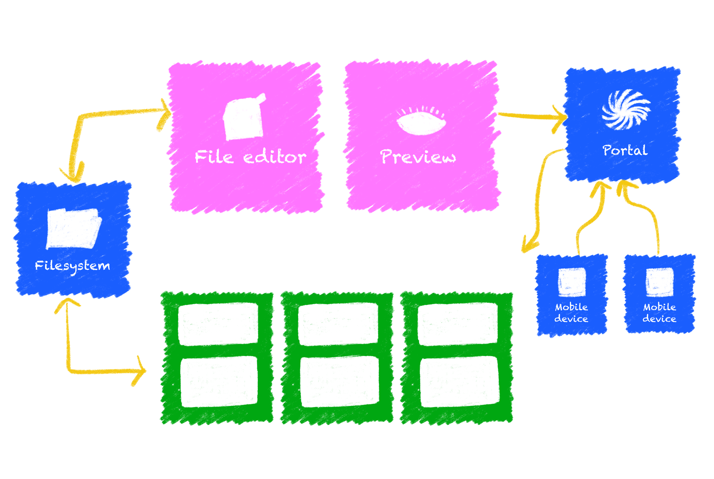

import LinkButton from "@leaningtech/astro-theme/components/LinkButton.astro";
import { DISCORD_URL } from "@/consts.ts";

We’re excited to introduce [BrowserPod](https://browserpod.io) a WebAssembly-based, in-browser container technology that runs full-stack development environments across multiple languages.

  <LinkButton
    type="primary"
    href="https://browserpod.io"
    label="Learn more"
    iconRight="mi:arrow-right"
  />

  <LinkButton
    type="discord"
    href={DISCORD_URL}
    iconLeft="fa-brands:discord"
    label="Join the Discord server"
  />

BrowserPod is a generalised, more powerful alternative to WebContainers, with advanced networking capabilities and flexible multi-runtime support. Containers, called _Pods_, run completely client-side. At their core there is a flexible WebAssembly-based engine that can execute multiple programming languages.

Each Pod can:

- Run multiple processes or services in parallel, with real concurrency powered by WebWorkers
- Access a scalable block-based filesystem with privacy-preserving browser-local persistence.
- Expose virtualized HTTP / REST services to the internet via _Portals_

Pods are fast booting, since no provision of server-side resources is required. Moreover, multiple Pods can run in each browser tab, enabling complex deployments.

BrowserPod is conceptually similar to WebContainers, but is designed from the ground up to be language-agnostic, to support inbound networking, and to be integrated within the Leaning Technologies ecosystem.

BrowserPod will be released in late November, with an initial focus on Node.js environments and a well defined path to support additional stacks, with Python and Ruby as immediate priorities.

Further capabilities will become available later by integrating BrowserPod with CheerpX, our x86-to-WebAssembly virtualization engine. In particular, we plan to support React Native environments in 2026.

## What is BrowserPod for?

<video controls autoplay loop muted playsinline>
	<source src="./browserpod_demo.mp4" type="video/mp4" />
</video>

BrowserPod is designed to run complete development environments in the browser, without installing local helper applications or dedicated server-side resources.

A typical use case of BrowserPod, exemplified by this [demo](https://vitedemo.browserpod.io/), would be a browser-based IDE that can run a preview server, for example via `npm run dev`. The preview server runs fully in the browser, with each update to files being reflected in the virtualized environment. As files are updated the normal Hot Module Replacement triggers, updating the preview.

The application preview is not just available in the same browser session, but is exposed to the internet via a Portal, a seamless solution to allow direct public access to any HTTP service running inside a Pod.

Portals make it possible to achieve real cross-device testing of applications and even pre-release sharing of test URLs with external users, including early adopters, stakeholders and clients.

BrowserPod’s initial focus will be on Node.js environments, which are supported via a complete build of Node.js, compiled to WebAssembly and virtualized in the browser. BrowserPod will support multiple versioned runtimes, with Node.js 22 being included in the first release.

This high-fidelity approach ensures that applications developed in BrowserPod containers will behave the same when migrated to production, making it possible to build real-world applications in Pods, not just prototypes.

BrowserPod is a great fit for web-based IDEs, educational environments, interactive documentation websites and AI coding Agents.

## How does BrowserPod work?

BrowserPod builds on our years long experience in delivering high performance in-browser virtualization via [WebVM](https://webvm.io). WebVM is powered by CheerpX, our x86-to-WebAssembly virtualization engine, and it has been the most popular tool we have released so far, with 15k+ stars on [GitHub](https://github.com/leaningtech/webvm).

To make BrowserPod possible we have rearchitectured CheerpX to separate its two main components: the x86-to-WebAssembly JIT compiler engine, and the Linux system call emulation layer. This emulation layer, that we are calling CheerpOS internally, is now shared across CheerpX and BrowserPod and, down the line, it will become a foundation layer across all our products.

CheerpOS is effectively a WebAssembly kernel that allows unmodified C/C++ code for Linux to run in the browser. In the context of BrowserPod it is used to provide a unified view of filesystem and access to networking across the multiple processes running in a Pod.

On top of this kernel layer, we compile the C++ source code of Node.js, with minimal changes, to a combination of WebAssembly and JavaScript. The use of JavaScript is specific to Node.js and provides the required shortcut to run JavaScript payloads natively in the browser itself, which is critical for high performance execution of Node.js environments.

Other stacks, such as Python and Ruby on Rails, will instead run as pure WebAssembly applications on top of the CheerpOS kernel.

## Licensing

BrowserPod will come with a generous free license with attribution, available for non-commercial users and technical evaluations.

A transparent pay-as-you-go model will be available for any use and purpose, including companies working on AI codegen tools. Pricing will be announced at release time and it will be very affordable to maximize the adoption of this technology, with discounts available for educational and non-profit use.

An Enterprise license will also be available for self-hosting and commercial support.

## General Availability

The initial release of BrowserPod will become generally available in late November - early December 2025, with support for Node.js 22.

Over the course of the following year, we have planned several additional releases, including support for multiple Node.js versions, support for Python and Ruby on Rails, and eventually support for React Native environments.

To receive up-to-date information on BrowserPod, make sure to register on our website. We plan to extend an early adopter program to a selected subset of registered users and organizations.

For more information on all our products and technologies, please join our [Discord](https://discord.leaningtech.com). Most members of the development team are active there and ready to answer any question you might have. You can also follow us on [X](https://x.com/leaningtech) and [LinkedIn](https://www.linkedin.com/company/leaning-technologies-ltd/) for updates.

## Conclusions

BrowserPod is currently in the final stages of development, and we are thrilled to see what the community will build on top of this technology when it is released in late November.

Leaning Technologies mission statement is “Run anything on the browser”, and BrowserPod is an important milestone along this journey. It will also not be the last and we have great ambitions for our ecosystem as we migrate to the unified CheerpOS foundational layer. Stay tuned!
