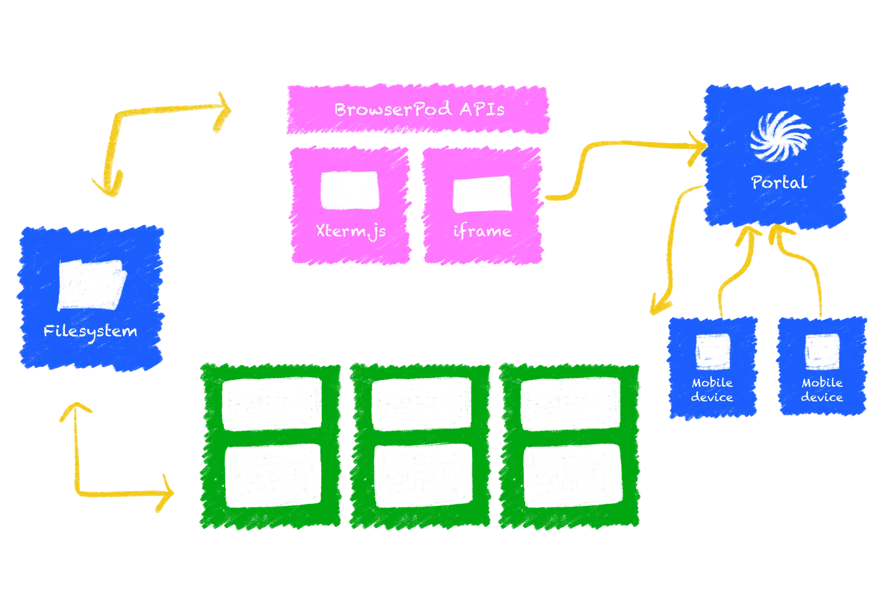

> **TLDR**: We’re beta-launching BrowserPod today, a WebAssembly-powered code sandbox for Node.js, Python and Ruby on Rails. Pods are instantly provisioned in-browser containers that use client-side compute, and can be exposed to the public internet. You can [start using BrowserPod now][BP-link], or keep reading to learn more.

Agentic coding, vibe coding, generative coding – different flavours of LLM-created or assisted code are everywhere, and their omnipresence are giving sandboxed computing environments a major moment in the spotlight. AI agents generate untrusted code, can introduce vulnerabilities and execute malicious instructions through prompt injection attacks or, on occasions, decide to wipe your whole filesystem. Sandboxes protect systems, local networks and data from threats by isolating agentic code in a secure virtual computing environment.

Sandboxes are typically ephemeral cloud instances. This is at first sight a great solution to the problem; by virtue of being in the cloud they’re naturally isolated from your system and they come with the additional benefit of portability, easily accessed through API calls and customized if needed. But they also come with a few drawbacks, for instance:

- **Latency / Provisioning Performance**: Using Cloud sandboxes introduces latency at the time of provisioning, which impacts frequently run, “closed-loop” computation.
- \***\*Runtime Performance**: Depending on the workload, acceptable performance can come at a substantial cost per hour of compute, particularly in the case of building pipelines.
- **Networking**: Cloud instances don’t have access to user-local network resources, and can suffer from other network limitations.
- **Cost**: Cloud computing is expensive, and with most businesses relying on cloud infrastructure, it’s something we’re all paying for even if we’re not personally cloud customers.
- **Ecological cost**: Data centers use massive amounts of energy and water, as demand grows, so does their ecological footprint.

The advent of WebAssembly and the maturity of its tooling, has enabled the execution of more and more complex computational payloads directly in-browser.

We see another option for the execution of untrusted code in most end-user facing tools; sandboxes that are instantly provisioned client-side, using local compute at native speeds, and leveraging the browser's sandbox for security.

That’s why we’re launching today, in Beta, BrowserPod: our own solution for this problem based on WebAssembly sandboxing and fully in-browser execution.

At Leaning Technologies, we’ve been at the forefront of WebAssembly-based solutions to convert large scale traditional applications to standard compliant Web apps, . We’ve done this across multiple languages and runtimes, starting from [C/C++][Cheerp-link], moving to [Java][CJ-link] and in recent years even safely executing arbitrary [x86 binaries][WEBVM-link] via dynamic Just-In-Time recompilation.

BrowserPod represents for us an opportunity to package everything we’ve learned in our 10+ years of experience to solve the problem of sandboxed computing. We can take advantage of the capabilities of modern browsers to reduce boot latency, pressure on data centers and the operational costs of provisioning virtual machines for untrusted user payloads.

import BrowserPodDemo_Beta from "@/components/BrowserPodDemo_Beta.svelte";

<figure class="w-full">
	

		<BrowserPodDemo_Beta
			client:only="svelte"
			showReplTab={true}
			readyActions={[
				{
					command: "node",
					args: [],
					terminal: "repl",
				},
			]}
		/>
	

	<figcaption class="text-center">
		Node 22 REPL running live in BrowserPod.
	</figcaption>
</figure>

# A bit of history

Over the years, we’ve pursued multiple approaches to executing large-scale native payloads as browser applications. Although the details change for every scenario, there are a few general patterns that hold, these can be logically separated into three components:

- **Application Code:** The actual payload / business logic the user is interested in, with the user having ownership or access to the source code (in most cases).
- **Libraries, Frameworks, and Programming Languages Runtimes:** This intermediate layer is often much larger and complex than the application code itself and often very complex to port to a new platform such as the browser. Although many of these components are open source, proprietary artefacts are also common.
- **Operating System:** Provides access to system resources such as files, network access and input/output devices. Different operating systems provide different levels of API stability at the syscall level.

## Our first product: C/C++ applications in the browser

Our first product, Cheerp, was focused on porting of C/C++ applications directly to a combination of WebAssembly and JavaScript. Although successful in some domains, such as porting mobile games to the browser, the requirement of having access to the whole source code, including all libraries, seriously limited its adoption.

Cheerp is extremely powerful, fully open source and it’s the cornerstone of our ecosystem. We’ve built all our subsequent technologies on top of Cheerp, and in that process, we’ve learned a lesson: to make a product successful on its own, it has to run real world, large scale applications without access to the source code and without any code change being required. In simple terms, things must _just work_.

## CheerpJ and CheerpX

Our following products, CheerpJ and CheerpX, adopted a new approach. Both support pre-compiled artefacts (JAR files / x86 ELF executables) and any interaction with system resources is virtualized using appropriate Web technology. For example, IndexedDB for file persistence or HTML5 Canvas for rendering window contents.

The end result is that unmodified applications can now run in the browser without any change. Conceptually the application does not even _know_ that it’s running in a virtualised and sandboxed environment.

### Syscalls

When deciding which set of system calls to emulate we settled on the ones provided by Linux, which has an extremely stable kernel APIs. Although not widely used by the larger public it is fully supported by the vast majority of programming languages runtimes, making it a sound target to emulate.

As our work with [CheerpX][CX-link], and [WebVM][WebVM-link] in particular proceeded, we came to the realization that the same linux emulation layer could unlock a whole new class of capabilities. This first insight made it possible for us to build what is now known as BrowserPod.

# BrowserPod: Closing the loop

BrowserPod exposes a WebAssembly _and_ JavaScript compatible interface to use a broad set of Linux system calls in a Web app. BrowserPod behaves like a proper kernel, co-ordinating access to resources across multiple processes and threads, with real multithreading provided by WebWorkers.

The most interesting payloads in the short term are popular language runtimes to build Web applications: Node, Python and Ruby on Rails. Additional utilities such as git, bash and similar command line tools are also in the pipeline.

All these applications can be compiled from C++ to WebAssembly. BrowserPod provides all the required system calls to offer a coherent vision of a single system, with multiple processes running in parallel and each sharing the same underlying file system and other virtualized resources.

Thanks to these capabilities, BrowserPod can run whole Web frameworks (including development servers, with hot reloading support) and build pipelines. Not only that, but in the future, BrowserPod will be able to boot multiple independent sandboxes, potentially within a shared virtual network, which could support even more sophisticated use cases.

## A note about Node

Running Node.js in BrowserPod comes with a specific challenge: how to execute the actual JavaScript application logic. Ideally, we would like to delegate execution to the underlying browser engine, but not all browsers behave exactly like node and there are node features which have no direct browser counterpart.

Our solution is to replace V8 API calls in node source with our custom implementation, based on native browser capabilities. Whenever we need to bridge gaps between browser engines and node, we transparently rewrite application JavaScript as needed.

One last important point: BrowserPod does not run “Node.js” in some abstract sense;it runs _specific versions_ of the unmodified Node platform. Since our approach compiles the node C++ source unmodified to WebAssembly, BrowserPod can provide a very accurate execution environment. Moreover, it also makes it simple for us to support future versions of node as they are released over time.

## Files and packets

Since BrowserPod is effectively a full operating system, it needs to provide scalable access to files and networking. We have learned from our experience with [WebVM][WebVMink] that simple, naive solutions such as accessing files from a plain HTTP storage simply cannot provide the level of performance necessary for real world applications. As a point of reference, it’s perfectly normal for a small npm-based application to attempt resolution of several thousand files during its boot.

To efficiently support file access at this scale we had to adopt a traditional block device filesystem on top of streaming disk blocks via HTTP or WebSockets. Currently we support Ext2 as our filesystem, which is convenient to populate disk images with standard tools. This choice also provides us with a straightforward upgrade path: as we implement additional filesystem features we’ll be able to support the full Ext3 and Ext4 feature sets.

Emulating networking is an especially painful point when porting native applications to the Web. [Direct Sockets][direct-sockets-link] offer a potential future path, but it’s unlikely they’ll be generally available to Web applications anytime soon.

Our solution for BrowserPod is to provide edge-computing-based proxying of network requests. This comes with some additional complexity and auditing requirements to avoid abuse, but it also enables one of the most exciting features of BrowserPod: virtualized HTTP endpoints. These endpoints can be accessed not just just from the same browser, or from your local host, but from anywhere on the wider internet.

## From TCP ports to HTTP Portals

<figure class="w-full">
	<video controls autoplay loop muted playsinline>
		<source src="./browserpod_demo.mp4" type="video/mp4" />
	</video>
	<figcaption class="text-center">
		An example of BrowserPod being used to run a full Vite+Svelte in-browser
		editor.
	</figcaption>
</figure>

What this means, in practice, is that whenever a Pod is booted it is assigned a globally accessible, unique and random domain name, something like:

`https://randomstring-port.browserportal.io`

Any port which is bound to public interfaces inside the pod will be exposed to the internet via this secret link. By sharing a link like this, you can show early adopters or clients how your application works without setting up any actual hosting. Moreover, you’ll be able to test your application from mobile devices, for example by encoding the link in a QR code on your main device screen.

## BrowserPod: A multi-runtime sandbox for agentic coding and more

<figure class="w-full">
	
	<figcaption class="text-center">
		Diagram of the BrowserPod architecture, illustrating the main components.
	</figcaption>
</figure>

We are very excited to be releasing BrowserPod to the public today in beta, and we think it is a product with exceptional potential. Although we are launching with only Node 22 support today, we’ve laid the groundwork to support much more: Python, Ruby/Rails, and more versions of Node.

Extensive support for command line tooling will also be added in the near future with git, bash, and compression utilities being the most immediate priorities.

Even more exciting opportunities will materialise by integrating CheerpX in Browserpod. This architecture will make it possible to seamlessly run binary x86 payloads, which are commonly shipped as part of npm modules. And, going even further, it will also enable non-JavaScript toolchains, such as React Native, to run within BrowserPod.

We envision BrowserPod as a _foundational_ technology that will be used to build many different products across multiple verticals. We can't wait to see all the creative use cases that the community will find for BrowserPod!

That being said, we already kept in mind a few major use cases that could definitely benefit from browser-based sandboxes when we designed the technology and API:

- In-browser IDEs and developer environments
- Programming courses and lectures
- Live docs for JavaScript libraries and Web frameworks
- And, of course, agentic coding

From the feedback we have received so far it’s clear that this last use case (agentic coding) will be predominant in the immediate future. The ability to safely unleash agentic loops in completely isolated in-browser sandboxes will allow more powerful automated coding solutions while decreasing cloud computing costs. At the same time, user data and code can be kept private while protecting the user system from agent mistakes and supply chain attacks.

## Conclusions

BrowserPod Beta is available right now, free for personal use and open-source projects, and with generous monthly allowances. You can try BrowserPod now using [our quick start][BP-quickstart-link].

If you have feedback or questions, you can reach us in our channel Discord or via GitHub issues.

import LinkButton from "@leaningtech/astro-theme/components/LinkButton.astro";

	<LinkButton
		type="secondary"
		href="https://github.com/leaningtech/browserpod-meta"
		iconLeft="fa-brands:github"
		label="GitHub Issues"
	/>

We think BrowserPod has the potential to revolutionize client-side sandboxing, and we are looking to hear what you think

[BP-link]: https://browserpod.io/
[BP-demo-link]: https://vitedemo.browserpod.io/
[BP-quickstart-link]: https://browserpod.io/docs/getting-started
[CJ-link]: https://cheerpj.com/
[CX-link]: https://cheerpx.io/
[Cheerp-link]: https://cheerp.io/
[WebVM-link]: https://webvm.io/
[direct-sockets-link]: https://wicg.github.io/direct-sockets/
