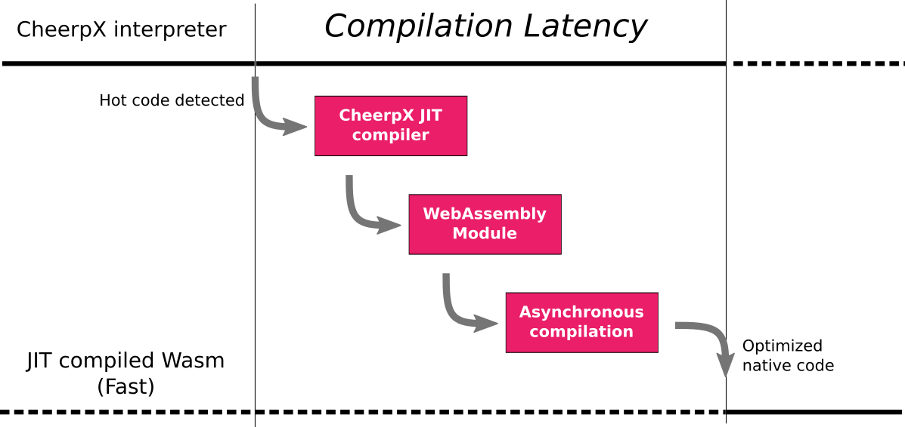
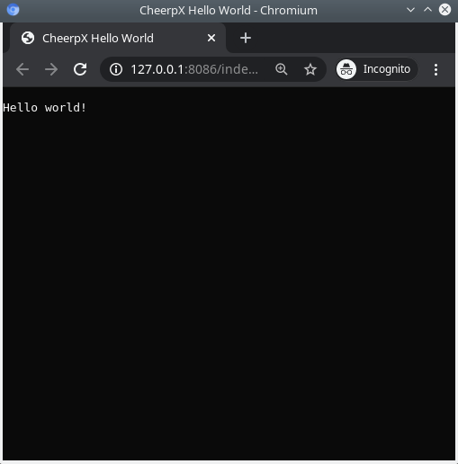

Here at Leaning Technologies, we use WebAssembly daily to create unique and seemingly impossible technologies, like [CheerpX](https://leaningtech.com/pages/cheerpx.html) (a WebAssembly virtual machine designed to safely run arbitrary x86 libraries and applications in browser) and [CheerpJ](https://leaningtech.com/pages/cheerpj.html) (a solution to compile and run Java applications in the browser).

CheerpX, in particular, is certainly the most complex JIT engine written in WebAssembly, and quite possibly the single most advanced WebAssembly project running in the browser.

In order to efficiently run arbitrary x86 code in WebAssembly, we have overcome all sorts of limitations, caused either by the current state of the Wasm standard, or by the browser implementations. If you are interested in reading more about the magic behind CheerpX, we published some information in [the previous article of this series](https://medium.com/leaningtech/extreme-webassembly-1-pushing-browsers-to-their-absolute-limits-56a393435323), and in a [presentation](https://www.youtube.com/watch?v=7JUs4c99-mo) back in February at the Wasm SF meetup.

<iframe
	title='CheerpX: a WebAssembly-based x86 virtual machine in the browser, Yuri Iozzelli'
	src="https://www.youtube.com/embed/7JUs4c99-mo"
	width="100%"
	class="aspect-video"
	frameborder="0"
	allowfullscreen="allowfullscreen"
></iframe>

Yuri Iozzelli discussing the internals of the CheerpX engine at the Wasm San Francisco meetup.

WebAssembly is an amazing technology, with an incredibly disruptive potential. However, probably due to its young age, it still has many rough edges.

To be clear, I am not referring here to some [very questionable takes](https://spectrum.ieee.org/tech-talk/telecom/security/more-worries-over-the-security-of-web-assembly) on its security model, but to actual limitations and bugs that we have encountered during the development process of CheerpX.

Let’s talk a bit about tail calls.

## Support for WebAssembly Tail Calls

As discussed in my [previous article](https://medium.com/leaningtech/extreme-webassembly-1-pushing-browsers-to-their-absolute-limits-56a393435323) tail calls are critical to efficiently support the execution of arbitrary x86 code, in particular to support indirect jumps while keeping a consistent call stack .WebAssembly tail calls are a post-MVP feature which is currently in Phase 3 (implementation phase).

This specification introduces two new opcodes: `return_call` and `return_indirect_call`. Among major browsers, **only Chrome supports Wasm tail calls**, and only by enabling them explicitly with the`--js-flags=”--experimental-wasm-return-call”` flag. Hopes are that this will be moved to the “Experimental WebAssembly” flags in `chrome://flags` [by the end of Q3–20](https://github.com/WebAssembly/tail-call/issues/12#issuecomment-649306046).

No other browser seems to have taken the “Implementation Phase” of the standard process as literally though.

### Tail call status on V8/Chrome

At first sight, tail calls are well implemented in V8, and we have been using (and abusing) them for a while now in our generated code. There are limitations though.

In particular, V8 follows a two-tier JIT compilation strategy for WebAssembly. There is a fast and simple *baseline compiler* (called Liftoff) and an advanced and slower *optimizing compiler* (called Turbofan). The idea is that the *baseline compiler*, being an order of magnitude faster than the *optimizing compiler*, will give you some decent executable code very soon. This will speed up the startup time of Wasm code. While the application starts Turbofan will be crunching the instruction graph in the background to eventually emit optimized native code. The problem is, *Liftoff* does not support Wasm tail calls. The compiler will give up and silently upgrade to *Turbofan*. This makes sense in terms of robustness, but it makes the problem quite opaque.

Careful use of this two-tiered system would be useful for CheerpX. We generate Wasm modules when we notice that a chunk of x86 code is run several times. After we notice that the code has become *hot*, we need to actually generate the Wasm bytecode. This takes time, but it’s intended to be an investment. The compiled code will be much faster than running in the interpret and we will recoup the time spent compiling (and more).

Unfortunately, before the newly generated Wasm bytecode can be used, the browser must compile it (another time) to generate native code, and the silent upgrade to Turbofan introduces *significant* latency. This delays the time we can finally see the return on the time invested in our JIT compiler. Using the *baseline compiler* to get a version of the code sooner could easily give a nice performance boost to our architecture. To be fair Chrome developers seems to be committed to getting this issue fixed in Q3 of 2020. Let’s wait and see.



Don’t feel bad if you are confused by the multiple layers of JITting. Sometimes we are as well.

### Tail call status on SpiderMonkey/Firefox

It is not great. And I am being kind, being a proud Firefox user myself.

The progress on this feature is tracked [here,](https://bugzilla.mozilla.org/show_bug.cgi?id=1571996) and there has been no update over the last 12 months. From what I can see from [related](https://bugzilla.mozilla.org/show_bug.cgi?id=1572400) [issues](https://bugzilla.mozilla.org/show_bug.cgi?id=1573179) on Bugzilla there is a major ABI mismatch that is stopping this from moving further. This is a pity, and it is seems another way in which Firefox could lose ground to competition. Moreover, we have actually seen the performance of Wasm on SpiderMonkey being superior to V8 in the past, and we would love to see how CheerpX behaves in Firefox.

Now, the obvious argument here is that Firefox is FOSS and we could “just” implement this feature ourselves for all the community to benefit. And we have actually contributed patches to both [V8](https://github.com/v8/v8/commit/5f6b78037435664edf0949f24e611fb32b14e266) and [SpiderMonkey](https://hg.mozilla.org/mozilla-central/log?rev=sander%40leaningtech.com) in the past so it won’t be a first. But in this case, this truly seems not a plausible path to follow. A full rework of Wasm ABI cannot be reasonably done by us as external developers, this is something that the core SpiderMonkey team needs to work on.

If any SpiderMonkey dev is reading this, please do get in touch. We are happy to help as much as we can to get this feature out, but we certainly cannot do it ourselves.

### Tail call status on JavaScriptCore/Safari

I must admit that my understanding of the development process of Safari is not as clear.

From what I can see tail calls are not supported in Safari and it seemed to me that no public bug report was dedicated to the issue. So we [created one](https://bugs.webkit.org/show_bug.cgi?id=215275). I am not sure how much of a priority if is for Apple to work on post-MVP features to upgrade WebAssembly. I certainly wouldn’t bet on Safari supporting tail calls sooner than Firefox. But I would be very happy to be proven wrong.

Again, if any dev from Safari/WebKit/JavaScriptCore is reading this, get in touch. We are happy to help.

### Conclusions

Tail calls are extraordinarily useful when implementing virtual machines and functional languages. WebAssembly tail calls are currently in Phase 3 (Implementation Phase). The next step, Phase 4, would then achieve full standardization of the feature.

Unfortunately, one of the requirements to move from Phase 3 to Phase 4 is to have [**2** Web VMs](https://github.com/WebAssembly/meetings/blob/master/process/phases.md#4-standardize-the-feature-working-group) implementing the feature, and server-side/command line engines do not count. Microsoft Edge does not count as well, since it’s just a reskinned Chromium.

For this feature to move forward either Firefox or Safari needs to make progress, any help on how to get this done is appreciated.

## Bonus content 1

In the [previous post in the series](https://medium.com/leaningtech/extreme-webassembly-1-pushing-browsers-to-their-absolute-limits-56a393435323), we shared a very early public demo of CheerpX, the x86 Python3 REPL running in the browser. You can find a much more polished version of the demo [here,](https://leaningtech.com/pages/pythondemo.html) please note that this will only work in Chrome/Chromium, after explicitly enabling tail calls. Instructions are included in the page. This new version includes most standard packages from Python (everything shipped in the [python3.8-stdlib](https://packages.ubuntu.com/focal/libpython3.8-stdlib) Ubuntu package), and *backspace* finally works!

## Bonus content 2 — Hello World in CheerpX

But I also want to share something more with you, are you ready to get your hands dirty? I am going to describe how to run your first *Hello World* using CheerpX.

A Linux host is assumed here, you can also find a ready-made [repo here](https://github.com/leaningtech/cheerpx_hello) for convenience. If you use the repo, just run `make` and skip to the “Start your favorite local HTTP server…” section.

Let’s start with something basic. Create a new directory:

mkdir cheerpx_hello
cd cheerpx_hello

Create your vanilla C hello world, nothing fancy here.

// hello.c
##include <stdio.h>int main()
{
printf("Hello world!\\n");
return 0;
}

Compile this to a 32-bit executable. Sorry, no support for 64-bit code for the foreseeable future.

gcc -m32 hello.c -o hello

This is a dynamically linked executable, so it will need a couple of libraries to run. This instructions are accurate for Ubuntu but may differ for your distro. You may also completely skip this if you wish, by adding the `-static` flag to the above compilation command.

mkdir -p lib/i386-linux-gnu
cp /lib/ld-linux.so.2 lib/
cp /lib/i386-linux-gnu/libc.so.6 lib/i386-linux-gnu/

Now we need a basic HTML page to let CheerpX do its magic.

```html
<!doctype html>
<html lang="en" style="height:100%;">
	<head>
		<meta charset="utf-8" />
		<title>CheerpX Hello World</title>
		<script src="https://cheerpxdemos.leaningtech.com/publicdeploy/cx.js"></script>
	</head>
	<body style="margin:0;height:100%;">
		<pre id="console" style="width:100%;height:100%;margin:0;"></pre>
		<script>
			async function cxReady(cx)
			{
			  cx.setConsole(document.getElementById("console"));
			  cx.run("/hello", \[\]);
			}
			function cxFailed(e)
			{
			   console.log("CheerpX could not start. Reason: "+e);
			}
			CheerpXApp.create().then(cxReady, cxFailed);
		</script>
	</body>
</html>
```

Start your favorite local HTTP server, and visit the HTML page you created.

```bash
http-server -p 8086 &
chromium-browser --incognito --js-flags="--experimental-wasm-return-call" http://127.0.0.1:8086/index.html
```




A minor miracle has just happened in front of your eyes.

Magic! And this works also for code compiled from C++ or Rust… or anything actually, although more libraries might be required. Feel free to experiment with this, but keep in mind that this is not a released or polished product. If you hack something nice, let me know [https://twitter.com/alexpignotti](https://twitter.com/alexpignotti)

## Get in touch!

Want to know more about the amazing and impossible products we make? Follow us on [Twitter](https://twitter.com/leaningtech) and join our Discord server. We are also eager to hear your opinion:

- How do you feel about our tech?
- Do you have in mind any cool use cases?
- Questions? [Just ask](https://twitter.com/leaningtech)!
