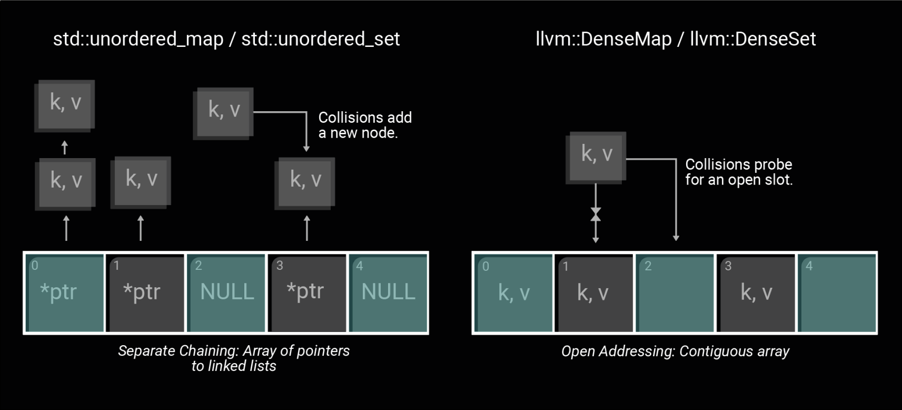

Another spring and another cohort of interns wrapping up their internships with us. This winter two of our interns worked on [Cheerp](https://cheerp.io/), our C++ to Wasm and JavaScript compiler. Andres put work toward optimizing Cheerp's compile time and Alex designed and built Cheerp a new test suite. Merlin worked on the Developer Relations and Experience side of things. He's helped us with making our documentation and communications with the developer community more clear, and worked on some issues on our developer website. Read below what they have to say about their experiences.

## Alex von Benckendorff – Intern Software Engineer – Compilers

For the past six months, I have had the privilege of working as a Software Engineering Intern at Leaning Technologies. My primary project focused on migrating the Cheerp compiler’s existing test suite to an [LLVM Integrated Tester](https://llvm.org/docs/TestingGuide.html) (LIT)-based infrastructure. The legacy test suite had reached its limits in scalability and maintainability. Migrating to LIT allowed for a more standardized and extensible solution, as well as aligning with the LLVM ecosystem. It also had the capacity to preserve the feature set, reliability, and efficiency of the previous system.

The challenges I faced were both technical and project-management related. Working within a fixed six-month timeframe required careful planning and incremental progress. I had to familiarize myself with LIT and Cheerp’s architecture, anticipate potential pitfalls, and iteratively validate the migration. Setting intermediate goals, testing incremental versions and refining my approach as I gained experience gave me valuable insight into working in a real-world software engineering environment. Also, being aware of gaps in my understanding of the full codebase that I worked on is something that required some getting used to.

One of the main technical challenges was preserving all of the functionality of the legacy test runner within the new LIT-based testing environment. Many tests required compatibility across multiple compilation targets (WebAssembly, asm.js, and JavaScript) and execution modes (regular and PreExecution). Whereas the previous system centralized this logic, LIT distributes behavior across test files and configuration, making direct translation a challenge. To address this, I developed a compatibility layer within the LIT configuration, introducing target- and mode-aware substitutions that could be used consistently across test files. This allowed legacy behavior to be expressed in a structured and maintainable way within the new system. However, since the output of any particular test can vary slightly depending on the particular compilation target, I had to make sure that output formatting was consistent throughout these targets and modes.

As part of a solution to this problem, I extended the Cheerp preexecuter to allow tests to emit observable output rather than only asserting equality. This enabled direct validation via FileCheck and improved debugging and reporting. I also made targeted improvements to consistency of the Cheerp Compiler by making sure the ordering process of elements, as well as the naming was now always done in the exact same way. This allowed for testing of this particular form of consistency, which was previously done in a substantially less rigorous way. Finally, I ensured that the new testing infrastructure integrated reliably with the CI environment, maintaining stability and performance in automated test execution.

Leaning Technologies offers interns a high degree of autonomy, which allowed me to take ownership of my project and develop practical problem-solving skills in a large and complex codebase. Through this experience, I deepened my understanding of compiler tooling, testing infrastructure, and the challenges of maintaining legacy behavior while modernizing systems. I also strengthened my ability to approach unfamiliar problems, balance technical ambition with practical constraints, and iteratively deliver robust solutions. Overall, this internship has significantly increased my confidence in working independently on complex engineering problems in a professional environment.

## Merlin de Cloe - Intern Software Engineer - Developer Experience and Relations

Greetings! I’m Merlin, 26 years old, a big fan of frogs and dancing and many other things. To conclude my studies at Codam Coding College, I joined Leaning Technologies as a Developer Experience and Relations (DevRel) Engineer intern.

As someone in the DevRel position instead of working on the core compiler products, my responsibilities contained everything around it. This meant my writing, design and communication skills grew as much as my technical skills.

Community management wise, one of my tasks was to maintain the community discord. Writing weekly devlogs, thinking of what could be improved and engaging with users. It was a pleasant surprise that things I learned just to talk with friends in my own time suddenly became relevant for my work.

Despite already being a strong communicator, it was great to get the opportunity to grow even more, especially when acting as a representative of the entire company. In this role, you represent the company not only with your person, but with your knowledge of our products. Bringing technical work to the public from your own perspective is a big responsibility. It is a difficult task to convey accurate and understandable information about complex things, particularly ones that you are only learning about during your internship. This felt like the perfect intersection between communication and engineering, as I needed the technical understanding of how the products worked combined with the ability to explain them in a way that is as easy to understand as possible for a new user.

Regarding the more technical work I did. My main focus was our documentation webpages, Labs. All the work for the pages is contained in a monorepo that builds our sites using the Astro framework. Maintaining this repo and fixing bugs meant I had to quickly familiarize myself with new frameworks while learning to navigate a large, professional codebases.

Funnily enough, I, in a sense, learned the most simply by being part of the team! Because of the small team size and how much trust and freedom I got, I was pushed to be a proactive team member. It felt a bit daunting at first and came with its own challenges: managing my own time, not taking direct feedback personally, and learning to make my own judgement calls rather than just following orders. As the internship went on, I started keeping track of more things, taking initiative, and giving more of my own feedback.

So thank you for the past 6 months! For trusting us while still giving us guidance when asked for or needed. And last but not least for the fun camaraderie and fun and random conversations during lunch!

## Andres Madrid Ucha - Intern Software Engineer - Compilers

My internship project was to profile and optimize Cheerp, our C++ to WebAssembly and JavaScript compiler. I primarily focused on Cheerp's custom optimization passes. To pinpoint exactly where most time was spent on, I relied on [perf](https://perfwiki.github.io/main/tutorial/), a Linux performance analysis tool that periodically samples a running program to track its CPU usage. By recording a call graph with perf, I could isolate which functions in which passes were responsible for causing bottlenecks. From there, the work became almost detective-like. I had to understand what a pass was supposed to do before I could judge whether the time being spent was a real problem or simply the cost of doing the work correctly.

The optimizations varied in complexity, though some were straightforward once spotted. For instance, replacing standard C++ containers with their [LLVM](https://llvm.org/) equivalents yielded quick wins. Unlike many standard associative containers, which rely on scattered heap-allocated nodes, LLVM alternatives pack elements into a contiguous array to maximize cache performance. The catch was ensuring that no existing code held onto iterators across insertions, as reallocations would silently leave iterators dangling. Other performance gains came from being smarter about analysis preservation. Many passes were conservatively invalidating all cached analyses after running, even those they hadn't touched. By marking which analyses a pass truly preserved, further passes could reuse that work instead of recomputing it from scratch.

The most significant task involved [Partial Executer](https://cheerp.io/blog/reducing-webassembly-size-by-exploring-all-executions-in-llvm), one of the most ambitious and time consuming passes of Cheerp. In a nutshell, the pass simulates code execution at compile time to identify and eliminate unreachable paths. I optimized the pass to terminate early when further simulation becomes redundant. Specifically, I introduced a progress flag that triggers only when the interpreter discovers valuable information. If a full traversal of a group of basic blocks occurs without raising this flag, the state has stagnated and the execution stops. I also implemented a global tracker for visited basic blocks; once all blocks in a function are marked as reachable, the pass skips any remaining call sites.

What made working on the Partial Executer memorable was discovering it had silently regressed. While comparing compiled outputs, I noticed it was having no effect whatsoever on the control flow it was supposed to simplify. The culprit was a Cheerp built-in function introduced as part of an ongoing transition to [LLVM’s opaque pointer model](https://llvm.org/docs/OpaquePointers.html), where pointers lose their explicit type information. It does nothing at runtime; its actual job is to carry the pointer type information through to Cheerp’s backend. Because Partial Executer was written before this function existed, it had no handling for it. In a strange way, my optimization work had uncovered a correctness bug.

Working at Leaning Technologies has been genuinely rewarding. I was given the freedom to explore the problems independently while still having a lot of guidance from senior engineers. Beyond learning a lot about how LLVM works, I have grown more confident with version control, code reviews and finding my way through a large codebase. My internship is not yet over, and my most recent work has taken me outside the opt passes and into Cheerp’s frontend and backend. As my first work experience, it has constantly pushed me further than I expected and I have come out feeling more resourceful than when I started.
