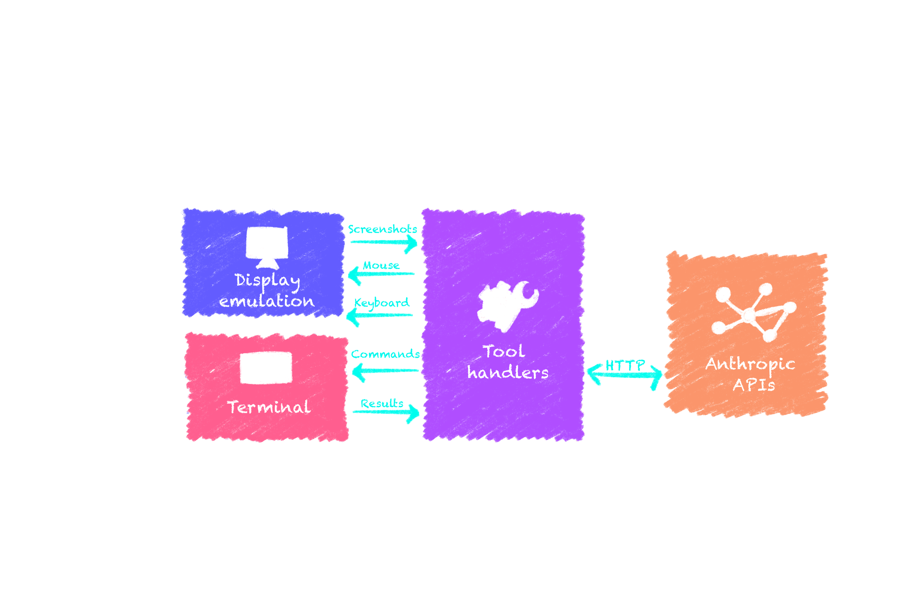

import LinkButton from "@leaningtech/astro-theme/components/LinkButton.astro";
import { DISCORD_URL } from "@/consts.ts";

A few months ago we experimented with integrating the [Computer use](https://docs.anthropic.com/en/docs/agents-and-tools/computer-use) feature from Claude into [WebVM](https://webvm.io), our WebAssembly-based Linux virtual machine running in the browser. The capabilities of Claude at the time were limited, and we kept the feature under wraps. However, with the recent release of Claude 3.7 Sonnet _signicantly_ improving the quality and efficiency of its VM control abilities, we are now ready to share the results of this integration, and make it available to the public.

This post is intended not only as a showcase of WebVM, but also as a tutorial on how Claude Computer Use actually works and how it can be implemented in any custom environment.

<div class="flex items-center gap-2 flex-wrap">
  <LinkButton
    type="primary"
    href="https://github.com/leaningtech/webvm"
    target="_blank"
    iconLeft="fa-brands:github"
    label="GitHub repo"
  />

<LinkButton
	type="discord"
	href={DISCORD_URL}
	target="_blank"
	iconLeft="fa-brands:discord"
	label="Join the Discord server"
/>

</div>

## Background



Claude Computer Use can be understood as a set of pre-defined _tools_ that are available to the LLM, not conceptually dissimilar from the tools used for web search or for running python. It is part of a recent wave of GenAI capabilities intended to let “agents” operate browsers or graphical operating systems to complete tasks. What makes Claude different is exposing an interface to directly control your own computer or VM, while other vendors focus on doing the operations behind the scenes in their own environment.

This unique capability makes it possible to work _together_ with the model to achieve the intended results, which seems a more powerful paradigm compared to leaving the model to its own devices. Of course, there are serious risks with letting LLMs control your computer, so the explicit [recommendation from Anthropic](https://docs.anthropic.com/en/docs/agents-and-tools/computer-use) is to always use a virtual machine.

WebVM - our Linux virtual machine that runs completely in the browser sandbox - is a perfect fit for this and similar technologies that will certainly appear in the future. It does not require server-side execution and does not send any user data outside of the user computer. Being built completely on standard Web technologies - WebAssembly in particular - it is fully isolated from your system and your other browser tabs. Since Claude APIs can be used directly from a browser tab, it’s possible to combine them with WebVM to create a secure and private environment to experiment with Claude Computer Use capabilities.

[WebVM](https://github.com/leaningtech/webvm) is FOSS and built on top of [CheerpX](https://cheerpx.io/) our x86-to-WebAssembly virtualization engine. Everything described in this post is available in the WebVM repository.

## How to integrate Claude in a Web Application

Anthropic APIs are very well designed and provide [CORS](https://developer.mozilla.org/en-US/docs/Web/HTTP/Guides/CORS) headers, which are required to use any API directly from browsers.

Basic integration in a Web app is extremely simple via the `@anthropic-ai/sdk` [NPM package](https://www.npmjs.com/package/@anthropic-ai/sdk). You can find the full code for WebVM integration [here](https://github.com/leaningtech/webvm/blob/main/src/lib/anthropic.js), but the following snippet is sufficient to exchange your first messages.

```js
import Anthropic from '@anthropic-ai/sdk';
...
// The `dangerouslyAllowBrowser` option enable CORS headers, the implied
// “danger" is accidentally sharing private API keys on the open internet.
// The recommended approach, that WebVM follows, is a being-your-own-key
// (BYOKey) policy. The user will manually insert its own API key in the
// Web app. The key is only saved locally to the browser and never sent to
// our servers.
const client = new Anthropic({apiKey: key, dangerouslyAllowBrowser: true});
// The tool object and messages array must be already defined, see below for details
const response = await client.beta.messages.create({
		// Place a limit on the maximal amount of tokens to generate
		max_tokens: 2048,
		// An array of messages between the user and the assistant
		messages: messages,
		// Enable the newest (at this time) Claude 3.7 Sonnet model
		model: 'claude-3-7-sonnet-20250219',
		// An array of tools to use, we only need one in this case
		tools: [tool],
		// Let the model only use one tool at a time for simplicity
		tool_choice: {type: 'auto', disable_parallel_tool_use: true}
		// Enable the computer use predefined tools
		betas: ['computer-use-2025-01-24']
	})
// Iterate over the response messages
const content = response.content;
for(var i=0;i<content.length;i++)
{
	const c = content[i];
	if(c.type == "text")
	{
		// A simple text response
		console.log(“Claude replied”, c.text);
	}
	else if(c.type == “tool_use”)
	{
		// Request to use a tool on the VM, keep reading for more details
		...
	}
}
...
```

The above snippet has some unusual configuration to enable Computer Use tools from a Web browser, although the comments should make the purpose of each option quite clear.

The `messages` and `tool` definitions are so far left out of the discussion. The Claude APIs, similarly to all other LLM providers, are stateless and the whole conversation history needs to be provided on every iteration. The `messages` array will look like this.

```js
const messages = [
	{ role: "user", content: "Hi, my name is Alessandro. What about you?" },
	{ role: "assistant", content: "Hello Alessandro! ..." },
	{ role: "user", content: "What was my name again?" },
];
```

<div class="float-right w-1/3">
	
</div>

The last assistant message is the response generated from the complete conversation history. The application is responsible for keeping track of all responses and providing them as context to the API for every additional step.

Finally, the `tool` object. Normally when using tools with Claude, this object should contain the whole definition of the tool, including its detailed description and required parameters. In the case of Computer Use, the tools come [pre-defined](https://docs.anthropic.com/en/docs/agents-and-tools/computer-use#claude-3-7-sonnet-tools) from Anthropic. We still need to choose which tool to use:

- **bash**: Which supports running commands and reasoning over the textual output of them. This is integrated in WebVM terminal mode ([https://webvm.io](https://webvm.io)).
- **computer**: Which can operate a complete graphical user interface using screenshots and mouse/keyboard control. Integrated in WebVM graphical mode ([https://webvm.io/alpine.html](https://webvm.io/alpine.html))
- **text_editor**: Not currently used in WebVM

There are several non-obvious considerations when integrating these tools into the virtualized environment. Let’s look at the simplest case, **bash**, first.

### Controlling a terminal using Claude

Whenever Claude needs to use tools it will send a `tool_use` response, with the `input` field containing the required parameters. In the case of the bash tool, it is simply a string representing the whole command that needs to be executed.

A typical example would be:

```json
{
	"type": "tool_use",
	"id": "toolu_01GC46QtMMoqVdHDEvgCdVyB",
	"name": "bash",
	"input":
	{
		"command": "find . -type f -name "*.py""
	}
}
```

The expected response is the complete textual output of the command, as written in the terminal. We need to reply with the `tool_result` message type and make sure to pass the `id` value from the previous `tool_use` message. Claude uses the ids to pair `tool_use` messages with their corresponding `tool_result` response.

```json
{
	"type": "tool_result",
	"tool_use_id": "toolu_01GC46QtMMoqVdHDEvgCdVyB",
	"content": "./hello.py\n"
}
```

When designing the integration with WebVM our objective was not only to let Claude run commands, which would have been straightforward thanks to [CheerpX APIs](https://cheerpx.io/docs/reference/CheerpX.Linux/run), but also to let the user properly collaborate with the model as part of the same terminal session. We chose to inject commands in the terminal as if they were user input, using a `# End of AI command` sentinel to mark the end of the tool output for both the model _and_ the user.

As a demonstration of the capabilities of this solution, we had Claude solve a CTF for us, with the challenge path and short instructions as the only input. The results are quite impressive. Claude will first do basic reverse-engineering of the binary using `strings` and `objdump`. After looking at the assembly code, it forges an input string that triggers the necessary buffer overflow. It is quite impressive to witness, with the caveat that similar scenarios might be in the training set.

<video controls autoplay loop muted playsinline>
	<source src="./webvm_claude_ctf.mp4" type="video/mp4" />
</video>

This style of integration has lots of potential and even with the current basic capabilities it could unlock quite a few scenarios:

- Helping users with sysadmin tasks, allowing them to experiment in the safety of the WebVM sandbox before applying the same commands to the real host
- SSh-ing into real hosts from WebVM, letting Claude have temporary access to your servers.
- Using Claude as a tutor when learning how use a Linux terminal
- Using Claude as a companion to draft complex shell commands in place

The **bash** tool as it is currently designed has some significant limitations, in particular it can only execute commands and cannot use the current state of the terminal as context. To make a silly example, it cannot exit vim for you since it cannot “see” you are currently in a vim session. On the flipside it is quite reliable since it works purely on text input and text output which is of course what modern LLMs are the most adept at doing.

## Pointers, keys and (lots of) screenshots

Contrary to the **bash** tool, the **computer** tool has many more moving parts, but it’s also much more capable... when things go well. This feature depends heavily on screenshots to “see” the screen and decide how to interact with it. Although this makes it possible for the model to have full understanding of the environment, it comes with some downsides:

- **Cost**: Since every interaction depends on one or more screenshots, which consumes lots of tokens, conversations can get quite expensive
- **Reliability**: The precision of the model when clicking on UI elements is not amazing. This might be connected to the maximal resolution of the screenshot being [capped to 1024x768](https://docs.anthropic.com/en/docs/agents-and-tools/computer-use#computer-tool), requiring rescaling of the screenshots and mouse coordinates to compensate for this.

While the **bash** tool only had one single action that could be used, the **computer** tool has several. We'll describe a few of them in depth, see [here](https://docs.anthropic.com/en/docs/agents-and-tools/computer-use#computer-tool) for a complete list.

### The `screenshot` action

WebVM virtualizes the display using a HTML5 canvas, so getting a screenshot is quite straightforward. The final implementation is somewhat more complicated though, since it needs to account for rescaling and be defensive against too many screenshots being taken in a row.

```js
case "screenshot":
{
	// Insert a 3 seconds delay unconditionally
	await yieldHelper(3000);
	var delayCount = 0;
	// Get the main display canvas
	var display = document.getElementById("display");
	var dc = get(displayConfig);
	// Lazily create a new canvas for screenshots
	if(screenshotCanvas == null)
	{
		screenshotCanvas = document.createElement("canvas");
		screenshotCtx = screenshotCanvas.getContext("2d");
	}
	// Resize the screenshot canvas if needed
	if(screenshotCanvas.width != dc.width || screenshotCanvas.height != dc.height)
	{
		screenshotCanvas.width = dc.width;
		screenshotCanvas.height = dc.height;
	}
	while(1)
	{
		// Resize the display to a Claude compatible size
		screenshotCtx.drawImage(display, 0, 0, display.width, display.height, 0, 0, dc.width, dc.height);
		var dataUrl = screenshotCanvas.toDataURL("image/png");
		if(dataUrl == lastScreenshot)
		{
			// Delay at most 3 times
			if(delayCount < 3)
			{
				delayCount++;
				// Wait some time and retry
				await yieldHelper(5000);
				continue;
			}
		}
		lastScreenshot = dataUrl;
		// Remove prefix from the encoded data
		dataUrl = dataUrl.substring("data:image/png;base64,".length);
		var imageSrc = {type: "base64", media_type: "image/png", data: dataUrl};
		var contentObj = {type: "image", source: imageSrc};
		return [contentObj];
	}
}
```

This is the [actual code](https://github.com/leaningtech/webvm/blob/91f68ce044d35489eaebf1703da3c408787c9c88/src/lib/anthropic.js#L288) used in WebVM, lightly edited for clarity. The inline comments should make it fairly easy to follow. The general idea is to keep the original display at native resolution in its `<canvas>` element, and use a secondary `<canvas>` element to get screenshots, using the `toDataURL` API. The original display is copied and resized into the secondary `<canvas>` using the `drawImage` API. To avoid incurring excessive costs, we keep track of the current state of the display and only send a reply when something has actually changed. This used to be very important with Claude 3.5, but may not be necessary with Claude 3.7 thanks to the newly introduced “wait” action.

### The “mouse_move”, “left_click” and “right_click” actions

These actions are used to manipulate the cursor of the VM, they are all pretty straightforward with the only caveat being rescaling the mouse to compensate for the screenshot resizing described above. As an example, this is the complete code for “left_click” handling

```js
case "left_click":
{
	var coords = tool.coordinate;
	var dc = get(displayConfig);
	// Rescale mouse coordinates
	var mouseX = coords[0] / dc.mouseMult;
	var mouseY = coords[1] / dc.mouseMult;
	var display = document.getElementById("display");
	var clientRect = display.getBoundingClientRect();
	var me = new MouseEvent('mousedown', {clientX: mouseX + clientRect.left, clientY: mouseY + clientRect.top, button: 0});
	display.dispatchEvent(me);
	// This delay prevent X11 logic from debouncing the mouseup
	await yieldHelper(60)
	me = new MouseEvent('mouseup', {clientX: mouseX + clientRect.left, clientY: mouseY + clientRect.top, button: 0});
	display.dispatchEvent(me);
	return null;
}
```

The implementation currently sends simulated mouse events to the display: this is suboptimal and in the future we plan to expose a direct CheerpX API to inject events without depending on the browser event loop.

An important detail is the 60 millisecond delay between the `mousedown` and `mouseup` events. It is required to make sure the Xorg process does not ignore the `mouseup` due to its _debouncing_ logic. If the delay is too short the `mouseup` will be considered a hardware glitch, rather than valid user input.

### The “type” and “key” actions

The last important bit that is missing is keyboard input. It can be provided by Claude in two different ways.

- **key** action: for single keystrokes and special combination of keys
- **type** action: For longer strings of plain text

As a practical example, this is how the **type** action is implemented:

```js
case "type":
{
       var str = tool.text;
       return new Promise(async function(f, r)
       {
               var textArea = getKmsInputElement();
               for(var i=0;i<str.length;i++)
               {
                       await kmsSendChar(textArea, str[i]);
               }
               f(null);
       });
}
```

Similarly to the mouse input above, the `kmsSendChar` helper function is currently also based on simulating KeyboardEvents. We plan to simplify this in the future by providing CheerpX APIs for this case as well.

Implementing the **key** action requires some (not truly interesting) additional parsing to support the expected `xdotool` syntax, typical inputs could be “ctrl+C”, “Return”, “Escape”. Directly executing `xdotool` in the VM would have been another option, but we preferred keeping the logic in JavaScript for educational purposes and to be compatible with future non-Linux or non-Xorg based VMs.

### The “wait” action

This simple action has been added in Claude 3.7 and has proven extremely useful, especially in the context of WebVM, which is obviously slower than your typical desktop due to the virtualization overhead. The implementation is very straightforward.

```js
case "wait":
{
	// Wait 2x what the model expects to compensate
	// for virtualization slowdown
	await yieldHelper(tool.duration * 2 * 1000);
	return null;
}

```

### Putting this all together

We hope this section will be useful to anybody planning to integrate the Claude **computer** tool in their own environment.

The full code for our implementation is available [here](https://github.com/leaningtech/webvm/blob/91f68ce044d35489eaebf1703da3c408787c9c88/src/lib/anthropic.js#L286). We don’t currently support all tools, but we cover everything we have found to be used in our testing. WebVM is FOSS and contributions to make this feature more complete are welcome. If you are looking for a good first contribution, adding support for “left_mouse_down”/”left_mouse_up” could be a good starting point and allow Claude to do Drag-and-drop operations that are currently unsupported.

As a showcase we can bring two examples, one fairly successful, the second... not so much.

Sticking to the previously mentioned “exit vim challenge”, Claude computer use can reliably solve the problem. There was no need to prime it for the editor being gvim, since it can easily recognize it after taking a screenshot. It will then inject the required keystrokes to exit the editor as requested.

<video controls autoplay loop muted playsinline>
	<source src="./webvm_claude_gvim.mp4" type="video/mp4" />
</video>

As the second example we have tried Minesweeper. We have experimented with this back in the Claude 3.5 era as well, but the level of precision with mouse control was completely inadequate. Claude 3.7 is much more capable in this regard, and seems to be able to place the mouse correctly on the intended squares of the game. As usual the process starts with a screenshot, and Claude can correctly identify the grid as being 9x9. Claude proceeds then with clicking in the center of the screen revealing most of the map. It begins reasoning about placing markers to highlight known mines, but it immediately makes a mistake, since it incorrectly considers a covered tile to be uncovered. This is not a fluke, we have tried multiple times and Claude seems consistently unable to move past the first move or two. Notice that we have enabled “thinking mode” as well for this test case, but it does not seem to help.

<video controls autoplay loop muted playsinline>
	<source src="./webvm_claude_mines.mp4" type="video/mp4" />
</video>

## Conclusions: Does the ghost fit the shell?

The capabilities of Claude 3.7 are impressive, especially when using the **bash** tool, notwithstanding all the limitations mentioned above. When using the desktop and the **computer** tool the experience might vary from “absolutely amazing” to “somewhat underwhelming”. The technology is moving quickly and we can see lots of improvements in the current version compared to 3.5.

In the future, we might want to experiment with forcing the desktop native resolution to be capped at 1024x768, since removing the rescale steps might have a positive impact on the precision on mouse control. It would cause the desktop to be pixelated for most users though, which is not great.

Another interesting development could be using the **computer** tool to control the terminal, with screenshots providing access to the current terminal contents. If the OCR is sufficiently accurate this could be a “best of both worlds” solution, matching the contextual awareness of the **computer** tool with the accuracy of the **bash** tool.

Integrating WebVM with other models could also be an interesting development. [WebVM](https://github.com/leaningtech/webvm) is FOSS and we welcome ideas and contributions from the community on how to further develop this concept.

WebVM is based on CheerpX, our state-of-the-art engine to run unmodified x86 binaries safely in the browser. The capabilities of CheerpX makes it a perfect fit for the nascent field of AI agent and AI-generated code execution. We think CheerpX has the potential to be the tool of choice to provide LLMs with code execution capabilities and what we have built so far thanks to Claude APIs is a strong proof that we are on the right track.

Are you intrigued by WebVM and want to tinker with it more? Then we have great news! In April 2025 we are organizing the second edition of the WebVM Hackathon. You’ll be able to hack for a whole week on WebVM with your team (up to five members), with Leaning Technologies’ engineers available to answer all your questions and a nice prize awaiting the best team. For more information see: [https://cheerpx.io/hackathon](https://cheerpx.io/hackathon)

We are always available on Discord: [https://discord.leaningtech.com](https://discord.leaningtech.com), we are building a lively and growing community with ~1.5k members at this time, the weekly DevLog, and the “Dev Shenanigans” Friday event where our devs share both personal experiences and engineering best practices.

As part of the Claude integration side-bar of WebVM you’ll find a button to save the conversation as PNG, if you find a useful, impressive, or simply funny use case please share it with us. We are looking forward to seeing how the community will tinker with this new feature.

You can also follow us on [X/Twitter](https://x.com/leaningtech) and [BlueSky](https://bsky.app/profile/leaningtech.bsky.social), stay tuned as many more exciting releases are planned in the year, across all our products.
