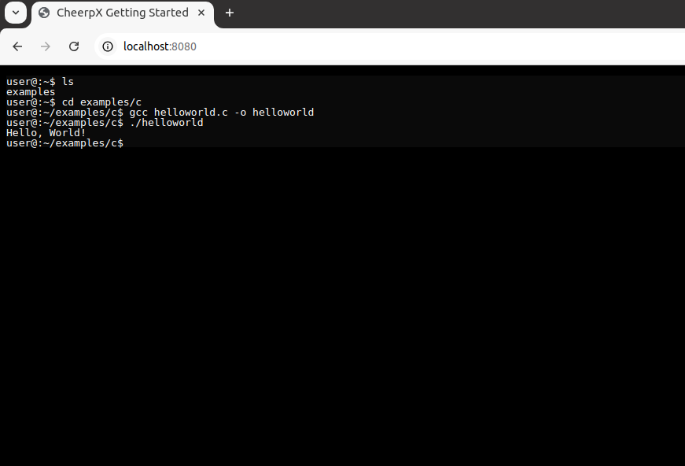

## What CheerpX Does

**CheerpX is an x86 virtualization technology for running executables and operating systems entirely client-side.** Upon completing the steps below, you’ll be able to run Linux executables right within your web browser!

## 1. Include CheerpX on your page

No installation is needed. Simply include CheerpX by adding the following script tag in the `<head>` or at the end of the `<body>` section of your HTML:

```html
<script src="https://cxrtnc.leaningtech.com/1.0.0/cx.js"></script>
```

The CheerpX's API is stable and breaking changes can only be introduced on a new major version. All CheerpX builds are immutable so you can trust that, if your application works today, it is going to work identically forever.

### ES6 Module Compatibility

CheerpX is also available as an ES6 JavaScript module. If you prefer to use the ES6 module version, you can include it like this:

```html
<script type="module">
	import * as CheerpX from "https://cxrtnc.leaningtech.com/1.0.0/cx.esm.js";
	self.CheerpX = CheerpX;
</script>
```

> [!tip]
> When using the ES6 module version, you don't have to assign the imported `CheerpX` to the global scope. This example is intended to keep compatibility with the traditional script inclusion method used in this documentation.

## 2. Create an application instance

To start using CheerpX, create an instance by calling the [`CheerpX.Linux.create`](/docs/reference/CheerpX-Linux-create) method, which is available globally once the script is included.

The example below demonstrates how to set up the file system and devices using [WebVM's `debian_large` image](https://github.com/leaningtech/webvm/blob/main/dockerfiles/debian_large), but you can also [create your own images](/docs/guides/custom-devices).

```html
<!doctype html>
<html lang="en" style="heigth: 100%;">
	<head>
		<meta charset="utf-8" />
		<title>CheerpX Getting Started</title>
		<script src="https://cxrtnc.leaningtech.com/1.0.0/cx.js"></script>
		<script type="module">
			// The read-only disk image from Leaning Technologies' fast cloud backend
			const cloudDevice = await CheerpX.CloudDevice.create(
				"wss://disks.webvm.io/debian_large_20230522_5044875331.ext2"
			);
			// Read-write local storage for disk blocks, it is used both as a cache and as persisteny writable storage
			const idbDevice = await CheerpX.IDBDevice.create("block1");
			// A device to overlay the local changes to the disk with the remote read-only image
			const overlayDevice = await CheerpX.OverlayDevice.create(
				cloudDevice,
				idbDevice
			);
			// Direct acces to files in your HTTP server
			const webDevice = await CheerpX.WebDevice.create("");
			// Convenient access to JavaScript binary data and strings
			const dataDevice = await CheerpX.DataDevice.create();

			const cx = await CheerpX.Linux.create({
				mounts: [
					{ type: "ext2", path: "/", dev: overlayDevice },
					{ type: "dir", path: "/app", dev: webDevice },
					{ type: "dir", path: "/data", dev: dataDevice },
					{ type: "devs", path: "/dev" },
				],
			});
		</script>
	</head>
	<body style="heigth: 100%; background: black;">
		<pre id="console" style="heigth: 100%;"></pre>
	</body>
</html>
```

> [!tip]
> A virtual system image, such as `debian_large`, is a complete snapshot of an operating system's files and configurations. CheerpX uses this image to simulate a Linux environment within your browser, allowing it to execute applications as if they were running on a native Linux system. This example is inteded to quickly get you up-and-running using a pre-deployed disk image from our cloud backend, for a much more self-contained example please see the [Simple Executable tutorial](/docs/tutorials/simple-executable)

## 3. Enable cross-origin isolation

CheerpX requires [SharedArrayBuffer](https://developer.mozilla.org/en-US/docs/Web/JavaScript/Reference/Global_Objects/SharedArrayBuffer), which itself requires the site to be cross-origin isolated. To enable cross-origin isolation, serve over HTTPS and set the following headers:

```
Cross-Origin-Embedder-Policy: require-corp
Cross-Origin-Opener-Policy: same-origin
```

For detailed instructions on how to configure headers in Nginx, check our [Nginx configuration guide].

During development, you don't need to use HTTPS if you're using `localhost` as the origin, the `COEP` and `COOP` headers are always required though. You'll need to make sure you serve over HTTPS when you deploy.

> [!warning] Cross-origin isolation may break existing site functionality
> Cross-origin isolation is a security feature that might impact your site in unexpected ways. For example, if you're embedding third-party iframes or opening cross-origin popup windows, you may need to make changes to your site to make them work. Test carefully!

## 4. Attach and interact with a console

To be able to see the output printed by the program, use [`setConsole`](/docs/reference/CheerpX-Linux-setConsole) method to use an HTML element as a console. Add the following code at the very end of the `<script>` tag in the example above.

```js
cx.setConsole(document.getElementById("console"));
```

## 5. Run an executable

Executables are started using the the [`run`](/docs/reference/CheerpX-Linux-run) API. Add the following code to the `<script>` tag to run a full-featured shell in your browser.

```js
await cx.run("/bin/bash", ["--login"], {
	env: [
		"HOME=/home/user",
		"USER=user",
		"SHELL=/bin/bash",
		"EDITOR=vim",
		"LANG=en_US.UTF-8",
		"LC_ALL=C",
	],
	cwd: "/home/user",
	uid: 1000,
	gid: 1000,
});
```

Now you can interact with the console to run commands. Make sure to give focus to the `console` element by clicking on the page if what you type on your keyboard is not displayed.

## Complete code

```html
<!doctype html>
<html lang="en" style="heigth: 100%;">
	<head>
		<meta charset="utf-8" />
		<title>CheerpX Getting Started</title>
		<script src="https://cxrtnc.leaningtech.com/1.0.0/cx.js"></script>
		<script type="module">
			// The read-only disk image from Leaning Technologies' fast cloud backend
			const cloudDevice = await CheerpX.CloudDevice.create(
				"wss://disks.webvm.io/debian_large_20230522_5044875331.ext2",
			);
			// Read-write local storage for disk blocks, it is used both as a cache and as persisteny writable storage
			const idbDevice = await CheerpX.IDBDevice.create("block1");
			// A device to overlay the local changes to the disk with the remote read-only image
			const overlayDevice = await CheerpX.OverlayDevice.create(
				cloudDevice,
				idbDevice,
			);
			// Direct acces to files in your HTTP server
			const webDevice = await CheerpX.WebDevice.create("");
			// Convenient access to JavaScript binary data and strings
			const dataDevice = await CheerpX.DataDevice.create();

			const cx = await CheerpX.Linux.create({
				mounts: [
					{ type: "ext2", path: "/", dev: overlayDevice },
					{ type: "dir", path: "/app", dev: webDevice },
					{ type: "dir", path: "/data", dev: dataDevice },
					{ type: "devs", path: "/dev" },
				],
			});

			// Interact with a console
			cx.setConsole(document.getElementById("console"));

			// Run a full-featured shell in your browser.
			await cx.run("/bin/bash", ["--login"], {
				env: [
					"HOME=/home/user",
					"USER=user",
					"SHELL=/bin/bash",
					"EDITOR=vim",
					"LANG=en_US.UTF-8",
					"LC_ALL=C",
				],
				cwd: "/home/user",
				uid: 1000,
				gid: 1000,
			});
		</script>
	</head>
	<body style="heigth: 100%; background: black;">
		<pre id="console" style="heigth: 100%;"></pre>
	</body>
</html>
```

## The result

If everything is set up correctly, you should be able to see and perform the following actions:



---

[Nginx configuration guide]: /docs/guides/nginx

## Have Questions?

We're here to help! If you have any questions or concerns, feel free to explore our [guides](/docs/guides) or [reference](/docs/reference) section or check out our [frequently asked questions](/docs/faq). You can also connect with our supportive community on [Discord](https://discord.com/invite/yzZJzpaxXT), and reach out whenever you’d like!
