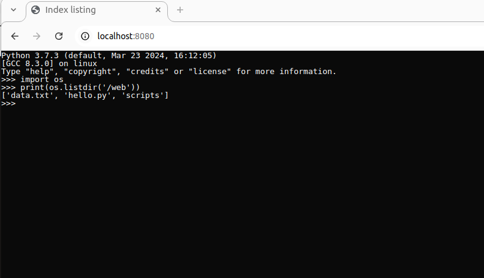

## What is `index.list`

The index.list file serves as a directory index for a WebDevice in CheerpX. It lists all files and subdirectories within the directory where it resides.

## Purpose of index.list

The primary purpose of index.list are:

- To enable the use of functions like os.listdir() to list directory contents.
- To provide seamless navigation of nested directories and files in the WebDevice.
- To ensure that CheerpX can recognize and display file structures for applications running in the virtual Linux environment.

## Structure of `index.list`

The `index.list` file contains a newline-separated list of all files and directories in the current directory.

### Example directory structure

Assume the directory structure is as follows:

```bash
.
├── cheerpXImage.ext2
├── Dockerfile
├── index.html
├── index.list.py
├── nginx.conf
└── web_root
    ├── index.list
    ├── main.py
    ├── script1.py
    └── scripts
        ├── index.list
        └── script2.py
```

**Content of** `/web_root/index.list`:

```
main.py
script1.py
scripts
```

**Content of** `/web/scripts/index.list`:

```
script2.py
```

## How to Use index.list

1. Creating `index.list` files

To generate `index.list` files, use the `index.list.py` script that goes over the given directory structure and creates `index.list` files where needed.

```bash
python3 index.list.py
```

> [!note] Note
> You need to create the `web_root` directory to use this script effectively.

2. Accessing Files in CheerpX

Once `index.list` files are created, you can access and interact with the files and directories through CheerpX using Python.

### Example code:

```py
import os

# List contents of the root directory in WebDevice
print(os.listdir('/web'))
# Output: ['main.py', 'data.txt', 'scripts']

```

3. Integrating with Your HTML

The following index.html file, when served by an NGINX server configured with nginx.conf, will allow you to interact with the Python REPL through a browser:

```html
<!doctype html>
<html lang="en" style="height: 100%;">
	<head>
		<meta charset="UTF-8" />
		<title>Index listing</title>
		<script src="https://cxrtnc.leaningtech.com/1.0.7/cx.js"></script>
		<script type="module">
			// Create a read-only block device for a disk image stored on the HTTP server
			const blockDevice =
				await CheerpX.HttpBytesDevice.create("/cheerpXImage.ext2");
			// Make the block device read-write using a persistent IndexedDB overlay
			const idbDevice = await CheerpX.IDBDevice.create("index_list");
			const overlayDevice = await CheerpX.OverlayDevice.create(
				blockDevice,
				idbDevice
			);
			// Initialize the CheerpX environment
			const webDevice = await CheerpX.WebDevice.create("/web_root");

			const mountPoints = [
				{ type: "ext2", path: "/", dev: overlayDevice },
				{ type: "dir", path: "/web", dev: webDevice },
				{ type: "devs", path: "/dev" },
				{ type: "devpts", path: "/dev/pts" },
				{ type: "proc", path: "/proc" },
			];

			const cx = await CheerpX.Linux.create({
				mounts: mountPoints,
			});
			// Setup the text console
			cx.setConsole(document.getElementById("console"));
			// Run the Python3 REPL in the browser
			await cx.run("/usr/bin/python3", []);
		</script>
	</head>
	<body style="height: 100%; background: black; margin: 0;">
		<pre id="console" style="height: 100%; margin: 0;"></pre>
	</body>
</html>
```

> [!note] Note
> Make sure to create your custom disk image and start the NGINX server. For more information, refer to the guides on Custom disk images and Basic server setup.

### Visual example:


