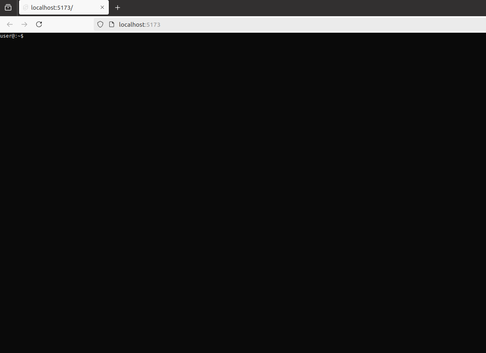

This tutorial will explain how to create a application with Svelte that works together with CheerpX.

## Install Svelte

First create a new Svelte app by running:

```bash
npm create svelte@latest my-app
```

1. Select the Skeleton Project option.
2. Enable Typescript if needed.
3. There are no additional options required for this tutorial.

Next, navigate to your project directory and install the dependencies:

```bash
cd my-app
npm install
npm run dev
```

At this point, the development server will run from the current terminal.

Click on the `localhost` link in your terminal window to test the development server.

(Vite uses `http://localhost:5173/` by default if port `5173` is available.)

## Install Cheerpx

Next, let's install CheerpX:

```bash
npm install @leaningtech/cheerpx
```

For this to work top level awaits must be enabled by setting the build target to es2020. Top level awaits are used by the CheerpX NPM package.

We'll also need to enable [Cross origin isolation]. It's required since CheerpX uses [SharedArrayBuffer].

Replace the following content in vite.config.ts with:

```ts title="vite.config.ts"
import { sveltekit } from "@sveltejs/kit/vite";
import { defineConfig } from "vite";

const viteServerConfig = () => ({
	name: "add-headers",
	configureServer: (server) => {
		server.middlewares.use((req, res, next) => {
			res.setHeader("Cross-Origin-Opener-Policy", "same-origin");
			res.setHeader("Cross-Origin-Embedder-Policy", "require-corp");
			next();
		});
	},
});

export default defineConfig({
	optimizeDeps: {
		esbuildOptions: {
			target: "es2022",
		},
	},
	plugins: [sveltekit(), viteServerConfig()],
});
```

Create a new file named src/routes/+page.ts to disable Server-Side Rendering ([SSR]). CheerpX code needs to be executed on the client side.

```ts title="src/routes/+page.ts"
export const ssr = false;
```

## Script

We will now modify `src/routes/+page.svelte` to replace the Svelte example with a full-screen console running `bash` using CheerpX. For more details on the CheerpX logic itself, please see our [Getting Started] guide.

```js
<style>
:global(html)
{
        height: 100%;
}
:global(body)
{
        height: 100%;
        margin: 0;
}
#console
{
        height: 100%;
        margin: 0;
}
</style>
<pre id="console"></pre>
<script lang="ts">
        import * as CheerpX from '@leaningtech/cheerpx';
        async function runBash()
        {
                const cloudDevice:CheerpX.CloudDevice = await CheerpX.CloudDevice.create("wss://disks.webvm.io/debian_large_20230522_5044875331.ext2");
                const idbDevice:CheerpX.IDBDevice = await CheerpX.IDBDevice.create("block1");
                const overlayDevice:CheerpX.OverlayDevice = await CheerpX.OverlayDevice.create(cloudDevice, idbDevice);
                const cx:CheerpX.Linux = await CheerpX.Linux.create({mounts:[{ type: "ext2", path: "/", dev: overlayDevice }]});
                cx.setConsole(document.getElementById("console"));
                await cx.run("/bin/bash", ["--login"], {
                          env: [
                            "HOME=/home/user",
                            "USER=user",
                            "SHELL=/bin/bash",
                            "EDITOR=vim",
                            "LANG=en_US.UTF-8",
                            "LC_ALL=C",
                          ],
                          cwd: "/home/user",
                          uid: 1000,
                          gid: 1000,
                        });
        }
        runBash();
</script>
```

Your web page should refresh automatically and you should see the bash prompt in your web page after a few seconds.



[SSR]: https://en.wikipedia.org/wiki/Server-side_scripting#Server-side_rendering
[instructions]: https://github.com/leaningtech/labs/blob/main/sites/cheerpx/src/content/docs/10-getting-started/index.md
[SharedArrayBuffer]: https://developer.mozilla.org/en-US/docs/Web/JavaScript/Reference/Global_Objects/SharedArrayBuffer
[Cross origin isolation]: https://web.dev/articles/why-coop-coep
[Getting Started]: https://github.com/leaningtech/labs/blob/main/sites/cheerpx/src/content/docs/10-getting-started/index.md
