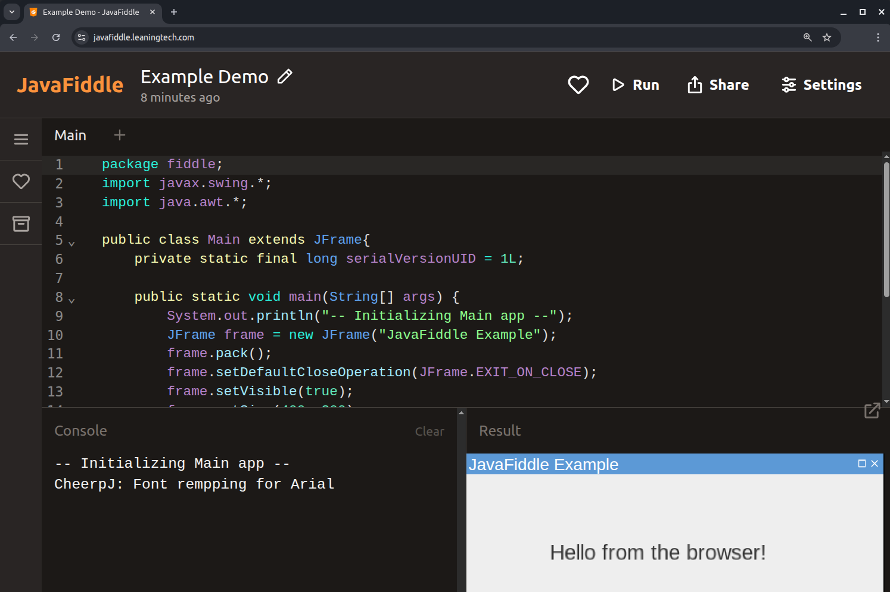
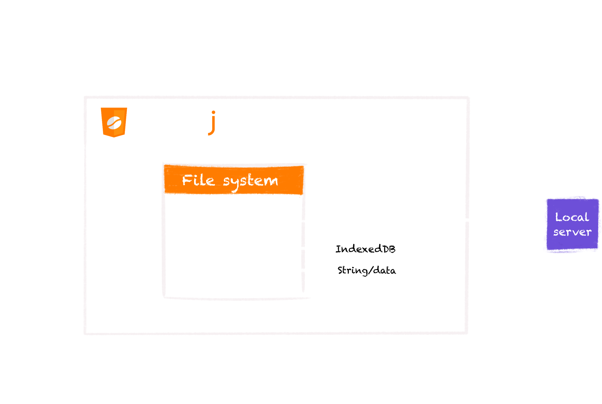

import { Icon } from "astro-icon/components";
import LinkButton from "@leaningtech/astro-theme/components/LinkButton.astro";
import { DISCORD_URL } from "@/consts.ts";

Today we are happy to announce CheerpJ 4.3, the latest release of CheerpJ, our WebAssembly-based Java Virtual Machine and OpenJDK distribution for the browser.

<div class="flex items-center gap-2 flex-wrap">
	<LinkButton
		type="primary"
		href="https://cheerpj.com/docs/getting-started"
		target="_blank"
		label="Get started"
		iconRight="mi:arrow-right"
	/>
	<LinkButton
		type="discord"
		href={DISCORD_URL}
		target="_blank"
		iconLeft="fa-brands:discord"
		label="Join us on Discord"
	/>
</div>

This release is focused on stability and improved user experience.
CheerpJ currently supports Java 8, 11 and 17, and has been extensively tested on a wide range of applications. From established enterprise Java EBS applications to small passion projects shared by our growing developer community. Support for Java 21 is also planned for later this year.

## What can CheerpJ do?

CheerpJ is a full WebAssembly-based JVM for the browser, and comes with a complete OpenJDK runtime, as well as a powerful emulation layer to provide file system access, general networking support and other OS-level features. It works fully client-side, via WebAssembly, JavaScript and HTML5 technologies, with no native Java installation required. CheerpJ not only allows you to run existing Java applications in modern browsers, but also makes the browser a viable target for modern Java development.

[Library Mode](https://cheerpj.com/docs/guides/library-mode) makes it possible to use Java libraries from JavaScript using a natural async/await-based approach, with direct access to Java methods, objects, and arrays. On top of this, native method support allows [Java native methods](https://cheerpj.com/docs/guides/implementing-native-methods) to be implemented directly in JavaScript, similar to how JNI works on standard Java platforms. Together, these features enable a level of interoperability between Java and the browser that was simply not possible before.

CheerpJ runs entirely client-side in the browser, no native Java installation or server-side backend is required. It can be integrated into any web page like any other JavaScript library, by simply adding a `<script>` tag. It requires no custom executable component, plugin, or server-side backend.

Running a Java application with CheerpJ is straightforward, requiring just three calls to the CheerpJ APIs (see our [Getting Started](https://cheerpj.com/docs/getting-started/Java-app) guide for a fully worked example).

```js
await cheerpjInit();
cheerpjCreateDisplay(800, 600);
await cheerpjRunJar("/app/my_application_archive.jar");
```

## From running legacy applications to building Java playgrounds in the browser

CheerpJ can run existing Java applications in the browser without any recompilation or modification to existing code. CheerpJ's Java runtime has been used extensively by clients all over the world to bring full-scale Swing applications back to modern browsers, translating Swing components into HTML elements running natively in the browser.

<figure class="w-full aspect-square">
	<div id="demodiv" class="w-full aspect-square relative">
		<iframe
			class="absolute w-full h-full focus:outline-none"
			src="https://cheerpj-example-swingset3.leaningtech.com/"
		></iframe>
		<div id="demofullscreen">
			<Icon
				class="absolute right-0 bottom-0 w-8 h-8 m-1 text-stone-900 cursor-pointer"
				name="fa-solid:expand"
			/>
			<Icon
				class="absolute right-0 bottom-0 w-8 h-8 m-1 text-stone-900 cursor-pointer animate-ping opacity-50"
				style="animation-duration: 3s; "
				name="fa-solid:expand"
			/>
		</div>
		<div id="demonormal" class="hidden">
			<Icon
				class="absolute right-0 bottom-0 w-8 h-8 m-1 text-stone-900 cursor-pointer"
				name="fa-solid:compress-arrows-alt"
			/>
		</div>
	</div>
	<figcaption class="text-center">
		A complex Swing application running live. Use the bottom-right control
		button to try it fullscreen.
	</figcaption>
</figure>

<script>{`
var demoDiv = document.getElementById("demodiv");
var demoFullscreen = document.getElementById("demofullscreen");
var demoNormal = document.getElementById("demonormal");
demoFullscreen.onclick = function()
{
	demoDiv.requestFullscreen();
};
demoNormal.onclick = function()
{
	document.exitFullscreen();
};
demoDiv.onfullscreenchange = function()
{
	if(document.fullscreenElement)
	{
		demoNormal.classList.remove("hidden");
		demoFullscreen.classList.add("hidden");
	}
	else
	{
		demoFullscreen.classList.remove("hidden");
		demoNormal.classList.add("hidden");
	}
};
`}</script>

Beyond running existing applications, CheerpJ can also be used to develop new Java applications for the web. The combination of Library Mode and native method support enables full interoperability between Java and JavaScript, making it possible to interact with the DOM and the broader JavaScript context from within Java itself. This also allows you to call Java methods directly from JavaScript and vice versa. A great example of what this makes possible is JavaFiddle, our in-house written Java playground for the browser.

The following snippet of code should give an idea about the capability of Library Mode. The code snippet is using the popular `iText` Java library to generate a PDF completely client-side in the browser.

```js
async function iTextExample() {
	await cheerpjInit();
	const lib = await cheerpjRunLibrary("/app/itextpdf-5.5.13.3.jar");
	try {
		const Document = await lib.com.itextpdf.text.Document;
		const Paragraph = await lib.com.itextpdf.text.Paragraph;
		const PdfWriter = await lib.com.itextpdf.text.pdf.PdfWriter;
		const FileOutputStream = await lib.java.io.FileOutputStream;
		const document = await new Document();
		const writer = await PdfWriter.getInstance(
			document,
			await new FileOutputStream("/files/HelloIText.pdf")
		);
		await document.open();
		await document.add(await new Paragraph("Hello World!"));
		await document.close();
		await writer.close();
		const blob = await cjFileBlob("/files/HelloIText.pdf");
		const url = URL.createObjectURL(blob);
		pdfDisplay.data = url;
	} catch (e) {
		const IOException = await lib.java.io.IOException;
		if (e instanceof IOException) console.log("I/O error");
		else console.log("Unknown error: " + (await e.getMessage()));
	}
}
```

CheerpJ is not only a powerful tool for reviving legacy applications in the browser, but also the ideal tool for building modern web applications in Java. A great example of this is JavaFiddle, our in-house Java playground for the browser, which makes it easy to write, run, and share Java code snippets directly in the browser. Try out the example from the screenshot below [here].

<figure class="w-full">
	
	<figcaption class="text-center">JavaFiddle Demo Screenshot</figcaption>
</figure>

Since the 4.2 release, we have also continued to improve the stability and performance of our Java 11 and 17 runtimes. Full graphical applications such as the FlatLaf Demo, a popular Look and Feel for Java, now run smoothly in the browser with CheerpJ.

<figure class="w-full aspect-square">
	<div id="demodivFlatLaf" class="w-full aspect-square relative">
		<iframe
			class="absolute w-full h-full focus:outline-none"
			src="https://leaningtech.github.io/cheerpj-example-flatlaf/"
		></iframe>
		<div id="demofullscreenFlatLaf">
			<Icon
				class="absolute right-0 bottom-0 w-8 h-8 m-1 text-stone-900 cursor-pointer"
				name="fa-solid:expand"
			/>
			<Icon
				class="absolute right-0 bottom-0 w-8 h-8 m-1 text-stone-900 cursor-pointer animate-ping opacity-50"
				style="animation-duration: 3s; "
				name="fa-solid:expand"
			/>
		</div>
		<div id="demonormalFlatLaf" class="hidden">
			<Icon
				class="absolute right-0 bottom-0 w-8 h-8 m-1 text-stone-900 cursor-pointer"
				name="fa-solid:compress-arrows-alt"
			/>
		</div>
	</div>
	<figcaption class="text-center">
		FlatLaf Look and Feel demo running in the browser with CheerpJ
	</figcaption>
</figure>

<script>{`
var demoDivFlatLaf = document.getElementById("demodivFlatLaf");
var demoFullscreenFlatLaf = document.getElementById("demofullscreenFlatLaf");
var demoNormalFlatLaf = document.getElementById("demonormalFlatLaf");
demoFullscreenFlatLaf.onclick = function()
{
	demoDivFlatLaf.requestFullscreen();
};
demoNormalFlatLaf.onclick = function()
{
	document.exitFullscreen();
};
demoDivFlatLaf.onfullscreenchange = function()
{
	if(document.fullscreenElement)
	{
		demoNormalFlatLaf.classList.remove("hidden");
		demoFullscreenFlatLaf.classList.add("hidden");
	}
	else
	{
		demoFullscreenFlatLaf.classList.remove("hidden");
		demoNormalFlatLaf.classList.add("hidden");
	}
};
`}</script>

## Virtualized Filesystem and improved support for file interactions

Unlike native applications, web applications running in the browser cannot access the local filesystem directly, due to the browser's sandboxed environment. To allow Java applications to interact with files as they would natively, CheerpJ provides a virtual UNIX-style filesystem with multiple mounting points, each serving a specific purpose:

<div style="padding-left: 40px">
	**/app/** — Read-only access to files served from your web server **/files/**
	— Persistent read/write storage for Java, backed by IndexedDB **/str/** — A
	transient mount for passing data from JavaScript to Java
</div>

Whenever a Java application triggers a file operation, it is forwarded to the virtual filesystem, allowing the application to run fully within the browser without any native file system access. The /files/ mounting point also makes use of IndexedDB, a low-level browser API for storing structured data, which is what makes persistent, client-side read/write storage possible without a server-side component.



In this release, we have also made it significantly easier to interact with the virtual filesystem directly from within a running Java application, without requiring any additional JavaScript code.

Any decorated Java window now features a upload new icon in its title bar, allowing users to select a local file and import it directly into the virtual filesystem. On the export side, we are introducing a dedicated virtual `downloads/` directory within `/files/`. Any file saved to this directory will be automatically downloaded to the user's local machine, making exporting files straightforward.

We hope these additions make file interactions feel more natural for both developers and end users alike. For more information, check out our dedicated filesystem documentation.

## Improved Mobile Support

Native Java applications have no built-in touch support, as AWT and Swing components are designed around mouse input. Since CheerpJ makes Java applications accessible in the browser, they can now also be used on smartphones and tablets. This introduces a new set of challenges around how touch input maps to mouse-driven behaviour.

A good example of this are native Java Swing menus. On desktop, you can activate menu items by simply moving the mouse over them once a menu is open. On mobile, there is no equivalent of this hover behaviour when using a touchscreen.

To address this, we have added support for long-press gestures, which are interpreted as mouse hover events. This allows users to navigate mouse-driven Java UI components on mobile in a way that feels natural and consistent with desktop behaviour.

We have also made general improvements to pointer and touch event handling, resulting in smoother and more reliable interactions across mobile devices overall.

## Demo: Unmodified Minecraft in the browser

<video controls autoplay loop muted playsinline>
	<source src="./browsercraft4.mp4" type="video/mp4" />
</video>

[Browsercraft](https://browsercraft.cheerpj.com/), our web-based "embedding" of a historical Java version of Minecraft, continues to serve as one of our most demanding stress tests for CheerpJ. Unlike other approaches you may have seen, Browsercraft is not based on decompilation or reverse engineering. The original client.jar is fetched directly from Mojang's servers and runs completely unmodified in the browser. If you haven't tried it yet, it remains one of the best showcases of what CheerpJ is capable of.

## What’s next for CheerpJ

CheerpJ 4.3 has been a release focused on stability and user experience, but there is much more to come. With CheerpJ 5.0 on the horizon, we are working towards bringing full support for modern Java to the browser. We believe WebAssembly will make Java a first-class programming language for the web. Stay tuned for further updates.

## Licensing

CheerpJ is commercial software, free to use for FOSS projects, personal projects, and one-person companies. For small businesses and enterprises, straightforward and affordable licensing options are available.

Enterprise licensing and support are available, with significant discounts for non-profit and educational institutions. For more information see Licensing.

## Try it out and join the community

CheerpJ is extensively documented, ranging from basic tutorials to the detailed API reference. Have a look at our developer documentation for more information and to get you started.

<div class="flex items-center gap-2 flex-wrap">
	<LinkButton
		type="primary"
		href="https://cheerpj.com/docs/getting-started"
		target="_blank"
		label="Get started"
		iconRight="mi:arrow-right"
	/>
</div>

For questions, discussion, and support, join us on Discord. It’s an active community where both Leaning Technologies developers and experienced users are on hand to help. It is also the perfect place to share and showcase interesting CheerpJ use cases.

[here]: https://javafiddle.leaningtech.com/#N4IgLglmA2CmIC4QgDQgK4AcAmBDMs2iIATAAwkBsAtGQCzUCMArACosInOcDMAdAE4SJAFqoQAMwhwAzogDaoTPgAWxALK4IAOz4ArXADdc4gMYB7bQSvFlpgNa4A5rAAEU7NjgBuADraIAFtMcwAnMFcDYwAPPhkAdx0nPgAqPwDgsIio3D5ceLBU9P9MdAAjaAhTV1NoXBkZV00dV1ho62xGgCkAMVDcQNhgf1dR10xQiGMCVxkwfCr3HVxoV2hLJ1nYSZWANW2ZCEsAVQBJABFXAF5XRgAZdLHXf18wUorFuYXqw3MIbFcgS02gAFABlMCTbROeQAXVcuFCThkAEpXMNtE8nmCAJ5zWCBPjmdCFCY6GCg3wgajUVynAKQFYQABeSSawIRmEwrhpVJRxTAr16-UG7hFbhu2lg8VcwoGsBBVK6RlwPX+XjcAFFogNMHA+QLXhJxXw7PYQfyXoKwMb5XFYGBzrAJLh0NAwABhdYyWAAeUw2wWlhBcsGfE1AA1TqwAPq+gByMY9d19YM1lu0ryNJp9YF2EEOFQVkPQsAzWZtOYdYJZCroZDIKFc5DI5ettrDubuuBxxLAIO0bug5cxWNGXW7ZVgqzqU9Wkulssn08VIAAEtP1mLzIFXGAVG4yqFzPEfaEAIQGkZjta4Of2sA9Sz9qUyp9WVcAQR20CpTffhQAAp3J+pzxk25AohmN63veuYAELEtonQggAHI2riUBhPANk2OHQTeHawHknggrO05tgAvv41HaCAlGwpRQA
