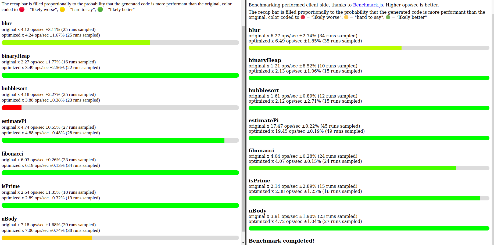
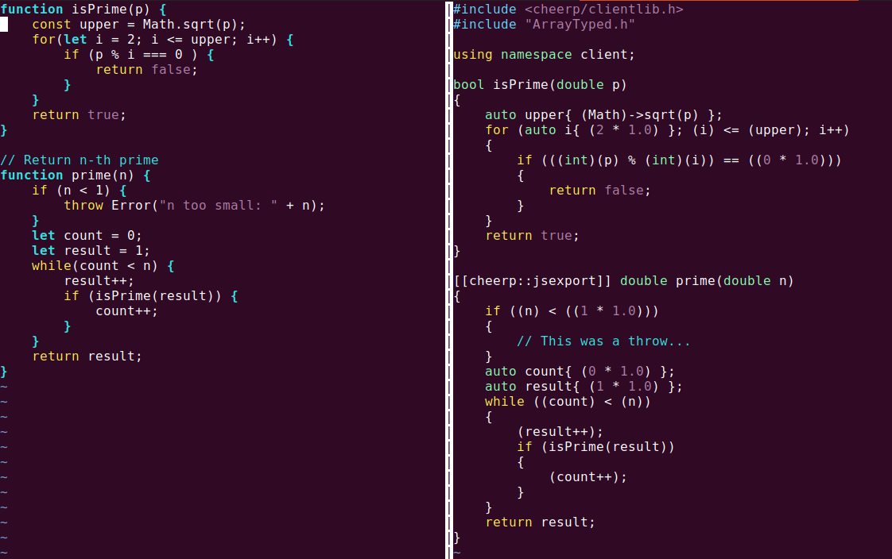
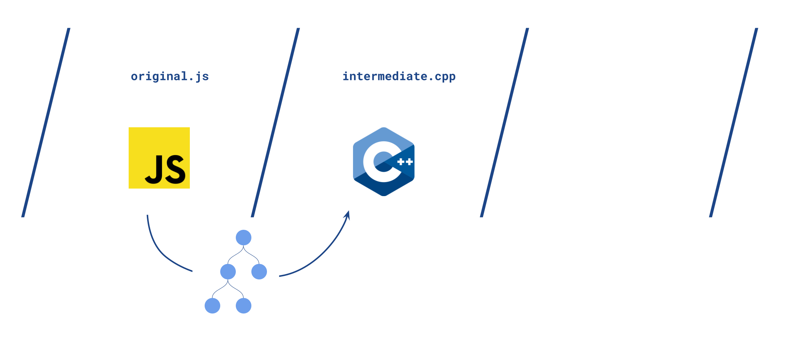
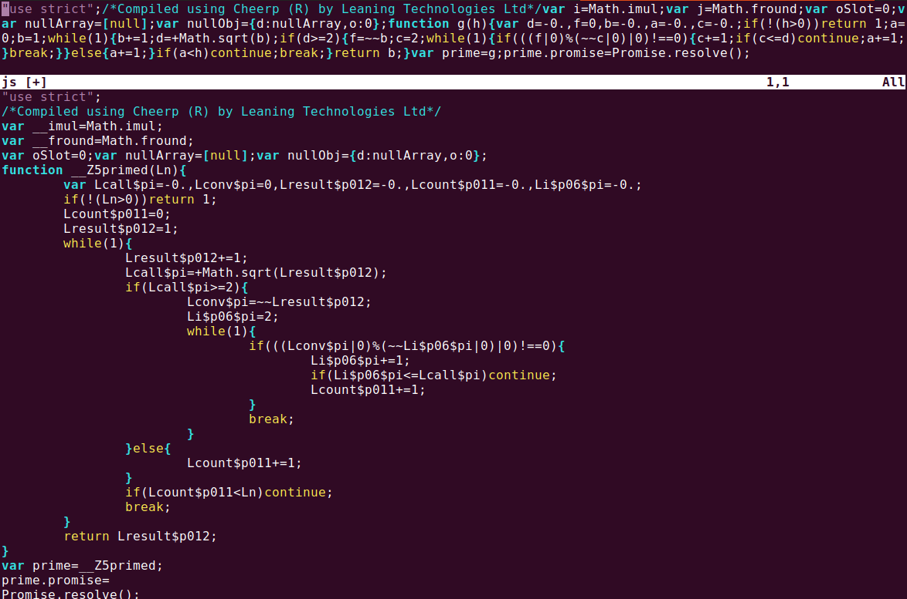

Carlo, a Leaning Technologies compiler engineer, has tried something bold.

Coming up with a JavaScript to JavaScript optimizing compiler.

Optimize for what metric? Performance of code execution (eg. how long does it take to calculate the n-th prime number).

He got started after reading “[Is WebAssembly magic performance pixie dust?](https://surma.dev/things/js-to-asc/index.html)”, an article by [Surma](https://surma.dev/), a Google Developer Advocate. It takes 3 JavaScript programs and follows the process of coming up with a faster WebAssembly version (passing via AssemblyScript).

He tried something similar, but targeting directly JavaScript instead of WebAssembly.

### Rules of the game:

1. Take some arbitrary JavaScript benchmarks
2. Come up with a JavaScript-only equivalent version that’s more performant
3. Do it in a mostly automated way
4. Adding type annotation is the only source modification allowed

TLDR: He mostly managed to succeed! Go to https://carlopi.github.io/js-opt-benchmark/ to run the benchmarks on your own device/browser of choice.

### So how did he do it?

#### Scoping

How to go on solving such a challenge? Is this even possible at all?

JavaScript engines (V8 / SpiderMonkey / JavaScriptCore) perform plenty of smart and powerful optimizations but have to strike a balance since more complex optimizations would incur unacceptable compilation latency (compilation and execution are both happening on your browser).

We just have to find a way to perform these more complex optimizations ahead of time.

Here is the plan: transform JavaScript code into [LLVM](https://github.com/llvm/llvm-project) [Intermediate Representation](https://llvm.org/docs/LangRef.html), let LLVM optimize the IR, and code-generate JavaScript.

One of the main problems of this is that LLVM IR and JavaScript have quite different memory models: “raw” linear memory in one case versus independent objects (and pointers where you can’t do arithmetic).

This affects all 3 stages: JavaScript -> IR, IR -> optimized IR, optimized IR -> optimized JavaScript in different ways.

## Presentations

Now we have some JavaScript code, and we want to feed it into Cheerp. From there the compiler will take care of applying all LLVM optimization passes (and enforcing that the additional invariants will not be broken) and generating JavaScript for us.

Now to get this process started, we need to process JavaScript code and output either Cheerp compatible LLVM IR or directly C++ code (conformant with Cheerp’s model).

I took what seemed the faster to prototype path: compiling JS to C++.

## JavaScript → C++

Now the problem I was left with looked like this: how to generate C++ code that has the same semantics of a given JavaScript program?

I researched a bit what tools were available for parsing JavaScript into an [Abstract Syntax Tree](https://en.wikipedia.org/wiki/Abstract_syntax_tree), found that [TypeScript](https://www.typescriptlang.org/) has an easy to hack demo on how to build a [linter on their AST](https://github.com/Microsoft/TypeScript/wiki/Using-the-Compiler-API#traversing-the-ast-with-a-little-linter). It was the perfect starting point.

TypeScript is a superset of JavaScript that allows one to add type information to parameters / returns / variables, and it has to be compiled to JavaScript to be run by engines.

(Note, one of TypeScript explicit [non-goals](https://github.com/microsoft/TypeScript/wiki/TypeScript-Design-Goals#non-goals) is optimizing the resulting code, so the TypeScript Compiler is mostly busy checking that no forbidden operations are done, using the type information whenever provided)

### TypeScript AST

TypeScript AST has currently 300+ kinds of nodes. Like PlusToken, AsteriskEqualsToken, Identifier, IfStatement, and many more. Here the complete list: [typescript.d.ts](https://github.com/microsoft/TypeScript/blob/master/lib/typescript.d.ts#L341).

Given that I had access to the AST already parsed, I began implementing a recursive visit of every node of Abstract Syntax Tree, implementing one by one every node I encountered.

I kept adding implementations to this visitor as long as it was required to run a few benchmarks.

I did run into some problems, not every JavaScript construct maps as naturally as “IfStatement” into a C++ program, so I discarded benchmarks that required functionality that seemed too lengthy to implement or slightly modified the source code to use a different (but equivalent) pattern.

I then iterated a few times, currently I implemented around 100 kinds of nodes, and the JavaScript to C++ tool will fail documenting which nodes have yet to be implemented to be able to parse a given program.

I also took another shortcut, I will require parameters and returns values to have a type assigned explicitly. This simplifies the project a lot, allowing also more optimizations to be made.

How does this intermediate C++ code look like?

It’s basically all there, taking advantages of 2 Cheerp’s features:

- **namespace client** capability to map external JavaScript classes and functions by just forward declaring them (already provided by the Cheerp’s provided headers files: [link](https://github.com/leaningtech/cheerp-utils/blob/ece76d65b746384ca0848c5b1a9b8bf66b5744ec/include/client/clientlib.h))
- [**JSExport**](https://medium.com/leaningtech/jsexport-cpp-in-the-browser-made-easy-710b2982046e) tagging to export the given classes or functions

## C++ → JavaScript

Now we just have to run Cheerp on it.

/opt/cheerp/bin/clang++ intermediate.cpp -o optmized.js -O3 -target cheerp

Cheerp is a based on clang/LLVM, so it will basically parse the C++ code into an Intermediate Representation; run various [optimization passes](https://github.com/leaningtech/cheerp-compiler/blob/6c187efc516e4db40b5a2d917d12250100bd41ef/llvm/include/llvm/InitializePasses.h#L63), (basically IR -> IR transformations) both at the translation unit level and at link time; and generate a JavaScript file that will then have equivalent semantics to the original source code.

Compressed and non-compressed output

One thing to note is that the non-readable version ends up being roughly as big as the original (minimized) code. This comes from two factors:

1. we are not shipping our own standard library but we are relying on the language functionalities
2. Cheerp generates quite compact code

JavaScript to C++ to optimized JavaScript, thanks to AST visitor and Cheerp

## Micro Benchmark Time

Benchmarks are hard to get right, and benchmarks on micro programs have their own additional set of limitations. Read for example the disclaimer in the central part of [Surma’s article](https://surma.dev/things/js-to-asc/index.html) or [“Why measure toy benchmark programs?”](https://benchmarksgame-team.pages.debian.net/benchmarksgame/why-measure-toy-benchmark-programs.html).

I run this toy compiler of mine on this programs:

1. algorithmic blurring of an image
2. implementation of a [BinaryHeap data structure](https://en.wikipedia.org/wiki/Binary_heap) (= push objects in, pop always the most valuable item from the heap)
3. bubble sort
4. computation of the n-th prime number
5. computation of n-th Fibonacci number
6. Monte Carlo estimate of Pi
7. N-body simulation

The first 3 benchmarks were the subjects of Surma’s article. The fourth one has been proposed by Franziska Hinkelmann in her talk “[Speed, Speed, Speed: JavaScript vs C++ vs WebAssembly](https://www.youtube.com/watch?v=aC_QLLilwso)” ([repo](https://github.com/fhinkel/javascript-vs-native-addon-prime-numbers/blob/d1252e6af5ab7a84151e45ad9d76206aafe9c077/primes.js)). [nBody](https://benchmarksgame-team.pages.debian.net/benchmarksgame/description/nbody.html#nbody) is part of the [Computer Language Benchmark Game](https://benchmarksgame-team.pages.debian.net/benchmarksgame/index.html), and the Fibonacci and Pi are a standard of sort for math computations (on integers or floating point).

I would like again to stress that these programs are not relevant nor representative of general JavaScript programs. But that’s fine, since what I am interested is showing that there is room for a JavaScript -> JavaScript optimizing compiler, and attach some numbers to the claim.

## Results

I put up a bare-bones web page where you can test those 7 benchmarks on your own device + browser (and thus JavaScript engine) of choice: [https://carlopi.github.io/js-opt-benchmark/](https://carlopi.github.io/js-opt-benchmark/).

While there is huge variability (some benchmarks are only faster on certain engines and more or less equivalent in others), some benchmarks show significant performance boosts (eg. 1.8x speedup across many devices / engines combinations). Especially isPrime and BinaryHeap show consistent improvements that I trust have to do with actual optimization being done.

There are a few notes to be made here:

- This numbers are only lower bound on what’s doable with such a tool. There are many optimizations (eg. integers everywere!) that were out of scope.
- The point of choosing these benchmarks is taking JavaScript already written to minimize execution time, so any performance extracted on top of that is much more significant.
- JavaScript code that wasn’t as optimal as this would possibly benefit much more from a compilation step.

## The end?

We did it.

We started from JavaScript programs. We added type information. We compiled them to C++ leveraging the Cheerp’s capabilities. We then compiled that to faster JavaScript.

The ideal workflow for such an optimizer would be mostly automated, with the only step requiring domain knowledge being adding type information.

The actual process I iterated to add a new benchmark/test looked like this:

1. run the TypeScript JavaScript to C++ tool
2. if there are type errors (like: “original.ts (12,34): Missing type in ParameterDeclaration”), add the relevant types, go back to 2
3. if there are missing AST node to be implemented, implement them, go back to 2
4. run Cheerp on the generated C++ file
5. if there are compilation errors, find the error in the AST visitor and fix it
6. tests + benchmark

It’s far from ideal and brittle, but worked enough to get this experiment up and running in a few hundreds lines of code.

## Comparisons

These are some related projects:

### V8 / SpiderMonkey / JavaScriptCode

These are engines that actually run JavaScript, basically compiling JavaScript into machine code. There is plenty of magic happening under the hood. Something that’s worth mentioning is that a lot of the magic depend on runtime knowledge of what’s actually being run (not even just types).

### Google’s Closure Compiler

The Closure Compiler is a JavaScript -> JavaScript compiler, that performs optimization mainly with the goal of reducing the dimension of a JavaScript file. The idea is that downloading a JavaScript file is a blocker to interactivity, so smaller code is the main metric (from my understanding). The Closure Compiler optimizations (eg. dead code elimination) will mainly help in that direction. Do read the [disclaimer](https://developers.google.com/closure/compiler/docs/api-tutorial3).

### TypeScript Compiler

[TypeScript](https://github.com/microsoft/TypeScript) augments the JavaScript language with the goal of providing the compiler more information to help catch errors during development. Another goal is helping in converting from modern JavaScript syntax to (more) widely supported JavaScript syntax.

Performance improvements are explicitly not in the scope of the TypeScript compiler.

### AssemblyScript

[AssemblyScript](https://www.assemblyscript.org/) is a TypeScript dialect that compiles to [Bynarien IR](https://github.com/WebAssembly/binaryen), and from there to WebAssembly. I got started after reading from [Surma’s article](https://surma.dev/things/js-to-asc/index.html) about how to optimize JavaScript performance (passing via AssemblyScript and then WebAssembly).

I know very little of AssemblyScript, but there is plenty of cool work being done, check it out.

### Cheerp

[Cheerp](https://github.com/leaningtech/cheerp-compiler) is a C++ to JavaScript / WebAssembly compiler. It does the heavy lifting for this exploration, bringing code generation and access to LLVM optimizations. Cheerp is also a basic building block for [CheerpJ](https://leaningtech.com/cheerpj/) (Java to HTML5) and CheerpX ([x86](https://leaningtech.com/cheerpx/) / [Flash](https://leaningtech.com/cheerpx-for-flash/) to HTML5).

### WebAssembly

This post is long enough, and probably I could fill many more paragraphs talking about what WebAssembly is or is not.

The short answer is that it’s not yet an ideal target for pure JavaScript compilation. I could have instructed Cheerp to compile to mixed JavaScript and Webassembly, but that would have meant additional complexity (both in generating C++ code *and* in the explanation) that I don’t believe would have added much value.

## The end!

This is it, I have shown how an optimizing compiler JavaScript -> JavaScript could perform and a path to build one. I think this is somehow an unique result, and I am quite proud of having pulled this off.

Thanks for following until here, I would be very curious to hear any feedback.

I am available on Twitter at [@carlop54002226](https://twitter.com/carlop54002226).
