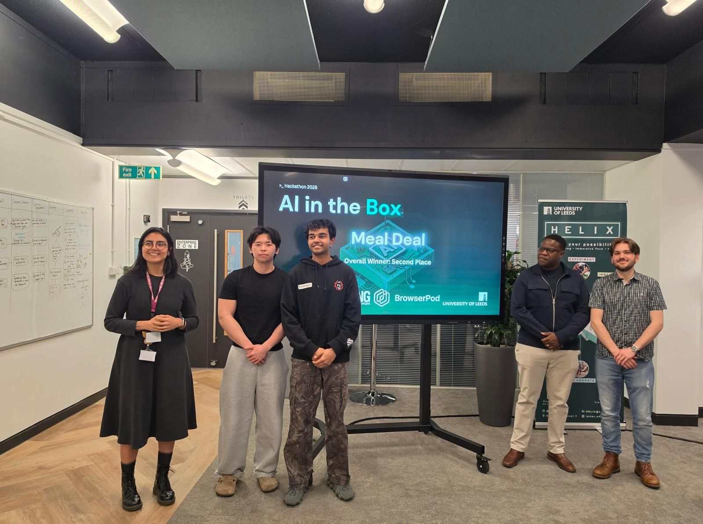

What happens when you challenge 60+ university students to build web applications powered entirely by secure, in-browser compute?

Last May 2026, Leaning Technologies and the Leeds Artificial Intelligence Society hosted **AI in the Box**—a 48-hour hackathon at Helix, University of Leeds, built around a single, compelling mission: every project had to run in a BrowserPod sandbox.

Over 60 students joined us at Helix, with 19 teams submitting projects covering developer tooling, healthcare, sustainability, software security, and multi-agent systems. With more than £2,000 in prizes available, competition was strong, but what stood out most was the sheer creativity and technical depth teams brought to the challenge.

## The Challenge

Every project submitted to AI in the Box had to use BrowserPod.

BrowserPod provides compute that runs inside the browser using WebAssembly, allowing applications to execute code within a secure browser sandbox. Rather than focusing on a specific framework or technology stack, the challenge encouraged participants to explore what becomes possible when code execution happens directly inside the browser sandbox.

Teams were free to approach the challenge in different ways:

- Some used AI tools such as Claude, ChatGPT, and GitHub Copilot to help build their projects before running the resulting applications inside BrowserPod.
- Others built AI-powered web applications where BrowserPod played a central role in the user experience.
- Many combined elements of both approaches above.

To help participants get started, we ran a BrowserPod workshop at the beginning of the event and provided technical support throughout the weekend. By the end of the hackathon, teams had produced projects ranging from developer-focused tooling to healthcare platforms and collaborative AI systems.

## What Teams Built

One of the most interesting aspects of the weekend was seeing how different teams interpreted the same challenge.

While every project was required to use BrowserPod, the resulting submissions varied significantly in both scope and approach. Some teams built platforms to inspect, understand, and verify code more effectively, while others tackled challenges in healthcare, sustainability, education, and multi-agent orchestration.

A recurring theme across these projects was **trust**. Several teams leveraged BrowserPod's sandboxed execution model to safely run AI-generated code, process sensitive health metrics locally, or orchestrate complex multi-agent negotiations in isolated environments. Rather than relying on traditional cloud execution, these projects showcased the power of keeping compute entirely client-side.

What stood out most was that no two teams used BrowserPod in quite the same way. Although everyone started with the same mission, the solutions that emerged reflected a wide range of technical interests, problem domains, and ideas. That diversity ultimately made judging one of the hardest parts of the weekend.

## Judging the Projects

Projects were evaluated by a panel consisting of:

- **Ana Gaby Reyna** (Leaning Technologies)
- **Mohammad Tasfiq** (Leeds Artificial Intelligence Society)
- **Martin Nyaga** (DRS Software)
- **Scott Langridge** (DRS Software)

Judges considered four key areas when evaluating projects: Creativity & Innovation, Technical Sophistication, Impact, and Design & User Experience.

The quality of submissions made selecting the winners far from straightforward.

## The Winners

The main prizes consisted of Amazon gift cards awarded per team:

- 🥇 **1st Place** - £1,000
- 🥈 **2nd Place** - £500
- 🥉 **3rd Place** - £250

In addition, category awards of £100 in BrowserPod compute tokens were available for category winning projects.

### 🥇 1st Place & Software Security Award - DevHub

- **Links:** [Live App](https://devhub-backend-2026.web.app/) | Repositories: [Frontend](https://github.com/IlanRV/Frontend) & [Backend](https://github.com/IlanRV/Backend)
- **Technical Highlight:** Cloned GitHub repositories directly into a client-side BrowserPod environment, executing code, displaying folder hierarchies, and running AI-powered static analysis locally inside the browser's secure sandbox.

DevHub tackled one of the most common challenges developers face when approaching an unfamiliar codebase: understanding it quickly.

The team built a platform that allows users to clone repositories directly into a BrowserPod environment and begin exploring them immediately. Once loaded, repositories can be analysed using AI-powered tooling that generates summaries, explains project structure, highlights key functions, and helps developers navigate large codebases more efficiently.

Its use of isolated BrowserPod environments for repository analysis and code execution also won them the **Software Security Award**, demonstrating how browser-based sandboxing can help developers inspect and work with unfamiliar codebases more safely.

### 🥈 2nd Place - ForkLab

- **Links:** [Live App](https://forklab-ai-hackathon.vercel.app/) | Repository: [Forklab-AI-hackathon](https://github.com/Jyozaa/Forklab-AI-hackathon)
- **Technical Highlight:** Utilized BrowserPod to spin up temporary, isolated execution environments on the fly, allowing AI agents to run generated code safely in the browser while developers observed, inspected streamed terminal output, and verified execution in real-time.

ForkLab explored a challenge that is becoming increasingly important as AI-assisted development tools continue to improve: how do developers trust AI-generated code?

The project introduced a sandboxed workspace where AI agents could generate and execute code while exposing the process to the user. Rather than treating AI-generated output as a black box, ForkLab allowed developers to observe execution, inspect results, and verify behaviour before adopting the generated code.

BrowserPod played a central role in the platform by providing isolated execution environments where generated code could run safely. The project demonstrated how browser-based sandboxing can help make AI-assisted development more transparent and trustworthy.

### 🥉 3rd Place - Concordia

- **Links:** Repository: [Concordia](https://github.com/0-robert/Concordia)
- **Technical Highlight:** Deployed BrowserPod instances to host and synchronize the local microservices responsible for managing the multi-agent negotiation logs and orchestration state, routing data to a Minecraft visualization layer.

Concordia was one of the most technically ambitious projects submitted during the weekend.

The project explored multi-agent coordination, using several AI agents that could negotiate tasks, divide responsibilities, and work together towards shared objectives. To make these interactions visible, the team used Minecraft as a visualisation layer, allowing observers to watch the coordination process unfold in real time.

Behind the scenes, BrowserPod was used to support the systems responsible for maintaining and synchronising the shared environment. The result was a project that combined technical depth with an engaging demonstration of collaborative AI behaviour.

### 🌱 Sustainability Award - Greencode

- **Links:** Repository: [Greencode](https://github.com/AbhishekVishwagna/Greencode)
- **Technical Highlight:** Ran lightweight carbon-intensity calculators and static analysis tools inside BrowserPod to profile execution patterns and reward developers for energy-conscious code choices.

Greencode focused on encouraging more sustainable software development practices.

The project introduced a green software credit system designed to reward developers for making energy-conscious decisions during development. By giving sustainability a measurable component, the team explored how environmental considerations could become a more visible part of software engineering workflows.

The judges recognised Greencode for addressing an increasingly important challenge with a practical and developer-focused approach.

### 🏥 Accessibility & Healthcare Award - VitalStream

- **Links:** Repository: [Real-Time-Patient-Monitoring-AI](https://github.com/Ella-Afonso/Real-Time-Patient-Monitoring-AI)
- **Technical Highlight:** Kept all patient data processing, trend simulations, and alerting logic entirely local within a secure BrowserPod sandbox, ensuring strict client-side data privacy for sensitive health metrics.

VitalStream was a healthcare monitoring platform designed to help clinicians monitor and respond to patient conditions more effectively.

The system simulated patient monitoring across multiple hospital wards, combining predictive trend analysis, AI-assisted triage, automated reporting, and alerting into a single dashboard. The project demonstrated how AI tools could support healthcare professionals in identifying and responding to potential issues earlier.

What made the BrowserPod integration particularly interesting was the team's focus on keeping application execution within a sandboxed environment, demonstrating how browser-based compute can support applications dealing with sensitive information.

## Working with Leeds AI Society

AI in the Box was delivered in collaboration with the Leeds Artificial Intelligence Society.

We'd also like to thank everyone who helped make the event possible, including the volunteers, mentors, judges, and participants who contributed their time throughout the weekend. We're grateful to Leeds AI Society for partnering with us on the event and helping create such a great environment for participants to build, learn, and experiment.

## Looking Ahead

AI in the Box was our first BrowserPod-focused hackathon, and the quality of submissions exceeded our expectations.

Most importantly, thank you to all the students who spent their weekend experimenting, building, debugging, and presenting their ideas. The creativity and technical execution on display made the event a huge success.

We're excited to continue supporting developers through future events and look forward to seeing what gets built next.

## Join Our Community

Interested in learning more about browser-based compute, sandboxing, and AI? We invite you to join the conversation:

- 💬 **Join our Discord:** Connect directly with the BrowserPod team and fellow developers on our [Discord server](https://discord.leaningtech.com/).
- 🤖 **Follow Leeds AI Society:** Stay up to date with the Leeds Artificial Intelligence Society by checking out their [website](https://leedsaisoc.co.uk/).
