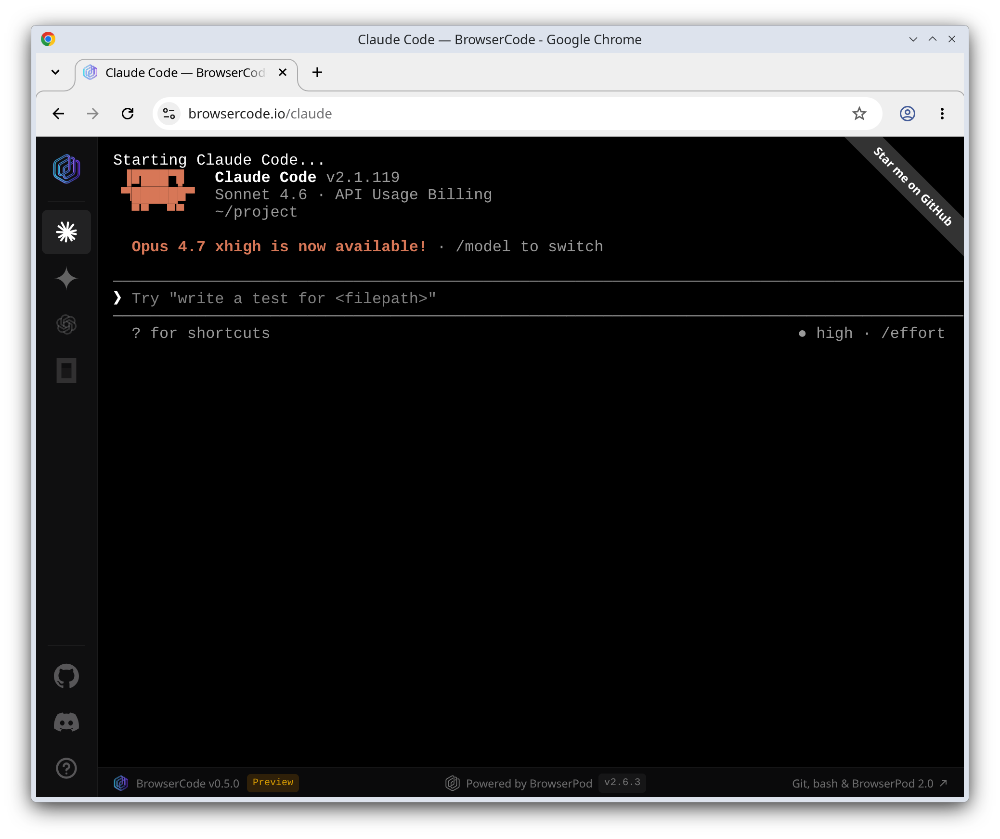
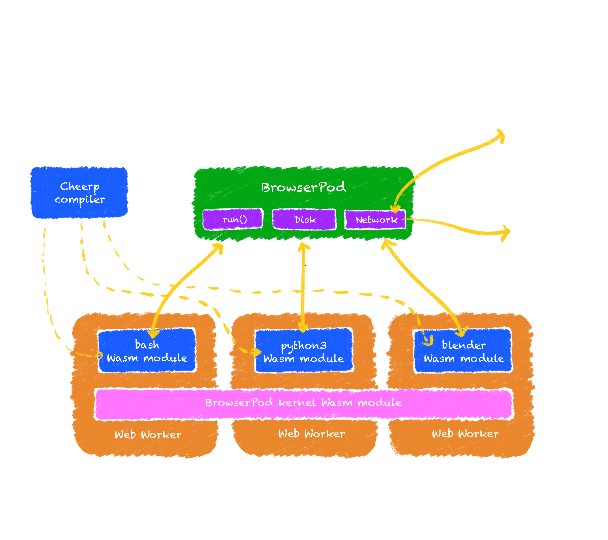
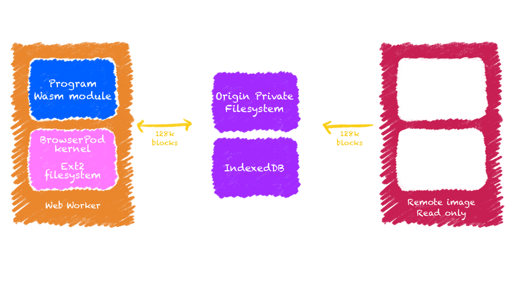
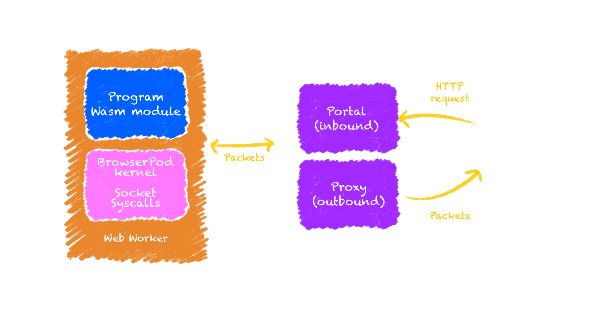
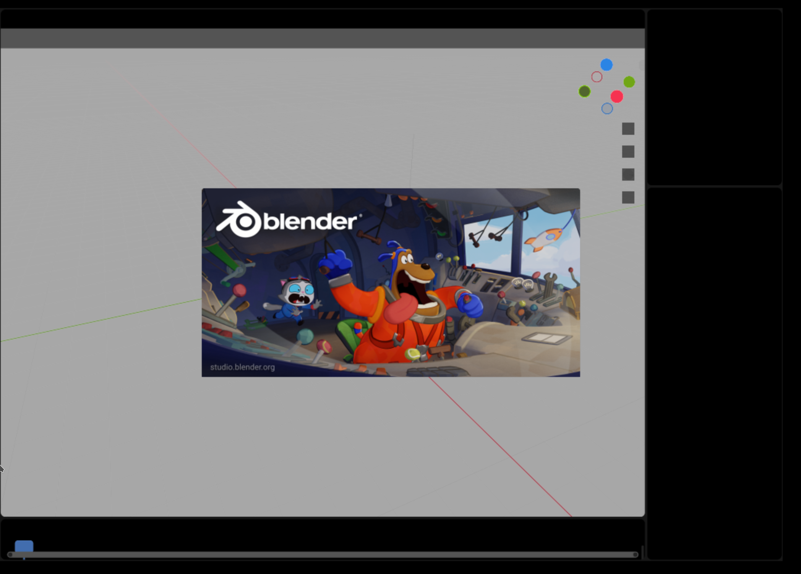

import BrowserPodProvider from "@leaningtech/astro-theme/components/blog/BrowserPodProvider.svelte";
import BrowserPodTerminal from "@leaningtech/astro-theme/components/blog/BrowserPodTerminal.svelte";
import BrowserPodDeepDiveDemo from "@leaningtech/astro-theme/components/blog/BrowserPodDeepDiveDemo.svelte";

<BrowserPodProvider
	client:only="svelte"
	ctxId="bp-2.0-demo"
	version="2.6.3"
	projectSource={{ type: "local", path: "bp-deep-dive" }}
	apiKey="bp1_2cc277b71b4bdd4850b0ee9bd117b2354e9be99d6a5b1cf3379f8135c84a8a5a"
/>

A few months ago we released [BrowserPod](https://browserpod.io): an in-browser sandbox, powered by WebAssembly, that runs completely client-side. Under the hood BrowserPod provides a _WebAssembly-native kernel,_ designed from scratch to run in the browser while being compatible with many applications originally designed for Linux.

This WebAssembly kernel is the critical feature that makes BrowserPod powerful enough to run real-world, full stack apps completely in the browser. This post is a deep-dive in the **architecture**, **capabilities** and **limitations** of our solution: we will start by highlighting the core functions of modern operating systems and how they translate in the BrowserPod design, we will then further delve into the implementation of the disk and networking subsystem, and finally discuss the current limitations and future plans.

<figure class="w-full">
	
	<figcaption class="text-center">
		[BrowserCode](https://browsercode.io) running Claude Code in the browser on
		top of BrowserPod
	</figcaption>
</figure>

With the release of [BrowserPod 2.0](https://labs.leaningtech.com/blog/browserpod-20), the tool is now stable enough to run _Claude Code_ and other agentic CLIs completely in the browser. Check out [BrowserCode](http://browsercode.io) to get a quick impression of what you could build with BrowserPod today.

## What does a _kernel_ actually do?

BrowserPod is heavily inspired by traditional kernels for native hardware, and we could identify many direct parallels between the WebAssembly execution model and the principles you’d typically find in an operating system textbook.

Low-level programming concepts are often misunderstood, especially by developers that are only exposed to more abstracted forms of coding. So, before getting into the details, it is a good idea to outline in broad strokes the main functions of an operating system kernel:

- **Accessing and abstracting the hardware**: The kernel contains specialized code, usually called _device drivers,_ that can speak the low-level protocol of the various hardware components of a device. The kernel also exposes an abstracted interface of the hardware to applications, making it possible to have multiple competing vendors and hardware designs without requiring each program to include device-specific logic.
- **Coordination of hardware access:** The kernel decides which application can access the hardware at any given time and, if it allows concurrent access, resolves any conflicts. As an example, consider a disk driver: only one (or a few) blocks of data can be read/written concurrently by the hardware. Any other request must be placed in a queue and served progressively. The kernel will decide the order in which requests will be processed,making sure no single application can hog all the resources. The kernel can also optimise the access patterns, for example by exploiting _locality_.
- **Application isolation:** A fundamental capability of modern operating systems is keeping applications isolated. This is normally achieved via a low-level CPU capability called “virtual memory”. The idea is that each application (or _process_ more accurately) can only ever access a subset of the physical memory and has no access at all to address in other _processes_. In operating systems parlance it is said that each process has its own independent _address space_. A useful side-effect of this property is that a crash in one process will not affect any other process on your system, at least ideally.
- **Concurrent execution:** If the hardware provides multiple CPUs, the kernel can also run more than one process concurrently. In practice, this means each CPU will be configured to access a different address space and multiple instruction flows will be executed independently in parallel. An interesting special case is _multi-threading_ where the CPUs will be configured to access the _same_ address space while maintaining an independent execution flow.

## A real kernel, but in a browser tab

<figure class="w-full">
	
	<figcaption class="text-center">
		Diagram of the BrowserPod architecture, illustrating the main components.
	</figcaption>
</figure>

Our objective for the BrowserPod kernel is to move beyond the current state of the art of WebAssembly as a compilation target. Compiling a single, potentially multithreaded, program and running it in the browser is relatively easy with existing toolchains.

What is missing, in our opinion, is a solution to run complete _software systems_: collections of programs that work together and interact to provide a complete user experience. Here’s a practical example: a simple `npm install && npm run dev` command actually represents a complex orchestration of multiple processes, including shells, node.js instances, install scripts, etc.

All these steps need to work on a coherent and persistent view of the files and other system resources, working together without stepping on each other's toes. As we started to lay out a viable architecture to solve this problem we noticed that we had to effectively build a _kernel_, and identified many parallels between our design and native kernels.

Each _program_ can be represented by a single WebAssembly binary, conceptually we could talk about `bash.wasm` or `blender.wasm`, but for consistency with the Linux convention we don’t apply any file extension to executable files.

_Concurrency_ is provided by Workers. One is spawned for every process or thread running in the system. In the case of a single-threaded application the WebAssembly module of the program will run isolated in a single worker, with its own WebAssembly memory. Multi-threaded processes will use multiple workers, all using the same shared memory.

All the applications are tied together by the BrowserPod WebAssembly kernel, which provides standard-named system calls such as `__syscall_readv`. Those syscalls can then be used from the WebAssembly apps by _importing_ them into the WebAssembly instance.

The BrowserPod kernel is itself a WebAssembly module, available in every Worker. The kernel is accessed concurrently by all the applications, providing a unified and coherent view of a single system.

- **Hardware access and coordination**: The “hardware” in this case is of course virtual, but works similarly to the native case. Applications are unmodified and expect to use abstract interfaces to system resources: files, sockets or devices such as `/dev/tty`. The BrowserPod kernel provides a Linux API-compatible syscall interface and makes sure that all the applications have orderly access to the shared state, such as the filesystem and the underlying virtual block devices.
- **Application isolation**: This feature is provided _automatically_ by the WebAssembly execution model. A WebAssembly module can only access the memory objects it creates or imports. Within the BrowserPod architecture all the WebAssembly processes use imported memories, which are supplied when they are started. Each instance of the same application (e.g. bash) receives a fresh memory object and can only interact with other processes via the BrowserPod kernel. When a new _thread_ is started it will use the existing memory object, allowing concurrent access to the same address space.
- **Concurrency:** Provided via Workers as described above. It should be noted that the model here assumes an unlimited number of virtual CPUs. Proper scheduling is delegated to the underlying operating system of the user device. In the future a different model based on multiplexing multiple WebAssembly threads on top of a single Worker could also be achieved using the _Promise Integration_ extension of WebAssembly.

The disk and network backends of BrowserPod are especially important for compatibility with a broad range of applications, and their architectures are worth discussing more in depth.

## Large disks for any device

<figure class="w-full">
	
	<figcaption class="text-center">Disk and filesystem architecture.</figcaption>
</figure>

BrowserPod is intended to be a generic WebAssembly-powered in-browser sandbox. As such it goes beyond running one single program and must allow users to execute a diverse set of applications, depending on their workload. As a practical example, we include git and all its utilities in the default disk images and they will be useful to many users, but we don’t want _every_ user to download all this additional code unconditionally.

Real-world code can also access _thousands_ of small files in normal operation. Npm-based applications are one of the worst offenders in this regard. Storing files as plain HTTP resources it’s possible but at this scale it becomes not practical due to the overhead of each request.

The [BrowserPod filesystem](https://browserpod.io/docs/understanding-browserpod/filesystem) implementation has been designed to carefully balance these aspects. These are the key ideas:

- **Filesystem:** POSIX-compatible, effectively an Ext2 implementation
- **Block-based streaming:** The disk image is not downloaded at startup, but progressively and on-demand.
- **Multiple backends:** Disk images can be stored on any HTTP server, with blocks being accessed using the standard HTTP byte ranges feature. For maximum performance a WebSocket service (hosted on Cloudflare), is used for our root images.
- **Local-only storage:** Blocks downloaded will be cached locally using either the _Origin Private File System (OPFS)_ API or _IndexedDB_. Any change to the blocks will only be saved locally, providing privacy-preserving persistence for BrowserPod sandboxes.

Ext2 could be considered a legacy choice, but it is simple to implement and works well at scale. We plan to add features over time to reach an Ext3 and eventually an Ext4 (i.e. modern) feature set.

## Solving networking, again

<figure class="w-full">
	
	<figcaption class="text-center">
		Networking architecture for inbound and outbound traffic.
	</figcaption>
</figure>

While the browser might intuitively seem a network-native platform, it’s not. There is no browser API to create raw TCP / UDP sockets in the browser, with the [Direct Socket API](https://developer.chrome.com/docs/iwa/direct-sockets) only available in _Isolated Web Apps_.

BrowserPod is in many ways a direct descendant of [WebVM](https://webvm.io), our x86 Debian virtual machine running in the browser. In the context of WebVM our solution was to [integrate with Tailscale](https://labs.leaningtech.com/blog/webvm-virtual-machine-with-networking-via-tailscale). This works, but it’s not a turnkey solution, and it requires the user to install the Tailscale client on their device.

For BrowserPod we wanted to go one step further and make sockets work out-of-the-box. Not only that, we also wanted to make it possible to access servers inside the sandbox from anywhere on the internet with zero setup. To explain, let’s start with the latter feature.

### Portals

BrowserPod introduces [_Portals_](https://browserpod.io/docs/understanding-browserpod/portals), automatically generated random domains that route HTTP traffic to services inside the sandbox. A portal URL will look like this:

<figure class="w-full">
	<pre class="not-prose overflow-x-auto rounded-lg bg-bg-800 p-4 text-center text-sm font-mono">
		<code class="break-all whitespace-pre-wrap">
			<span class="text-bg-500">https://</span>
			<span class="text-sky-600 dark:text-sky-400">
				rbmhk1uf4vrqwns4mizrouzchdbljdohkssfp0mktzrijk4algta
			</span>
			<span class="text-amber-600 dark:text-amber-400">-4000</span>
			<span class="text-bg-500">.browserportal.io</span>
			<span class="text-emerald-600 dark:text-emerald-400">
				/path/index.html
			</span>
		</code>
	</pre>
	<figcaption class="text-center">
		Example of a typical portal URL highlighting{" "}
		<span class="text-sky-600 dark:text-sky-400">the portal ID</span>,{" "}
		<span class="text-amber-600 dark:text-amber-400">the internal port</span>,
		and{" "}
		<span class="text-emerald-600 dark:text-emerald-400">the request path</span>
		.
	</figcaption>
</figure>

We adopted Cloudflare workers to support inbound traffic, so it was natural to use them as proxies for outbound traffic too, with a relatively straightforward implementation.

This solution works very well, but it introduces some thorny additional problems to prevent users from abusing our platform: it’s never a good idea to have an open proxy to the whole internet. To make BrowserPod “just work” while preventing abuse we settled on a tradeoff:

- **Limited whitelisted domains for the free tier**: BrowserPod can be used by anybody with a few clicks and offers a generous free tier, but free users can only access a few selected and whitelisted domains. The list is expected to change over time but at its core it offers access to npm package registries and major git hosting platforms such as GitHub.
- **Custom whitelisted domains for paying users**: Beyond the free tier, users can add custom additional domains to their whitelist, with an “unlimited” configuration also possible.

We think this is the best that we can responsibly provide at this time within the limitations of the browser platform. We will of course keep looking foralternatives that might appear or further standardization of the Direct Sockets API. Networking in this field is not yet fully solved, but we think that we are inching ever closer to the right solution on every iteration.

## Wasm binaries, but for Linux?

We’ve explained that BrowserPod binaries are WebAssembly modules and use Linux-compatible syscalls, but we have not described yet how they are generated.

For this project we have extended [Cheerp](https://cheerp.io): our existing C/C++ to WebAssembly and JavaScript compiler. We have introduced a new target: `wasm32-browserpod-linux` which directs the compiler to follow the right conventions. The idea is that this new Cheerp target can be used as a drop-in replacement for native compilers when building packages. The target naming follows established patterns for cross-compilers and can be recognized by most build-systems without custom patches.

Packages are built using Nix and we are continuously expanding what we include by default in our BrowserPod release. How we use Nix is an interesting topic in its own regard and we might publish an in-detail blog post about this in the future.

If you’ve heard about [WASI](https://wasi.dev/) you might wonder why we did not adopt it. Although nominally standard, WASI is paradoxically both overcomplicated in its design and too limited in scope to serve as an alternative for the Linux API. There have been attempts at expanding the feature set with [WASIX](https://wasix.org/), but we believe adopting the Linux syscalls verbatim to be simpler and more effective.

Cheerp is FOSS and support for the `wasm32-browserpod-linux` target is available in public [nightly builds](https://launchpad.net/~leaningtech-dev/+archive/ubuntu/cheerp-nightly-ppa). If you're curious to see this in action please keep reading for a step-by-step tutorial.

## Right, but what can I do with this?

The first version of BrowserPod was released in February 2026, but the platform is already very powerful. As of today you can run node, python, bash, git and many other Linux command line utilities in the sandbox.

We have prepared a few demos to showcase how the capabilities of BrowserPod can be applied to a few concrete scenarios, but the potential use cases are much, much broader than what we can show here.

### Learning Python in the browser

Thanks to BrowserPod it's possible to create platforms to learn programming languages in the browser, without any cloud computational resources. As an example of this idea the following demo will run a few simple operations on user input. When the users stops the loop the Python executable will start again as a REPL, to demonstrate that BrowserPod can run multiple instances of the same application.

```python
import sys
import subprocess

while True:
    name = input("\nWhat's your name? ")

    words = name.split()

    print("\nHello,", name)
    print("Uppercase:", name.upper())
    print("Reversed:", name[::-1])
    print("Word count:", len(words))

    initials = "".join(word[0].upper() for word in words)
    print("Initials:", initials)

    again = input("\nRun again? (y/n) ").lower().strip()

    if again != "y":
        print("\nLaunching python REPL...")
        break

subprocess.run([sys.executable])
```

<BrowserPodDeepDiveDemo
	client:only="svelte"
	ctxId="bp-2.0-demo"
	terminalTabs={[
		{
			id: "python-demo",
			label: "Terminal",
			steps: [{ command: "python3", args: ["python/hello.py"] }],
		},
	]}
	description="Python running in the browser"
	height="22rem"
/>

Now, there are other options to run Python in the browser, but BrowserPod can do much, much more.

### Explore git repos from Web apps

BrowserPod ships with git and can reach major hosting platforms such as GitHub from the sandbox. The demo shows how git workflows can be run in the browser using BrowserPod. A shell script drives the demo loop, but you could also use the [BrowserPod API](https://browserpod.io/docs/reference/BrowserPod/run) to control each step directly from JavaScript.

An important thing to note is that this is not based on some custom implementation of the git protocol. BrowserPod is running the official git tools, compiled to WebAssembly.

First a repository is cloned, you can either supply a public GitHub repository URL or use the default [browserpod-meta](https://github.com/leaningtech/browserpod-meta) repo. After cloning the script will use `git show -p` to print the latest commit in patch format.

You can run the loop again if you wish, or exit the loop to drop into an interactive shell to keep experimenting with the cloned repository.

```bash
#!/bin/bash

DEFAULT_REPO="https://github.com/leaningtech/browserpod-meta"

while true; do
	read -r -p $'\nGitHub repository URL (Enter for default): ' repo_url
	if [ -z "$repo_url" ]; then
		repo_url="$DEFAULT_REPO"
	fi

	echo "Selected repository: $repo_url"

	rm -rf repository
	if ! git clone "$repo_url" repository; then
		echo "Clone failed. Try another URL."
		continue
	fi

	pushd .
	cd repository
	git show -p
	popd

	read -r -p $'\nRun again? (y/n) ' again

	if [ "$again" != "y" ] && [ "$again" != "Y" ]; then
		echo ""
		echo "Launching bash..."
		break
	fi
done

exec bash
```

<BrowserPodDeepDiveDemo
	client:only="svelte"
	ctxId="bp-2.0-demo"
	terminalTabs={[
		{
			id: "git-demo",
			label: "Terminal",
			steps: [{ command: "bash", args: ["git/explore-repo.sh"] }],
		},
	]}
	description="Git workflow in the browser"
	height="22rem"
/>

### Full-stack node applications in the browser

BrowserPod also ships with Node.js and you can run full-stack applications in the browser: install dependencies, start a dev server, and expose it through a [Portal](https://browserpod.io/docs/understanding-browserpod/portals) for live previews.

The demo below runs a minimal Express.js app. Click play to run `npm install` and `npm run dev`. Once the server is listening, the preview panel will automatically load the Portal URL.

<BrowserPodDeepDiveDemo
	client:only="svelte"
	ctxId="bp-2.0-demo"
	showPreview={true}
	previewPort={4000}
	autoStart={false}
	height="52.5rem"
	terminalTabs={[
		{
			id: "express-demo",
			label: "Terminal",
			cwd: "/home/user/express",
			steps: [
				{ command: "npm", args: ["install"] },
				{ command: "npm", args: ["run", "dev"] },
			],
		},
	]}
	description="Express.js with a live Portal preview"
/>

This is only one example. The [BrowserPod console](https://console.browserpod.io) includes ready-made playgrounds for many popular Node.js frameworks: Express.js, Next.js, Nuxt, React, Svelte and more.

## Current limitations and future directions

As powerful as BrowserPod is, there are currently some significant limitations that are worth discussing. Good news though: we believe that we will be able to implement solutions for most of them in the medium term.

- **Source code is required**: Our C/C++ compiler (Cheerp) can compile many applications and libraries that target Linux with little to no modification. We also expect the amount of required changes to shrink over time. This implies that in the a very broad set of packages could be compiled to run on BrowserPod, potentially reaching the same level of completeness as your average Linux distribution. The tradeoff here is that access to the source code is required. First-party proprietary applications can be compiled as well, but third-party binaries are currently unsupported. We plan to bridge this gap by integrating BrowserPod with our x86-to-WebAssembly virtualization engine, called [CheerpX](https://cheerpx.io). CheerpX is the engine that powers [WebVM](https://webvm.io), and it has been tested at scale over the last several years. While native WebAssembly binaries can be expected to run at almost native speed, some amount of slowdown is to be expected when virtualizing x86. This said we think the current performance of CheerpX will be sufficient for many practical use cases.
- **JIT engines require special treatment**: Compiling from C/C++ works perfectly for static code, but does not solve the issue of code generated at runtime by Just-In-Time (JIT) compilers. This is especially important for JavaScript and N[ode.js](http://node.js) support. The build of [Node.js](http://Node.js) that we provide has been modified to run JavaScript payloads on the underlying browser JavaScript engine and can achieve native-like performance. An interesting idea that we are considering is extending V8, the JavaScript engine used by [Node.js](http://Node.js), to target WebAssembly directly.
- **Lack of paging for WebAssembly binaries**: Large, complex applications will compile to large WebAssembly modules. A high quality toolchain can minimize the size, but we know that the output size is a real constraint for the adoption of WebAssembly as the distribution medium for larger apps. We believe a solution can be built on top of WebAssembly as it currently is, and we are currently looking for a partner to test our ideas on a real world large codebase.
- **Graphics and 3D**: Compiling command line tools for the BrowserPod target is (more or less) a solved problem. Graphical applications bring yet another level of complexity, with the major issue being support for accelerated 3D graphics API expected by desktop apps: Desktop OpenGL and Vulkan. The Web platform offers WebGL and WebGPU, but neither are immediately compatible. We have several ideas on how to solve this problem, but the solution won’t be ready for a few more months.

<figure class="w-full">
	
	<figcaption class="text-center">
		[Blender](https://www.blender.org/features) booting in BrowserPod. Rendering
		is glitchy since there is no support yet for desktop OpenGL.
	</figcaption>
</figure>

Overall, we think BrowserPod has almost unbounded potential. Achieving a comprehensive solution for graphics and 3D will make it possible to realize full-desktop experiences in the browser at native speed. On the other hand integration with CheerpX will make it possible to download arbitrary containers from DockerHub and run them fully client-side while exposing internet-visible services. It will take some time to achieve all these objectives, but the right building blocks are either in place or being engineered right now.

## Building for the `wasm32-browserpod-linux` target

We'd like to share a quick primer on how to build your own WebAssembly binaries for the BrowserPod target. If this does not sound immediately interesting for you feel free to skip this section.

To use the `wasm32-browserpod-linux` target you'll find need to get a nightly build of the Cheerp compiler. Nightly builds are currently distributed for Debian/Ubuntu and similar distro using a [PPA](https://launchpad.net/~leaningtech-dev/+archive/ubuntu/cheerp-nightly-ppa).

```bash
sudo add-apt-repository ppa:leaningtech-dev/cheerp-nightly-ppa
sudo apt-get update
sudo apt-get install cheerp-core
```

For this example we'll use a slightly elaborate "hello world", designed to showcase how BrowserPod can run multiple different programs in the same sandbox.

```c
#include <stdio.h>
#include <unistd.h>

int main(void) {
    // Canonical hello world
    printf("Hello, world!\n");

    // Replace this process with a shell running the pipeline
    char *argv[] = {
        "sh",
        "-c",
        "echo Hello World | sha1sum | tr /a-z/ /A-Z/",
        NULL
    };

    char *envp[] = {
        "PATH=/bin",
        NULL
    };

    execve("/bin/sh", argv, envp);
    return 1;
}
```

Save this file as `hello.c` and compile it with the following command:

```bash
/opt/cheerp/bin/clang -target wasm32-browserpod-linux -o hello hello.c
```

Now you need to setup a simple web application using BrowserPod, you can do so quicky using the following command:

```bash
npm create browserpod-quickstart@latest browserpod-hello --template bash
```

// TODO: POPULATE THE WASM BINARY

## Give it a try

To get an immediate feeling for what BrowserPod can do, check out [BrowserCode](https://browsercode.io/claude): Claude Code running unmodified in the browser on top of BrowserPod.

You can log-in with your Anthropic credentials and run the full agentic loop in your browser. All data stay local.

BrowserCode is [FOSS](https://github.com/leaningtech/browsercode) and it’s intended to be a reference integration of BrowserPod designed to showcase its capabilities. You can fork the repo to build your version, or something else entirely, by logging on the [BrowserPod console](https://github.com/leaningtech/browsercode).

You will be able to test BrowserPod on multiple ready-made sandboxes running many popular Node.js frameworks (Express.js, Next.js, Nuxt, React, Svelte, …), command line tools, and build your first integration using the BrowserPod API.

All BrowserPod accounts have access to a generous free tier to experiment with the technology. If you plan to use BrowserPod for your Open Source project or startup, please [get in touch](https://browserpod.io/pricing/). We offer extended token grants especially for these cases.

If you have questions, or are interested in further details, you can find the whole developer team (myself included) on our [Discord](https://discord.leaningtech.com). Beside the BrowserPod developers you’ll also find an active and welcoming community that has recently passed the 2000 users milestone.

We are looking forward to seeing what you’ll build with BrowserPod.
