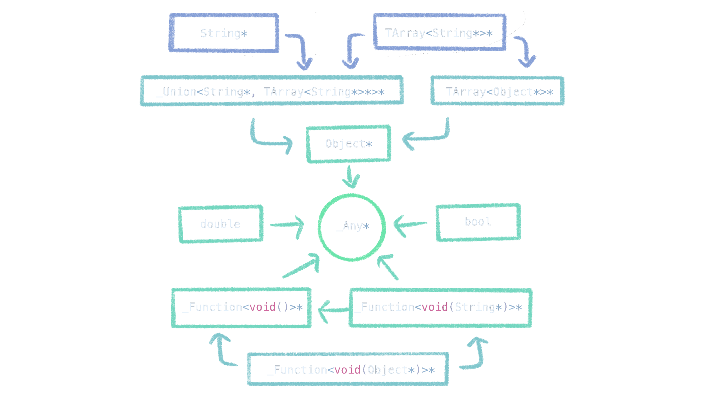

import ThreeDemo from "@leaningtech/cheerp-ts-three-demo";

The latest nightly build of Cheerp includes powerful integration with
[TypeScript](https://www.typescriptlang.org/), a popular programming language
that adds _static type checking_ to JavaScript, allowing us to seamlessly share
type information across C++ and TypeScript.

We have also completely overhauled [Clientlib](#clientlib), including improved
type information, support for `co_await` on JavaScript `Promise` objects, and
much more.

There is lots to see, so let's jump right in!

Alternatively, you can [skip to the end for a cool demo](#threejs-demo), or
take a look at the [Clientlib migration guide](/cheerp/clientlib-migration).

## Integration with `jsexport`

Cheerp makes it easy to expose C++ functions to JavaScript with the
`[[cheerp::jsexport]]` attribute.

```cpp title="square.cpp"
[[cheerp::jsexport]]
double square(double x) {
    return x * x;
}
```

```js title="index.js"
import initSquare from "./square.js";
const { square } = await initSquare();
console.log(square(2)); // prints "4"
```

### Type checking

Note that the `square` function in C++ takes an argument of type `double`.
When calling this function from C++, the compiler would ensure at compile time
that we cannot pass, for example, a string to the `square` function. Let's see
what happens when we try to pass in a string from JavaScript.

```js title="index.js"
console.log(square("hello")); // prints "NaN"
```

JavaScript will not give us any sort of error; we only get `NaN`. Mistakes like
this can be easy to make, and it would be nice if we had a compiler to warn us
about such mistakes.

This is where TypeScript comes in. When given a declaration for the `square`
function, the TypeScript compiler can, at compile time, check that the
arguments have the correct types. Let's start by manually writing a declaration
file.

```ts title="square.d.ts"
export default function (): Promise<{
	square(x: number): number;
}>;
```

Now, when we compile our code, the TypeScript compiler will yell at us if we
try to pass a string to the `square` function.

```
index.ts:3:20 - error TS2345: Argument of type 'string' is not assignable to parameter of type 'number'.

3 console.log(square("hello"));
                     ~~~~~~~
```

It's worth noting that these declaration files are beneficial for integration
with IDEs as well. The error above could be displayed inside of the editor,
and the type information is used to improve autocomplete, among other things.

### Automation

Writing these declaration files by hand is a pain. We already wrote down the
types once in C++, why do we have to repeat the same function signature again?

As you have probably guessed, Cheerp can now automatically generate TypeScript
declaration files for us. Simply add the `-cheerp-make-dts` flag.

```sh "-cheerp-make-dts"
/opt/cheerp/bin/clang++ square.cpp \
    -o square.js \
    -target cheerp \
    -cheerp-make-module=es6 \
    -cheerp-make-dts
```

After running this command, you should find a `square.d.ts` with content
similar to what we wrote before.

### Complex types

The TypeScript declaration generator is also able to translate your own
`[[cheerp::jsexport]]` types and types from Clientlib.

<details>
<summary>Example</summary>
```cpp title="complex.cpp"
class [[cheerp::jsexport]] Vec2 {
    double x, y;
public:
    Vec2(double x, double y) : x(x), y(y) {}
    double length() const { return std::sqrt(x * x + y * y); }
};

[[cheerp::jsexport]]
client::TArray<client::String*>* keys(client::Object\* object) {
return client::Object::keys(object);
}

````

```ts title="complex.d.ts"
export interface Vec2 {
        length(): number;
        delete(): void;
}
type __Options = { buffer: ArrayBuffer } | { absPath: String | URL };
export default function(options?: __Options): Promise<{
        Vec2: {
                new(x: number, y: number): Vec2;
        };
        keys(_object: object): Array<string>;
}>;
````

</details>

### Internals


The implementation of this is actually fairly simple.

To generate the JavaScript bindings, for each `[[cheerp::jsexport]]`
declaration, some metadata is added to the module during compilation. The
metadata nodes store all `[[cheerp::jsexport]]` function signatures, classes,
and members of those classes. When generating the JavaScript output, we look
for these metadata nodes and use them to generate the JavaScript bindings.

For the generation of TypeScript declarations, we can reuse the same metadata
nodes. It is as simple as iterating over the metadata and outputting everything
to a file in the right format.

One extra complexity with the TypeScript output is that we need to be able to
inspect the types of function arguments and return values. The function
signatures themselves only offer a mangled name for these types, and it's up to
us to demangle and parse this name ourselves. For example, when we encounter
`_ZN6client6TArrayIPNS_6StringEEE`, we must first parse this string to see that
it's a `client::TArray` of `client::String` pointers, and then we must
translate this into the appropriate TypeScript type, `Array<string>`.

We also have some special handling for Clientlib types. The `client` namespace
is removed, `TArray` becomes just `Array`, `_Union` becomes a TypeScript union,
`_Function` becomes a TypeScript function, and primitive types are translated
to their TypeScript equivalent.

## From TypeScript to C++ headers

Calling into C++ from JavaScript is only one side of the story. We must also be
able to call JavaScript functions from C++. You may need to call your own
JavaScript code, call functions of the DOM, or maybe even a third party
library.

Let's start by writing a function in JavaScript that we want to call from C++.

```js title="library.js"
function square(x) {
	return x * x;
}
```

With Cheerp, by declaring this function in C++ in the `client` namespace, we
will then be able to call it from C++.

```cpp title="main.cpp"
namespace [[cheerp::genericjs]] client {
    double square(double x);
}

[[cheerp::genericjs]]
int main() {
    std::cout << client::square(2) << std::endl; // prints "4"
}
```

```sh
/opt/cheerp/bin/clang++ main.cpp -o main.js
cat library.js main.js | node
```

### Automation

Writing these declarations by hand has the same issues as before. It's tedious.
We have to repeat each declaration, once in JavaScript, and once to declare it
in C++. And if we ever change the signature of `square`, we need to update the
C++ signature as well.

To solve this, we have developed
[ts2cpp](https://github.com/leaningtech/ts2cpp). ts2cpp is a program that
converts TypeScript declaration files into C++ headers that can be used with
Cheerp.

Ideally we would write the `square` function in TypeScript. But let's start
by seeing how far we can get without touching the `square` function. Let's
pretend it's part of some third party library that we cannot modify.

We can use the TypeScript compiler to generate a declaration file from
JavaScript code.

```sh
npx tsc library.js --allowJs --declaration --emitDeclarationOnly
```

```ts title="library.d.ts"
declare function square(x: any): number;
```

Not bad! While it wasn't able to figure out the type of the function argument,
it still got the correct return type.

Now we can use ts2cpp to generate a C++ header.

```sh
ts2cpp library.d.ts -o library.h --pretty
```

```cpp file="library.h"
#ifndef LIBRARY_H
#define LIBRARY_H
#include <cheerp/clientlib.h>
namespace [[cheerp::genericjs]] client {
    double square(const _Any& x);
}
#endif
```

The `_Any` type is from Clientlib, which I will explain in detail later.

We can call the `square` function just as we did before. But instead of needing
to declare it manually, we can include the automatically generated `library.h`.

```cpp title="main.cpp" ins={4} del={1-3}
namespace [[cheerp::genericjs]] client {
    double square(double x);
}
#include "library.h"

[[cheerp::genericjs]]
int main() {
    std::cout << client::square(2) << std::endl; // prints "4"
}
```

### Improving type information

One obvious flaw is that we are missing some type information about the
`square` function. We know that this function should only accept a numeric
argument, but it was typed as `_Any`. This means we can also pass, for example,
a string.

```cpp
client::square(new client::String("hello")) // returns "NaN"
```

We could manually edit the generated declaration file...

```ts title="library.d.ts" ins={2} del={1}
declare function square(x: any): number;
declare function square(x: number): number;
```

While this might work as a last resort, this is not any better than manually
writing the whole declaration in C++ to begin with. And if we ever need to
regenerate the declaration file, our changes will be lost.

A better solution is to add this type information directly to the `square`
function, with TypeScript!

```ts title="library.ts" ": number"
function square(x: number) {
	return x * x;
}
```

We then use the TypeScript compiler to generate both the JavaScript library,
and also another declaration file. But this time, the declaration file will
have the correct argument type for the `square` function.

```sh
npx tsc library.ts --declaration
```

After regenerating `library.h` again with ts2cpp, we now get an error when we
try to pass a string to the square function.

```
main.cpp:7:30: error: cannot initialize a parameter of type 'double' with an rvalue of type 'client::String *'
        std::cout << client::square(new client::String("hello")) << std::endl;
                                    ^~~~~~~~~~~~~~~~~~~~~~~~~~~
./library.h:5:23: note: passing argument to parameter 'x' here
        double square(double x);
                             ^
```

### Internals

ts2cpp is a TypeScript declaration to C++ header transpiler. Its structure
consists of multiple passes. Some passes transform the code into another
representation, while other passes only modify it.

The first step is to actually parse the TypeScript declaration files into a
TypeScript AST. For this, we use the
[TypeScript Compiler API](https://github.com/Microsoft/TypeScript/wiki/Using-the-Compiler-API).

One problem with the AST is that the declaration of a single entity can be
split up and scattered around in multiple different AST nodes, or even
different files.

```ts
declare interface Foo {
	hello(): void;
}

declare interface Foo {
	world(): void;
}
```

The above code only declares a single interface, but its body is scattered
across multiple AST nodes. The second step, which I called "discovery" is to
walk the entire AST and group together nodes that belong to the same entity.

The third step is to convert the grouped TypeScript AST into a C++ AST. To name
just a few of the conversions that take place in this step:

- Any TypeScript entity that can be directly translated into a C++ entity is
  translated as such.
- TypeScript types are converted to C++ types.
- Functions with optional arguments are converted to overloaded functions.
- Fields of a variable or members of a namespace with the same name as a class
  are converted to static members of the class.
- Generic constraints are converted to `std::enable_if` templates and
  `static_assert`s.

And much more.

Some transformations can only be applied after the whole C++ AST has been
generated. The next few steps examine and modify the C++ AST.

- Duplicate declarations are removed.
- Some base classes are made virtual to deal with diamond inheritance.
- `using` declarations are added for common methods from base classes that
  would otherwise be shadowed by methods in the derived class.

The final step is to actually write the C++ declarations to a file.

It is important to make sure that declarations are written in the correct
order. We cannot simply forward declare every class at the start. Some
declarations depend on the complete declaration of another class. For example,
base classes must be complete, they cannot only be forward declared. This is
further complicated by the possibility of nested classes, which have
restrictions on where they can be forward declared or completed.

ts2cpp is a complex program with many components. To explain how it all works
in detail here would make this post even longer than it already is. For more
information about the internals of ts2cpp, such as how it handles dependency
resolution, you can have a look at its extensively commented
[source code](https://github.com/leaningtech/ts2cpp).

## Clientlib

An important feature of Cheerp is that it allows you to seamlessly call
JavaScript and browser APIs from C++ code. This functionality is provided by a
collection of headers that we call Clientlib. The headers contain a long list
of declarations for these APIs, with some extra utility functions to help with
common tasks such as type casting and string conversions.

```cpp
#include <cheerp/clientlib.h>

[[cheerp::genericjs]]
int main() {
    client::console.log("Hello, World!");
}
```

With the introduction of ts2cpp, we are doing a complete overhaul of Clientlib.
With improved type information, addition of modern APIs, integration with C++
coroutines, and more. Except for a few utility functions, the new headers are
generated automatically by ts2cpp from the TypeScript declarations for these
APIs.

Let's take a look at some of the awesome things you can do with the new
Clientlib, and also discuss some of the problems we had to solve to make it all
work.

### Coroutine support

This is perhaps my favorite feature of the new Clientlib. You can now use
`co_await` in functions that return a `client::Promise`. You can also use
`co_await` to await `client::Promise` instances.

```cpp
#include <cheerp/coroutine.h>
#include <cheerp/client.h>

using namespace client;

[[cheerp::genericjs]]
[[cheerp::jsexport]]
Promise<String*>* randomUUID() {
    Response* response = co_await *fetch("https://httpbin.org/uuid");
    Object* json = (co_await *response->Body::json())->cast();
    co_return (*json)["uuid"]->cast();
}
```

### Pointers as template parameters

For template classes, such as `client::TArray`, if the type parameter is a
class type, it must now be a pointer. With the old Clientlib, you would write
`TArray<String>*`. This must now be `TArray<String*>*`.

This change is slightly controversial. There is a lot of existing code that
uses the old way of writing type parameters, which now has to be updated. One
could also argue that `TArray<String>*` looks cleaner than `TArray<String*>*`.

The main benefit of the new approach is that we can easily support
`TArray<double>`. To see why this is the case, let's write a template function
`pop`. `pop` removes and returns the last element in a `TArray<T>`.

```cpp
template<class T>
T* pop(client::TArray<T>* array) {
    // We can just call the pop method that already exists on `TArray`.
    return array->pop();
}
```

This is how you would have written `pop` for the old Clientlib. The template
argument `T` can be inferred from the type of the `array` argument. When
passing in a `TArray<String>`, `T` is `String`, and the function returns
`String*`. Awesome stuff.

Less awesome, though, is what happens when we pass in a `TArray<double>`. We
want `pop` to return `double`, _not_ `double*`. But when passing in a
`TArray<double>`, `T` is `double`, and the function returns `double*`.

We could work around this with some template magic, but that would also be very
ugly.

```cpp "FixTemplateType<T>"
FixTemplateType<T> pop(client::TArray<T>* array) {
```

If we require that arrays of strings are `TArray<String*>` instead of
`TArray<String>`. We can rewrite the `pop` function to just return `T`.

```cpp ins={3} del={2}
template<class T>
T* pop(client::TArray<T>* array) {
T pop(client::TArray<T>* array) {
    return array->pop();
}
```

Now, when passing in a `TArray<String*>`, the return type will be `String*`, as
expected. When passing in a `TArray<double>`, the return type will be `double`.

After some discussion, we decided that using pointers when the type argument is
a class type is an improvement over not using pointers, and we should make the
switch sooner rather than later.

### Virtual inheritance

Another interesting change is how we deal with
[diamond inheritance](https://en.wikipedia.org/wiki/Multiple_inheritance#The_diamond_problem).
For example, TypeScript defines the `Element` interface to inherit from
`Node`, `ChildNode` and `ParentNode`. `ChildNode` and `ParentNode` themselves
inherit from `Node`.

The old Clientlib did not support diamond inheritance. Base classes had to be
removed until there was no longer any diamond inheritance. As a result of this,
the `ChildNode` and `ParentNode` classes did not inherit from `Node`, were
missing many functions from the `Node` class, and could not be `static_cast`
to `Node`.

The new Clientlib solves this using virtual inheritance. This is still
zero-cost because all classes in the `client` namespace are compiled to opaque
references to JavaScript objects. There is one downside, while you _can_
`static_cast` from `ChildNode` to `Node`, you cannot `static_cast` from
`Node` to `ChildNode` when `Node` is a virtual base of `ChildNode`. This is
still an improvement over the old Clientlib, though, as before you could not
cast between `Node` and `ChildNode` at all.

### Type casting

To deal with the shortcomings of `static_cast`, client types now have an extra
`cast` method.

The first overload of `cast` takes as a type argument the type that we want to
cast to. The second overload does not take any type arguments, but returns an
intermediate object that implements a generic `operator T()`. The type of the
conversion operator can often be inferred, and does not need to be explicitly
specified in that case.

### Fancy types



#### The `_Any` type

This is a pretty simple improvement. Not all client types are objects.
Primitives, such as numbers and booleans, do not inherit from `Object`. It is
sometimes useful to say that a value can have _any_ type. What do we call the
type for such a value? TypeScript calls it `any`, we call it `_Any`.

#### The `_Union` type

`_Union` is a template type that can hold a value of any of the types listed in
its template arguments. Continuing with the TypeScript analogies,
`_Union<T...>` is similar to `T | ...` in TypeScript. For example, the third
argument to the `addEventListener` function can be a boolean, or an object of
type `AddEventListenerOptions`. To specify this, the function signature uses
the type `const _Union<bool, AddEventListenerOptions*>&`.

Union types solve another problem that might not be immediately obvious. To see
why, first let's discuss the alternative.

`Uint8Array` has a constructor that takes either an `ArrayBuffer*`, a
`SharedArrayBuffer*` or an `ArrayLike<double>*`. Instead of using a union type
in the constructor, we could instead generate 3 separate overloads.

```cpp
Uint8Array(ArrayBuffer* array);
Uint8Array(SharedArrayBuffer* array);
Uint8Array(ArrayLike<double>* array);
```

`Uint8Array` also has a `get_buffer` method. This method returns an
`ArrayBuffer*` or a `SharedArrayBuffer*`. We cannot use the same overload trick
with return types, so it must still return a union.

```cpp
_Union<ArrayBuffer*, SharedArrayBuffer*>* get_buffer();
```

Ideally, we should be able to directly pass the result of `get_buffer` to the
constructor of `Uint8Array`. This does not work with the overloads because each
individual signature is not compatible with the union type returned by
`get_buffer`.

```cpp
new Uint8Array(array->get_buffer()); // error
new Uint8Array(array->get_buffer()->cast()); // error: ambiguous
new Uint8Array(array->get_buffer()->cast<ArrayBuffer*>()); // ok
```

By instead using a const reference union type for the constructor, we _can_
directly pass the result of `get_buffer` to the constructor without the need
for any casts.

```cpp
Uint8Array(const _Union<ArrayBuffer*, SharedArrayBuffer*, ArrayLike<double>*>& array);
```

#### The `_Function` type

`_Function` is a type safe first-class function type that is used for passing
functions to higher order functions. The template argument to `_Function` is a
C-style function type that specifies the return value and arguments of the
function. `_Function` types can be constructed from raw function pointers and
from C++11 lambdas.

#### Type conversions

You will often find the `_Any`, `_Union`, and `_Function` types passed by const
reference. Passing by const reference allows these types to be implicitly
constructed from other compatible types. The rules for these conversions are
specified by the `cheerp::CanCast` helper template, which mostly mimics the
rules of TypeScript.

`_Any` can be constructed from any other type. `_Union` can be constructed from
any type that can be converted to any of the types in the union. `_Function`
can be constructed from other functions with a _covariant_ return type and an
equal or smaller number of _contravariant_ arguments.

## Three.js demo

With `ts2cpp`, we can generate C++ headers not only from our own TypeScript
declarations, but also from third party libraries!

Three.js is a 3D graphics library for JavaScript. TypeScript declarations for
Three.js are also available in a separate npm package.

Let's make a simple spinning cube to see how we can use Three.js in C++.

First, we need to generate a C++ header for the Three.js library.

```sh
ts2cpp $(find node_modules/\@types/three/src -type f) node_modules/\@types/webxr/index.d.ts --out three.h --namespace THREE
```

All of the business logic is implemented in C++.

```cpp
#include <cheerp/client.h>
#include "three.h"

using namespace client;
using namespace client::THREE;

[[cheerp::genericjs]]
[[cheerp::jsexport]]
void run(HTMLCanvasElement* element) {
    using BoxStandardMesh = Mesh<BoxGeometry*, MeshStandardMaterial*, Object3DEventMap*>;

    auto* rendererParameters = new WebGLRendererParameters();
    rendererParameters->set_canvas(element);
    auto* materialParameters = new MeshStandardMaterialParameters();
    materialParameters->set_color("white");

    auto* scene = new Scene();
    auto* renderer = new WebGLRenderer(rendererParameters);
    auto* camera = new PerspectiveCamera(75, element->get_clientWidth() / element->get_clientHeight(), 0.1, 1000);
    auto* cube = new BoxStandardMesh(new BoxGeometry(1, 1, 1), new MeshStandardMaterial(materialParameters));
    auto* light = new HemisphereLight("white", "black", 1.0);

    scene->add(cube, light);
    camera->get_position()->set_z(3);

    _Function<void(double)>* animate = new _Function<void(double)>([&]() {
        requestAnimationFrame(*animate);
        auto* rotation = cube->get_rotation();
        rotation->set_x(rotation->get_x() + 0.01);
        rotation->set_y(rotation->get_y() + 0.01);
        renderer->render(scene, camera);
    });

    requestAnimationFrame(*animate);
}
```

We compile this with Cheerp into an ES6 module.

```sh
/opt/cheerp/bin/clang++ main.cpp -o main.js -target cheerp -cheerp-make-module=es6
```

Now we just need some JavaScript glue to import Three.js and call the `run`
function...

```js
window.THREE = await import("three");
const { default: init } = await import("../lib/three-demo.js");
const { run } = await init();
run(canvas);
```

Et voilà. We have a spinning cube in C++.

<ThreeDemo client:only="svelte" />
