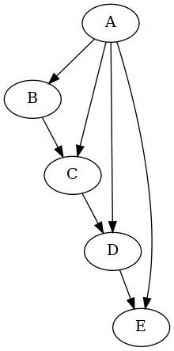
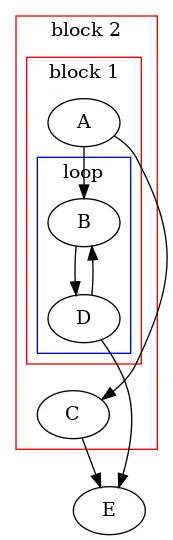
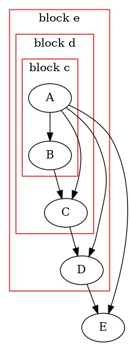
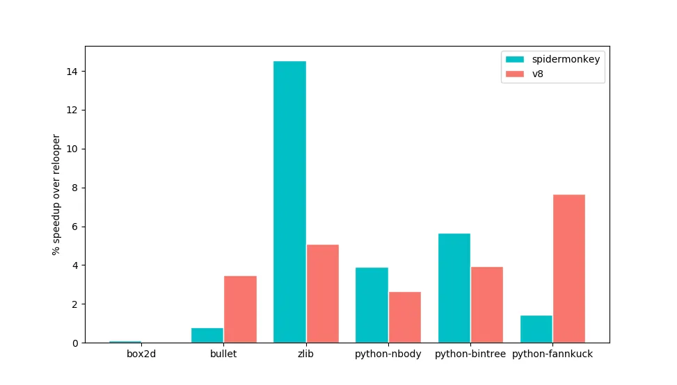

I work on [Cheerp](https://www.leaningtech.com/cheerp/), a C++ to JavaScript and WebAssembly compiler based on LLVM.

One of the challenges of compiling LLVM IR code to JavaScript and WebAssembly is the structured control flow problem: We have some code represented as a **control flow graph** (CFG), and we want to convert it into **structured control flow**.

A **CFG** is a directed graph with groups of consecutive non-branching instructions (basic blocks) as nodes, and branches as edges.

**Structured control flow** instead represents code as an ordered sequence of basic blocks and scoped control flow constructs (if/else, while/for, switch, break, continue, …). Notably, **goto** is not included.

## JavaScript vs WebAssembly control flow

From the point of view of this article, JavaScript’s and WebAssembly’s control flow constructs are equivalent.

[Despite some voices advocating for it](https://github.com/WebAssembly/design/issues/796), WebAssembly does not currently include any form of goto, and has control flow constructs equivalent to JavaScript’s, as you can see in the following summary table:


A few notes:

- if/else statements work exactly the same, nothing worth noting here
- `break` and `continue` are replaced in WebAssembly by a single instruction `br`(for _branch_). Depending on the enclosing scope it is referring to, `br` has either the semantic of `break` or the one of `continue` . While in JavaScript there is an optional _label_ argument, in WebAssembly there is a mandatory _depth_ argument, which indicates which enclosing scope the `br` instruction is referring to.
- `loop` instructions in WebAssembly are equivalent to an infinite `while(1)` loop in JavaScript, but with an implicit `break` at the end. Branch instructions targeting a `loop` jump to its beginning (acting like a `continue`).
- `block` instructions in WebAssembly are equivalent to a JavaScript `do..while(0)` loop. Branch instructions targeting a `block` jump to its end (acting like a `break` ).

I omitted the `switch` statement in JavaScript and the corresponding `br_table` instruction in WebAssembly for brevity because their correspondence is less straightforward and we don’t strictly need them (but they are nice to have performance-wise when a condition has more than 2 branches).

From now on I will use JavaScript in the examples because the syntax is more familiar to most people, but keep in mind that everything applies to WebAssembly as well.

## A universal but inefficient solution

According to the [structured program theorem](https://en.wikipedia.org/wiki/Structured_program_theorem), we only need a loop and a branching construct in order to solve the problem (so we don’t even need break or continue statements!), but at the cost of using an additional helper variable (we will call it _label_) that encodes the control flow state.

An easy way to get a solution is to build a big state machine that jumps on the right block with the help of a _label_ variable:


```js
let label = "a";
while (1) {
	switch (label) {
		case "a":
			A();
			if (A_to_B()) {
				label = "b";
			} else {
				label = "c";
			}
			break;
		case "b":
			B();
			label = "d";
			break;
		case "c":
			C();
			label = "e";
			break;
		case "d":
			D();
			if (D_to_B()) {
				label = "b";
			} else {
				label = "e";
			}
			break;
		case "e":
			E();
			break;
	}
}
```

This works, but it is terribly inefficient. Writing, reading and branching on the label adds overhead to the program execution. Even a modern JIT compiler will be unable to optimize the control flow between blocks. This state machine approach is far from an optimal solution.

In this simple example, we can easily find an optimal solution manually, with no extra variables:

```js
A();
if (A_to_B()) {
	while (1) {
		B();
		D();
		if (D_to_E()) {
			break;
		}
	}
} else {
	C();
}
E();
```

## Relooper, and why it is not good enough

In the specific context of LLVM-to-JavaScript/WebAssembly compilers, the first algorithm that solved the structured control flow problem was [Emscripten](https://emscripten.org/)’ s **Relooper**. Cheerp itself used Relooper before version 2.0, but we replaced it for reasons I am going to explain shortly.

Relooper is described in the original [Emscripten paper](https://github.com/kripken/emscripten/raw/master/docs/paper.pdf). It is very readable, so I recommend to check it out. In short, it is a greedy algorithm that tries to find some common patterns in the CFG, and falls back to our naive approach with the _label_ variable when it can’t match any pattern.

To its merits, Relooper served us well, and produces good quality code most of the time, but it is very easily tricked by more complex control flow into emitting unnecessary label assignments. Sometimes we found some code that was sub-optimally structured by Relooper, and even if we recognized why the heuristics fail, it is not always easy to come up with a patch to improve it. It is sometimes just impossible given the greedy nature of the algorithm.

Here is a very simple example that confuses Relooper (CFG on the left and source C++ code on the right):



```js
switch (A()) {
	case 0:
		B();
	case 1:
		C();
	case 2:
		D();
	default:
		E();
}
```

The resulting JavaScript produced with Relooper is:

```js
var label = 0;
switch (A()) {
	case 0: {
		B();
		label = 3;
		break;
	}
	case 1: {
		label = 3;
		break;
	}
	case 2: {
		label = 4;
		break;
	}
}
if (label === 3) {
	C();
	label = 4;
}
if (label === 4) {
	D();
}
E();
```

As you can see, Relooper is using the _label_ variable here, but it is quite obviously not needed, as you can see in this alternative manual solution:

```js
d: do {
	e: do {
		switch (A()) {
			case 0:
				B();
				break;
			case 1:
				break;
			case 2:
				break d;
			default:
				break e;
		}
		C();
	} while (0);
	D();
} while (0);
E();
```

If we keep adding cases to the switch, Relooper will add more and more _if_ statements checking on the label variable. In real code bases we found some generated code that uselessly sets, check and immediately resets the _label_ variable dozens of times. And to make this worse, these aberrations usually happen in places where the control flow is complex for performance reason, like the main loop of a zip compressor, a python interpreter, or a ray tracing engine.

Due to this and similar issues, we decided to get rid of Relooper and find a better algorithm.

## Looking for prior art

As it often turns out in computer science, something very similar to our problem was thoroughly investigated and solved back in the ’70s: at the time people were arguing about the use and misuse of **goto** statements in programs, and proposing alternative constructs less powerful but sufficient to convert programs using gotos into a structured control flow form.

A particularly interesting result for our problem is that as long as the CFG is **reducible**, we can convert it to a structured form consisting of loops, conditional branches , and multilevel continue and break statements (see [this paper](https://dl.acm.org/citation.cfm?doid=48014.48021) for an overview of this and similar results).

These are exactly the constructs that we have! And it is not a coincidence, since programming languages added constructs like multilevel break and continue statements specifically to get rid of arbitrary goto statements.

But what is a reducible CFG?

According to [Wikipedia](https://en.wikipedia.org/wiki/Control-flow_graph#Reducibility), a **reducible CFG** is one with edges that can be partitioned into two disjoint sets: **forward edges**, and **back edges**, such that:

- Forward edges form a directed acyclic graph (DAG) with all nodes reachable from the entry node.
- For all back edges (A, B), node B dominates node A.

In simpler words, **all loops need to be single entry**. Most C/C++ code produces a reducible CFG, so this result is very encouraging!

## The Stackifier algorithm

Putting aside irreducible CFG for a moment, how can we compile any reducible CFG into JavaScript without using the label variable?

We can leverage the definition of reducible CFG to build our algorithm:

- Since the forward edges form a DAG, we can sort the blocks in **topological ordering** (For every forward edge A-B, A comes before B in the ordering).
- We choose any topological ordering (in general, there are multiple valid ones), with the constraint that once a loop starts all the subsequent blocks must be dominated by the loop header, until all the loop blocks have appeared.
- We enclose each loop in a **loop scope** (a `while(1){/*...*/}` in JavaScript and a `loop...end` in WebAssembly). All the back edges become `continue` statements (possibly labeled in case of nested scopes).
- Now we are left with the forward edges. If the source and destination blocks are consecutive in the topological order, we don’t need to do anything.
- Otherwise, we need to place a **block scope** (a `do{/*...*/}while(0)` in JavaScript, and a `block...end` in WebAssembly), such that the destination block is just after the end of the scope. In principle we can put all the scope openings at the beginning of the function, but in practice JavaScript engines don’t like deeply nested scopes and throw an error beyond a certain limit (around 1000 for a script with just empty nested scopes, less in real code). We place the opening just outside of the outermost scope that closes between the `break` and the end of the scope.

Not all arbitrary placements of scopes are valid. We cannot intertwine two of them, only nest them:

```js
// NOT ALLOWED
while(1){
  do{
}
while(0);// OK
while(1){
  do{
  }while(0);
}
```

How do we know that our algorithm never produces intertwined scopes? Since we chose an ordering such that all the loops contain only blocks dominated by the loop header, by definition there can be no edge with the source outside of the loop and the destination inside (except when the destination is the loop header, which is fine), so we never need to put a block scope that ends in the middle of a loop but starts outside.

As an example, let’s take the Example CFG from the beginning, and process it with Stackifier:



```js
block2: do {
	do {
		A();
		if (A_to_C()) {
			break;
		}
		while (1) {
			B();
			D();
			if (D_to_B()) {
				continue;
			} else {
				break block2;
			}
		}
	} while (0);
	C();
} while (0);
E();
```

Let’s also see how Stackifier fares with the CFG that gave Relooper trouble:



```js
d: do {
	e: do {
		c: do {
			switch (A()) {
				case 0:
					break;
				case 1:
					break c;
				case 2:
					break d;
				default:
					break e;
			}
			B();
		} while (0);
		C();
	} while (0);
	D();
} while (0);
E();
```

As you can see, there is no extra label variable used here.

## Improving Stackifier: adding if/else nesting

One nice feature of Relooper is that the control flow that it produces is (most of the time) quite readable and compact.

As you can see even in the simple example above though, the basic version of Stackifier is not: basically it adds a block scope for every forward edge target that does not appear immediately after its predecessor, and control flow is achieved mostly with `break` and `continue` . Not exactly the kind of code a human would write. It is also bigger in size due to all the scopes that it needs to add.

Relooper achieves a more natural control flow structure by nesting some successor blocks inside the conditional branches at the end of the predecessor blocks.

To achieve the same, Cheerp’s version of Stackifier adds two steps to the basic algorithm:

- When we sort the blocks in topological ordering, we add an additional constraint on the particular order that we choose: after we add a block to the ordering we need to visit its successors; instead of visiting them in an arbitrary order, we first visit the successors that have the block as their only forward predecessor.
- Then, in the rendering phase, if a block has only one forward predecessor, we nest it directly inside the corresponding branching statement of the predecessor. All the blocks dominated by this block will also end up inside of the branching statement.

This does not result in intertwined scopes because no block inside the if/else statements is reachable from outside the statement itself (since we only nest subsequent blocks dominated by the first nested block).

To see the effect of this improvement, look at our usual Example CFG processed by this new version of Stackifier:


```js
A();
if (A_to_B()) {
	while (1) {
		B();
		D();
		if (D_to_B()) {
			continue;
		} else {
			break;
		}
	}
} else {
	C();
}
E();
```

As you can see, we managed to remove both of the enclosing block scopes. This saves some bytes, and also produces code that is more readable.

## Fix the irreducible control flow

In order to handle an irreducible CFG, we first need to somehow turn it into a reducible one.

In order to do that, we need to identify all the multiple-entry loops, and turn them into single-entry ones.

Identifying the multiple-entry loops is easy:

- We split the graph into [**Strongly Connected Components**](https://en.wikipedia.org/wiki/Strongly_connected_component) (SCCs), which are a group of nodes that can all reach each other. LLVM has a generic implementation of the algorithm for finding them.
- SCCs with more than one element are loops
- We identify all the loop headers, which are the nodes reachable from outside of the SCC
- If there is more than one, we have a multiple-entry loop

Once we have identified the loop and its headers, we have two options to fix the irreducible control flow: **block duplication** and **dispatcher block**.

**Block duplication** fixes the control flow by duplicating some blocks. It has the advantage of having no extra runtime cost. The big disadvantage though is that it can theoretically increase the code size exponentially. This means that it cannot be a universal solution.

The **dispatcher block** solution has the advantage of increasing the code size only linearly in the worst case, but at the cost of a small runtime penalty.

The idea is to create a new block (the Dispatcher), that will be the new unique header of the loop.

The Dispatcher has as predecessors the predecessors of all the header blocks, and as successors the header blocks themselves. It uses the helper label variable and a switch statement to direct the control flow into the right header. When code inside or outside of the loop wants to reach an header, it sets the label variable to the correct value and jumps to the Dispatcher.

This is similar to the “state machine” solution that we tried at the beginning, but limited only to the portion of control flow that is irreducible. All the control flow inside the loop which does not involve the header is left untouched.

The algorithm is applied recursively to the interior of the SCCs with more than one element (we consider all the nodes of the SCC and all the edges excluding the back edges).

In the following example, I highlighted the headers in green, the back edges in red, and the edges coming from outside in violet. The new Dispatch block and its edges are orange.

You can see that the edges that do not go directly to the headers are left untouched.


## Performance Improvements

By limiting the use of the _label_ variable, Stackifier produces better code than Relooper, but the actual performance gains for a whole program can vary widely, depending on if and where Relooper generated sub-optimal control flow.

Micro-benchmarks with simple control flow would see no difference, and ones specifically made to confuse Relooper would be artificially inflating the difference.

In order to have more realistic examples, I took the 3 biggest benchmarks of our test suite by size (zlib, box2d, and bullet) , and additionally I used an experimental internal build of the CPython interpreter and run 3 scripts from the [benchmarks game](https://benchmarksgame-team.pages.debian.net/benchmarksgame/) on it (n-body, binary-tree and fannkuch, chosen because they have no external dependencies). I ran the tests on Chrome (V8) and Firefox (SpiderMonkey).

These are the results (the y axis shows the relative speedup of Stackifier over Relooper in percentage):



The difference ranges from none at all for box2d, to 14% for zlib with SpiderMonkey (I am not sure why SpiderMonkey and V8 seem to be affected differently).

In real world codebases we saw performance gains of up to 8%.

## Acknowledgments

The Stackifier algorithm has been first implemented in the WebAssembly backend of [upstream LLVM](https://github.com/llvm/llvm-project/tree/master/llvm/lib/Target/WebAssembly). That implementation has been an important source of inspiration for Cheerp’s version (and its lack of documentation a source of motivation for writing this article). The if/else nesting strategy though is unique to Cheerp, as far as I know.
