WebAssembly in its current MVP form is shipped by all major browsers and is already capable of amazing things. This does not mean that its development has concluded: on the contrary, there are many post-MVP feature proposals at different stages of development.

One such [proposal](https://github.com/WebAssembly/reference-types/blob/master/proposals/reference-types/Overview.md) is about adding the so-called `anyref` / `externref` type (and related instructions) to the specification. But what is `anyref`, and why is it desirable to add it to WebAssembly?

## WebAssembly Anyref

The full proposal is explained in detail in [this repo](https://github.com/WebAssembly/reference-types), but the basic idea is to be able to represent opaque host references (JavaScript objects in the case of a Web Browser) from WebAssembly. Even with this proposal, these references can only be passed around via function arguments and return values, and stored and loaded in tables. Future proposals will expand what is possible to do, and eventually lead to full GC support in WebAssembly.

The current specifications of `anyref` are quite limiting, and in particular, they don’t allow to store these references in linear memory directly. They need to be stored in a table at an index, and then the index itself can be stored in linear memory. Doing this requires some runtime bookkeeping of tables, to “allocate” and “deallocate” slots and give out indices.

Integrating `anyref` support directly in languages like C/C++ and Rust (i.e. directly representing a DOM object as `anyref`) is not straightforward, and the current mainstream opinion seems to be to use `anyref` under the hood in autogenerated glue code while keeping the actual user-written code dealing with just indices (see [here](https://github.com/WebAssembly/tool-conventions/issues/122) for an interesting thread discussing this).

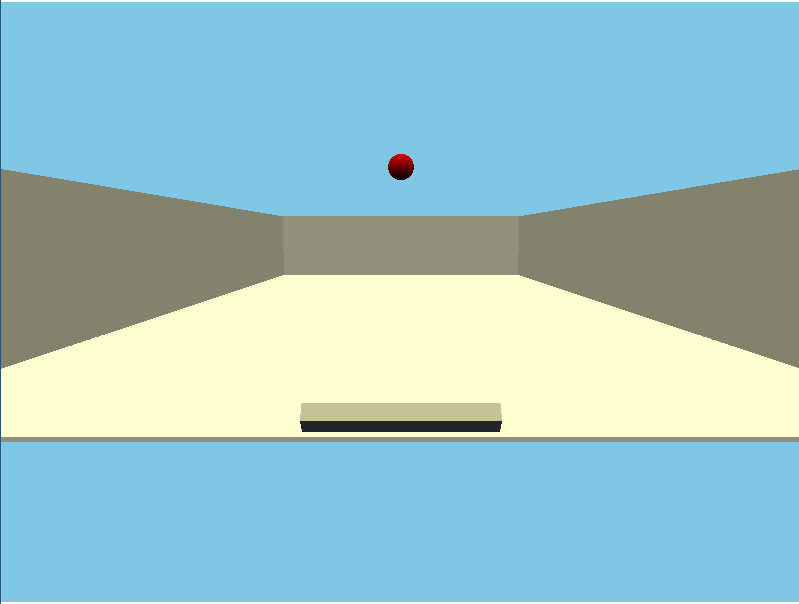

Demo application of a C++ application compiled to Wasm with anyref support

## Cheerp

I work on [Cheerp](https://leaningtech.com/cheerp/), a C++ to JavaScript and WebAssembly compiler based on LLVM.

The Cheerp compiler is in an interesting and unique position here: since its inception, it has supported an [object memory model](https://github.com/leaningtech/cheerp-meta/wiki/Cheerp-memory-model), where C++ objects are stored as JavaScript garbage collected objects, in addition to being able to store them in a contiguous linear memory (which is the memory model of WebAssembly).

This allows Cheerp to compile C++ code to regular JavaScript, and interoperate easily with JavaScript libraries (including the native browser APIs). It is also possible to mix and match these two representations and choose one or the other for any declared struct/class.

There are some limitations: while linear memory objects (declared with the `cheerp::wasm` attribute) can be used by code compiled to both WebAssembly and JavaScript, garbage collected JavaScript objects (declared with the `cheerp::genericjs` attribute) cannot be accessed by code compiled to WebAssembly. This is enforced by our compiler frontend. `anyref` can allow us to relax some of the current restrictions since we are now able to pass around references to JavaScript objects in WebAssembly code!

## Implementation of anyref support in Cheerp

As an experimental prototype of `anyref` support, we decided to only allow classes defined in the special `client` namespace to be used in WebAssembly functions: these classes have no layout on the C++ side, only methods. Special methods starting with `set_` and `get_` are compiled to accesses to the corresponding member fields of the object. Classes declared in this namespace can model existing objects coming from the JavaScript outside of Cheerp, like the native web APIs or a third party JavaScript library.

Since these objects can only be handled by pointer (the actual type is effectively opaque since only the declaration is visible), it is easier to reason about them, and they map perfectly to the current capabilities of `anyref`.

So how does this look like in practice?

> The most basic feature we can enable with `anyref` is to allow pointer of types in the client namespace to be passed to WebAssembly function as arguments (and returned as well):

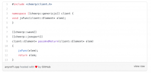

Basic example: `anyref` as arguments and return values.

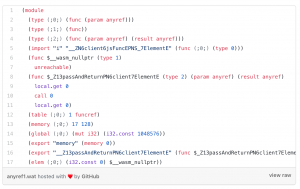

The resulting wat file. You can see the anyref types in the function signature

This can be handy, but just passing around pointers without being able to call methods is not too useful. There is currently no support for calling methods on `anyref` values, but we can generate JavaScript wrappers that take the `anyref` as a first argument and forward the method call:

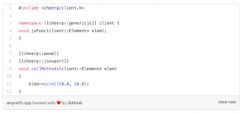

Call methods on anyref values

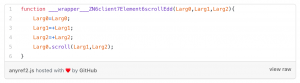

This is the JS wrapper function that forwards the method call

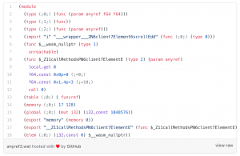

This is the resulting wat file calling the wrapper

This way we can also allow calling methods on client objects from WebAssembly functions. But what about allocating the objects in the first place? We can generate a wrapper JavaScript function as well, which will return the newly created object:

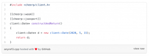

Create new client objects from Wasm

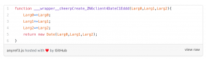

This is the JavaScript wrapper that forwards the object creation

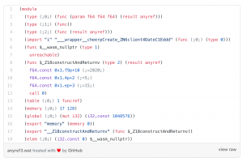

This is the resulting wat file calling the wrapper

Now we can pretty much do anything with objects in the client namespace directly from WebAssembly!

But what if we want to use global objects, like console or document?

For now, we support limited access to global client objects: we only allow `extern` declaration of object types (not pointers), and we implement access to them by generating wrapper functions that return the desired global as `anyref`. This is read-only access, but it is enough to make console, document, etc work:

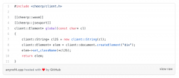

Access client globals from Wasm

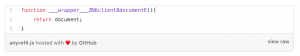

This is the JavaScript wrapper that forwards the access to the global

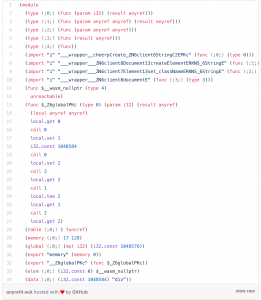

This is the resulting wat accessing the global through the wrapper

The main limitation that remains is that we have no way of storing anyref values anywhere (from pure WebAssembly code at least, we can always resort to using a `cheerp::genericjs` function), so we can only handle them for the duration of the function call.

This is annoying, but with future expanded support for globals (using real WebAssembly globals instead of wrapper functions) and exposed access to WebAssembly tables we plan to improve the situation.

## Demo

To showcase what is possible to do in the current state, I wrote this (very incomplete) pong-like game using the JavaScript 3d library **three.js**, implemented with only functions compiled to WebAssembly (excluding the automatic wrappers of course):

### Cheerp Anyref example

#### Live demo

yuri91.github.io

<iframe class="t u v iz aj" title="recording" src="https://cdn.embedly.com/widgets/media.html?src=https%3A%2F%2Fgfycat.com%2Fifr%2Fforsakenqueasyamericancrocodile&amp;display_name=Gfycat&amp;url=https%3A%2F%2Fgfycat.com%2Fforsakenqueasyamericancrocodile&amp;image=https%3A%2F%2Fthumbs.gfycat.com%2FForsakenQueasyAmericancrocodile-size_restricted.gif&amp;key=a19fcc184b9711e1b4764040d3dc5c07&amp;type=text%2Fhtml&amp;schema=gfycat" width="802" height="754" frameborder="0" scrolling="auto" allowfullscreen="allowfullscreen" data-mce-fragment="1"></iframe>

The demo in action

(**IMPORTANT NOTE:** you need a browser with `anyref` support in order to try the game. For Chrome, run it with `--js-flags="--experimental-wasm-anyref"` )

You can find the repo with the source code [here](https://github.com/yuri91/AnyPong).

## Conclusions

The `anyref` feature looks very promising for Cheerp, and we plan to eventually expand its use to all `genericjs` types, to allow truly seamless interoperability between code compiled to JavaScript and to WebAssembly, as well as external JavaScript libraries.

**P.S**: The official name of the feature seems to have recently changed from `anyref` to `externref` (see [this commit](https://github.com/WebAssembly/reference-types/commit/551e8761352eb0b3f36879342d360cc0f1b69950#diff-6e21615101714084c6d67ecf426e9f3f)).
