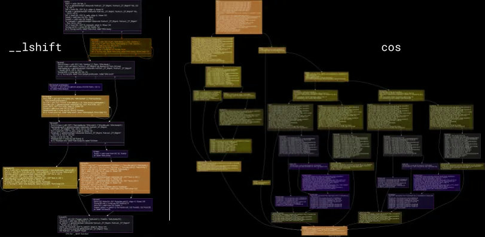
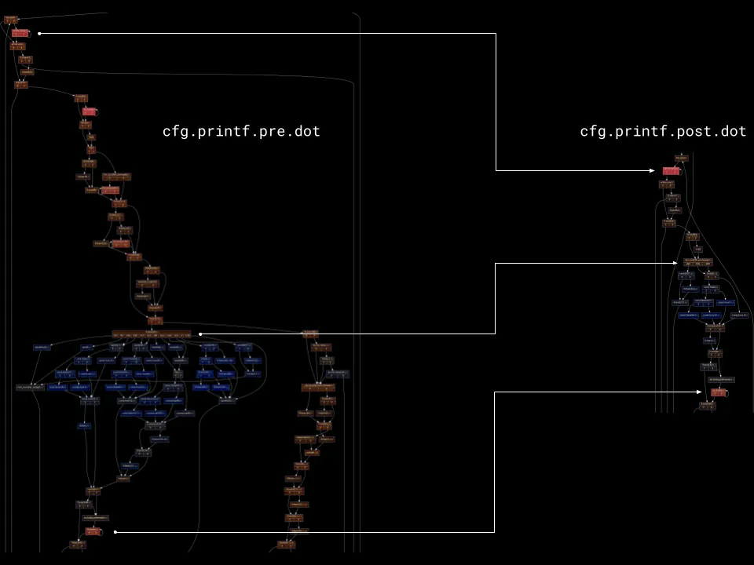

Partial Executer is a brand-new LLVM optimization pass that uses an Interpreter-like engine to prove some code will never be executed, making it safe to eliminate it.

In this article, I will explain the ideas behind it, the engineering challenges, and the results of this work.

## LLVM basics

Some basic understanding of LLVM internals will be helpful, if you are already familiar with such concepts feel free to skip ahead.

The basic process of compiling is:

- a program is first represented as a collection of source files
- code is transformed by the front end into an equivalent IR (=Intermediate Representation)
- optimization passes transform the original IR into a more compact and performant IR
- the optimized IR is converted into an executable for a given target


The advantage of this architecture is that different concerns are separated in different components:

Language specific semantics and checks are only needed in the first step (source -> IR).
Target specific information is only needed in the last step (IR -> executable)

We will concentrate now on the “middle-end”, where IR to IR transformations are performed.

One of the core features of the LLVM framework is the vast amount of sophisticated optimizations which are done in this stage.
The Intermediate Representation of functions will be a graph (representing the control flow) connecting groups of statements that are executed sequentially (Basic Blocks).



<figcaption>Example of Control Flow Graph linking together blocks of Instructions- the IR for left_shift and cos</figcaption>

## The problem: reducing code size

I work on a C++ to WebAssembly & JavaScript compiler, [Cheerp](https://leaningtech.com/cheerp/).

There is quite some magic involved in the various details, but at a high level this is just another compiler. The source code is parsed, optimized, and code-generated. The main visible difference is that instead of a native executable, [Cheerp](https://labs.leaningtech.com/cheerp) generates a .js and a .wasm file.

The code is then embedded, either directly or as dependency, in a HTML page and it’s loaded on first use before being executed. Load time will directly impact users and reducing the code size is a more critical concern compared to your typical native target.

An important part of the development of Cheerp is working on improving the generated code size, and so there was I, tasked with staring at LLVM’s IR and looking for new optimization possibilities.

## Getting a baseline

I knew there had to be code that was never actually executed since other optimizations I touched in the past started from this assumption.

You might have heard of dead-code elimination, an LLVM optimization pass that removes code proven as unreachable. I was actually interested in less-obvious situations. In particular blocks that are reachable on the control flow graph, but not when consider wider execution invariants.

If there was a way to prove that certain blocks are never executed, they could be then removed and this change would not be observable.

To get started, I first played a bit with the generated code, adding some assert(false) in the suspicious parts. I executed the code and the assertion seemed to never be triggered.

Then I took a more systematic approach: instrumenting the generated code, running it on a diverse set of inputs, and collecting statistics about never executed blocks. I then removed such code completely and compared the output size to the original one. The potential size improvement seemed significant. I knew I was onto something.

There were obviously false positives, but I identified a significant test case to start with: printf.

## Printf

printf is a standard C library function that takes a format string and a variable number of other arguments.

```cpp
int printf(const char* format, ...);
printf("Here a somewhat random number: %i\n", rand());
```

[printf](https://en.wikipedia.org/wiki/Printf) is complex enough to have been shown to be Turing complete (see [IOCCC](https://www.ioccc.org/2020/carlini/index.html) or the [paper](https://www.usenix.org/system/files/conference/usenixsecurity15/sec15-paper-carlini.pdf)).

The format string could come from anywhere or be generated at runtime. But in many cases it will be just a string literal, known at compile time.

Can we use information on the call-sites and the corresponding format strings to prove that some code paths, for example formatting for floating point numbers, are actually never taken?

And can we do it in a way that is fully agnostic of the actual implementation of printf?

And can we generalize the approach so that it works on any function?

<p align="center">......</p>

It turns out the answer to all 3 questions is “Yes”.



<figcaption>Control Flow Graph of printf, before and after running PartialExecuter</figcaption>

## Partial Executer: game plan

```cpp
runPartialExecuter(Function& Fn)
{
    Set<BasicBlock> visited;
    for each CallSite CS of Fn:
        partialExecute(CS, Fn, visited)
    for each BasicBlock BB of Fn:
        if visited.count(BB) == 0:
            BB.replaceWith(unreachable)
}
```

The logic that we have to perform is: keep a set of visited blocks across all functions, iterate all call-sites, and then eventually remove blocks that have never been visited.

Simple enough. The devil is then in the implementation of the partialExecute function, but we can start with a simpler problem and see whether we can make any progress in solving printf.

### Step 1: arguments known, no interaction with global state

Say a function doesn’t load or store global data, and all its call sites have known arguments.

Then it’s only a matter of using an interpreter and executing one instruction after the other. Eventually, branches will be interpreted and correctly predicted, so it is trivial to follow the flow of the function.

Fortunately as part of the LLVM framework there is an interpreter for LLVM’s IR, so we can reuse the existing ExecutionEngine / Interpreter infrastructure.

We start by populating the arguments with the known values and registering a callback to inform us about instructions that have been visited, and let the ExecutionEngine do its job.

Another problem we have to solve is a Computer Science classic: “Is this function ever going to terminate?” ([the halting problem](https://en.wikipedia.org/wiki/Halting_problem)).
Here we will use a trivial approach, whenever a Basic Block (= sequence of Instructions) is executed more than a fixed amount of times, we stop the interpreter while marking all Basic Blocks in the function as visited.

### Step 2: allowing Stores to global state

Say that we store to global memory but we never load (= read) values from it.

Since we will never load, there is no way to observe whether a value has actually been stored or not. So while interpreting we can ignore stores, since they are not observable.

Here we are adding a new insight: at interpreter time we are not actually interested in full execution. A more relaxed _partial execution_ is sufficient.

Consider as an example this code:

```cpp
void someFunc(int n)
{
    someGlobal = 42;
    if (n == 57)
        //some stuff
}
```

And we know that for all call sites the argument ’n’ will be different than 57.

Here we could safely transform someFunc to:

```cpp
void someFunc(int n)
{
     someGlobal = 42;
}
```

Setting someGlobal to 42 will be observable by the rest of the program, so it has to remain in the function, but we can still process the rest of the function and possibly optimize it.

### Step 3: allowing Loads from non-mutable global state

Here things will start getting interesting.

```cpp
void processString(const char* ptr)
{
    if (*ptr)
        // do something with ptr
    else
        // String it’s empty, fail
}
```

Say that the interpreter needs to decide what branch should be executed. Doing so requires loading from the memory pointed by ptr and checking its value.

Can the load be actually performed by the interpreter?

While initializing the ExecutionEngine we will determine (using IR information) that certain ranges in memory are known to be read-only, and while performing Loads we can query whether the loaded pointer is included in those ranges.

### Step 4: skipping Instructions

In step 2 we used the fact that Stores are not observable to skip them over, but we can generalize the logic further, since there are many more reasons that could cause an Instruction not to be evaluated by the interpreter, for example:

- some of its operands might not be known (e.g. a function argument that is unknown at interpreter time)
- it’s a load from a memory location we can’t prove read-only
- it’s an instruction that can’t be interpreted (e.g. gettimeofday())

Bailing out and marking any Instruction in the current function as visited is always a valid fallback, but we can do better and try to preserve information further.

We can mark a given Instruction as unknown, and go to the following one. Note that instruction with unknown operands will themselves tagged as unknown.

This logic is sound, given that we are never loading from mutable state, all observable effects an Instruction can have are encoded on its computed value. If we keep track of which values have been computed, we can use the information to decide which Instructions have to be skipped.

With this approach we can robustly deal with any instruction we cannot interpret, as long as it does not impact the control flow.

Handling non-predicted control flow is the next step.

To recap, the visiting algorithm at this point has the following components:

1. a set of visited Basic Blocks
2. a map between Instructions and their computed values (for a given call site)
3. a function to decide what Instructions have to be skipped (informed by the map 2)
4. the Interpreter logic that from an instruction and its operands compute the value

### Step 5: Fun with graphs


Here is how printf begins. It performs some allocations, then checks whether some global state has been properly initialized and branches based on that.

In our current model, this is a big show stopper.

Fortunately, it is possible to expand the logic further to non-predicted control flow instructions.

Looking at the control flow graph, it seems like we could just say “skip the first two blocks”, but we would need a formal way to decide where in the CFG we should resume execution.

It’s time for Strongly Connected Components.

The basic algorithm for [SCC decomposition](https://en.wikipedia.org/wiki/Strongly_connected_component) works as following:

---

1. assign each Basic Block to its own component. Edges between blocks becomes edges between components

2. as long as there are cycles in the component graph, merge them in a single (connected!) component

3. the SCC graph will have now no cycles, and each component will represent a group of Basic Blocks

---

Absence of cycles means the SCC-graph is now a Direct Acyclic Graph ([link](https://en.wikipedia.org/wiki/Directed_acyclic_graph)), that has the useful property to be topologically sortable.

Intuitively we can treat each Strongly Connected Component as a separate sub-function, and visit them in order.

We will start from the component containing the entry point. We will visit it, collecting the outgoing edges.

While visiting a given component we will iterate over the edges that reach it from outside, determining how many possible entry points there are.

If there are none, the component (and so the blocks it represent) will never be visited, so we can go to the next one.

If there is a single possible starting Basic Block, we will treat it as the entry point of the function, and proceed from there.

In some rare cases, there might be more than one. In such case, we bail out marking every Block in the component as reachable (also including every outgoing edge).

I know we are already deeply in graph territory here, but we have to dig further, stay with me for the very last step.

### Step 6: Recursive fun with graphs

Some of you may have noticed a gap in the previous reasoning: how do we treat edges that loop back in what we considered an entry point of a component?

Back-edges will invalidate whatever knowledge we gained. Any way to avoid that?

At the very high level, what we will be doing is making a copy of the (unique) starting block for a given component. All edges from within the component to the starting block will be routed to its copy.

Now the starting block has no incoming edges any more, so we can proceed to interpret it without fears that eventual back-edges will force us to backtrack.

Even better, since there will be no incoming edges from within the component, we can use the SCC algorithm once again to further split the blocks, recursion!!

What we will be doing is basically visiting loops in depth, hoping that they terminate in a given number of iterations. If that happens, great, we can propagate information downstream. Otherwise we backtrack, mark the current component and all its outgoing edges as visited and go to the next Strongly Connected Component.

To guarantee termination, we will use the same approach as step 1: we keep a counter of how many times a given Basic Block is visited, bailing out if greater than a fixed amount. This bounds the total running time of this optimization to linear in the number of Instructions. (_waving hands_)


<figcaption>Before and after PartialExecuter has been performed on printf</figcaption>

## Recap

Partial Executer allows the removal of proven unused code, decreasing code size.

To get there, we have used the fact that Functions are mostly independent to partially execute them and prove that some Basic Blocks are never part of any possible execution path.

Removing code has an indirect benefit as it might unlock further optimizations. Compilers are a game of small gains, and any additional piece of information may be leveraged by the following stages.

## The End!!

Thanks for following me to here, I will be looking forward to any feedback (@[carlo_piovesan](https://x.com/carlo_piovesan)).

Partial Executer has been shipped together with the [Cheerp 2.7 (rc1) release](https://medium.com/leaningtech/cheerp-2-7-compile-cpp-to-webassembly-plus-javascript-c9b3ef7e318b). Code is available [here](https://github.com/leaningtech/cheerp-compiler/blob/master/llvm/lib/CheerpWriter/PartialExecuter.cpp[), issues [here](https://github.com/leaningtech/cheerp-meta), benchmarks and release article [here](https://medium.com/leaningtech/cheerp-2-7-compile-cpp-to-webassembly-plus-javascript-c9b3ef7e318b).

I would like to thank all my colleagues at [Leaning Technologies](https://leaningtech.com/) for the brainstorming sessions, guidance and reviews that helped put this optimization together.

<p align="center">......</p>

Kitchen sink for loosely related information that did not fit in the article or have been added afterwards:

\- Yuri Iozzelli’s work on [PreExecuter](https://labs.leaningtech.com/cheerp) had a different angle while using the same components

\- [WebVM](https://webvm.io/) / [CheerpX](https://leaningtech.com/cheerpx-for-flash/) developments by Alessandro Pignotti informed the choices made here
