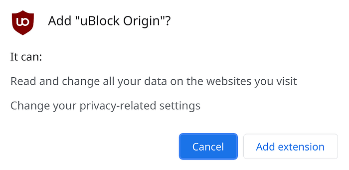

A bit of a “learn from our pain” / rant / sharing our experience-type blogpost, but here goes.

At [Leaning Technologies](https://leaningtech.com/), we make compilers and VMs that target JavaScript and WebAssembly. Our tooling is used both to extend the life of existing applications allowing them to run on modern browsers, but also to port and develop new web applications in languages that are traditionally a prerogative of native applications (such as C/C++ and Java).

As we typically work at the limits of what modern browsers and HTML5 specs allow, we have found (and fixed!) [more](https://bugs.chromium.org/p/chromium/issues/detail?id=1231027) [browser](https://bugs.chromium.org/p/v8/issues/detail?id=11861&q=alessandro%40leaningtech.com&can=2) [bugs](https://bugs.chromium.org/p/v8/issues/detail?id=8384&q=alexpigna.dev%40gmail.com&can=1) [than](https://bugs.chromium.org/p/chromium/issues/detail?id=896713&q=alexpigna.dev%40gmail.com&can=2) we’d like, helped improve the performance of [more than one](https://bugs.chromium.org/p/v8/issues/detail?id=8508&q=alessandro%40leaningtech.com&can=2) [JavaScript](https://bugzilla.mozilla.org/show_bug.cgi?id=1248163) engine, and are an active part of the [standardization process](https://github.com/WebAssembly/branch-hinting) for WebAssembly.

Generally speaking, we work in a niche where it’s easy to develop PoCs and small toy projects, and very hard to make robust products. Having a majority enterprise clientele, but also because of our nature, we are the sort of people that always try doing things The Right Way™.

[CheerpJ](https://leaningtech.com/cheerpj/), in particular, is our solution to convert and run any Java client application, fully client-side, in the browser. And when we say “any”, we mean: reflection, proxies, dynamically generated classes, full runtime support (AWT, Swing, etc), threads, you-name-it. CheerpJ is the only tool in the market with these capabilities, and is mostly used by enterprise customers with complex porting and migration requirements.

As an offshoot of this technology, we have for several years offered a free-to-use Chrome extension (for non-commercial purposes), called [CheerpJ Applet Runner](https://chrome.google.com/webstore/detail/cheerpj-applet-runner/bbmolahhldcbngedljfadjlognfaaein).

This lets users seamlessly access fully deprecated Java Applets on modern versions of Chrome, without a local Java installation, or a plugin. This is achieved, in essence, by converting the Applet bytecode to HTML5 on the fly, and providing a full Java runtime environment in JavaScript and Wasm.

Originally developed to have our tech tested as much as possible *in the wild*, it has become very widely used by people, from all walks of life, who still need to use Java applets on a daily basis. We have helped over 40,000 students, senior card players, artists, law enforcement officers and even major US federal institutions to access content that is way past its selling date. And with a 4.4/5 rating and wide adoption, I think we have been quite successful at that.

Just to be clear, we don’t buy reviews.

# Not the best way to begin your day

In March 2020, as the COVID-19 pandemic began to rage over the planet, I woke up one day to find what any extension developer dreads the most. Two emails, in rapid succession:

1. Your recently published update was rejected for policy violations;
2. Upon review, your product was found to violate our policies and it has been removed from the store.

The second email offered us a shimmer of hope: it was possible to reply and appeal to the decision, which we immediately did. We received an automated response that, due to the (at the time) new pandemic and general congestion of the Chrome Web Store, it might have taken a few days to receive an answer.

**Almost 18 months later, we are still to receive an answer to our appeal.** The extension is still up on the store somehow, with a *Rejected* update in the Dashboard. Because of this, we have decided not to update the extension, or try again with the same update, being worried that the extension might be taken down altogether.

What this has meant was leaving users with unresolved bugs, and leaving us without the extensive testing that only thousands of end-users can provide to our new releases. Not only that, but there have been several major releases to CheerpJ, the big-sister technology behind this extension, which we have not been able to propagate to the Applet Runner.

After such a long time, we can’t postpone updates any longer, and can’t continue stalling.

> This post is about our plan to get out of this quagmire, about the inevitable costs of this situation (both for us and our users), and the massive amount of frustration, pointless limitations and ugly bugs that we have found along the way. Hopefully, this will be useful for other developers of Chrome extensions. At the very least, they might find some comfort from seeing other people having their fair share of pain.

# Are we the bad guys?

Chrome Web Store policies change frequently, mostly getting stricter by the day, and for very good reasons.

Extensions are powerful, and can easily have a serious negative impact on user security and privacy. This can happen both directly (i.e. a plain malware/spyware extension), but also indirectly, by compromising the developer account or remote assets of an otherwise legit extension.

There is also the grey area of “extension acquisitions” by shady companies: we very regularly receive inquiries to purchase the CheerpJ Applet Runner extension, most of them not looking exactly kosher.

Anyway, as a form of defense in depth, the Chrome Web Store policies require that the least possible amount of permissions are requested. In this way, even a compromised extension can still do limited damage. This makes complete sense. Extensions developers are incentivized by a “warning” system: when installing an extension a worrying message is shown to the user if the extension requires heavy-handed permissions. Moreover, developers have to justify each and every requested permission when submitting an item to the store.

uBlock Origin: A very popular extension that shows quite a worrying message at install time

CheerpJ Applet Runner gets no warning at install time

For us, the idea of sticking to these guidelines not only made sense — it was a no-brainer. We care hugely about user privacy, and we certainly do not want our users to think that CheerpJ Applet Runner will “read and change all their data on the websites they visit”. To be fully honest, we don’t even want the responsibility that comes with that.

That said, our extension needs to be able to do some tricky stuff just to work as expected. In particular:

- Many Java powered websites will try to detect if Java is supported before creating the relevant <applet>/<object> elements. Plugins have been unsupported in modern browsers for quite a while at this point. To work around this, the extension needs to “spoof” that the plugin exists, to let such pages fully load. Usually, this check is done synchronously and very early in the page life cycle. For this reason, the extension needs to be able to inject the spoofing code *very early.*
- It’s not possible to predict which domains may still use Java applets. They could be anywhere, although most likely not on major, well maintained sites. We know from user’s bug reports that an immense number of obscure pages still include Java applets. Inevitably, our extension needs to be able to run (potentially) on any website, but should only be actually enabled on the small subset of domains that the user requires.
- Finally, our extension needs to do the magic trick of “converting and running Java Applets” as HTML5 in the browser, without a plugin. While this is our bread and butter, and we know this is not only possible, but also safe to do, we can imagine that an overworked extension reviewer may have a different impression, and with little time available may just opt for the safer option of declining approval.

# We don’t need no weird permission

With quite a bit of effort, we settled on the following permissions scheme, which worked well for us for years, up until the unsettling emails of March 2020.

- **optional_permissions <all_urls>:** Our solution to let users run the extension on any domain, was to use **optional_permissions**. This feature allows extensions to declare the maximal amount of permissions needed, without having them actually granted at installation time. In terms of UX the user will need to selectively enable CheerpJ Applet Runner on his chosen useful domains, most likely just a handful. This is done via a single click in the extension popup. The extension would then be automatically enabled on any follow-up visit to the same domain, as Chrome will remember the granted permission. The user is always free to drop permissions, by using the standard Chrome UI.

The permission is only requested after a user action, and the scope is clearly stated

- **declarativeContent**: This permission was used to provide a visual hint whenever a Java applet is detected, or about the status of CheerpJ when already enabled. Using the **declarativeContent** API it is possible to select different icons depending on which CSS selector matches on the page. This is fully privacy preserving, since the extension only *declares* the rules to the browser, without actually accessing the page contents. Ideally, this behavior should be specified statically in the manifest.json file, and no permission would be required. Unfortunately, specifying icons in the manifest is only possible using a [deeply undocumented base64/binary format](https://source.chromium.org/chromium/chromium/src/+/main:chrome/browser/extensions/api/declarative_content/content_action.cc;l=406;bpv=1;bpt=1?q=%5C%22imageData%5C%22&ss=chromium%2Fchromium%2Fsrc&start=21) (which I managed to figure out only recently). Not that it matters, since the whole feature [has been **completely broken** since April 2018](https://bugs.chromium.org/p/chromium/issues/detail?id=1231027), without anybody noticing.

The previous extension popup, describing the meaning of each icon

- **activeTab:** A very lightweight permission, just used to query the current tab id and bootstrap the process. Although using *activeTab* is recommended, and possibly the least invasive thing you can ask for, Google still requires a justification for using it.

# No good deed goes unpunished

To the best of our understanding, by following this scheme we were playing well within the rules. Certainly above the industry average. Getting so close to losing our extension after all this effort has been very painful and frustrating, and has essentially forced us to delay updates for a very long time, to avoid risking the extension being banned.

My best guess about what happened is a change in policy that made **remotely hosted code** frowned upon, and fully banned in the upcoming Manifest V3 revision of the APIs.

CheerpJ runs Java, and as such, it needs a full ‘equivalent’ of the Java runtime. In CheerpJ, this is provided as a fully static set of JavaScript/WebAssembly files, distributed by us on a CDN, with each version fully immutable once published. The extension itself is very lightweight, with most of the actual logic being provided by the remote modular runtime. Of course, all this logic would run in the context of the page,

The Chrome Web Store process for submitting extensions does allow developers to justify whenever permissions are required. As much as we believe that the CheerpJ Applet Runner already plays by the rules, we also suspect that our use case is just too unique and unexpected to be fully understood in the limited time allocated by reviewers.

Moreover, as far as we understand the extension is currently living on borrowed time, and it is very unclear if another rejected update may cause it to go down for good. We have tens of thousands of users which may need this tool, and we don’t want to let them down.

This is our plan to update the CheerpJ Applet Runner extension, in the hope of a successful and quick review and approval on the Chrome Web store.

# The plan (1/4): Be as light as a feather

As you can imagine, we are extremely worried about the risks of getting the next update to the CheerpJ Applet Runner rejected, and about the risks of the extension getting taken down for no reason.

To make sure to avoid a second rejection, we have decided to re-engineer the extension to reduce the permissions required to its absolute minimum. Ideally to zero.

This has come with a cost that we were previously not happy to pay, but can’t avoid any longer. In particular, new versions of the extension won’t be able to use the “enable once / run always” feature. The user will need to click the extension icon *every single time he needs to use an applet*.

To minimise the required permissions, and hopefully maximize the chances of getting the update approved, we had to make several major changes:

**Adopt Manifest V3**: [Manifest V3](https://developer.chrome.com/docs/extensions/mv3/intro/mv3-overview/) is a new revision of the Chrome extensions platform, which introduces new rules and limitations to enhance user security and privacy. Using V3 is currently optional, as V2 is still supported, but it’s clear that at some point in the future V2 will be deprecated.

We decided to adopt V3 in the hope that its stricter limitations will make the revision process more straightforward and less subject to arbitrary decisions from reviewers. Moreover, we are also future-proofing the extension to a future deprecation of V2.

**Include the whole runtime in the extension**: This is a requirement in manifest V3, since *remotely hosted code* is now banned. Previous versions of the CheerpJ Applet Runner used to fetch individual runtime components from a CDN, on demand. This avoided unnecessary downloads when only small parts of the runtime were required.

Technically, this limitation is enforced using **very strict** Content-Security-Policy requirements in the extension manifest. To be fair, this might be an improvement for some users on slow connections. On the other hand, we will need to be more careful in planning our updates, as the extension is no longer a few kilobytes, and we don’t want to spam our users with large background downloads.

**Drop Google Analytics**: Previously, the CheerpJ Applet Runner used GA for *very* minimal tracking of usage (not users), with a single-click opt-out, and no logging of URLs.

Due to the new CSP, loading the normal GA script is forbidden. It would have been technically possible to use GA (or another analytics provider) by bundling the script with the extension, or by just sending events manually. Nonetheless, we went one step further and decided to *drop any form of tracking*.

**Drop optional access to any host**: This is the most expensive choice we had to do in terms of UX. As far as we understand a special review process is imposed to extensions that use **<all_urls>**, even if only as part of the **optional_permissions** section.

To avoid this more in-depth review altogether, we are dropping this capability, and that’s the reason why enabling the extension only once for a domain is not possible anymore. We have devised a new approach, and we will only use the **activeTab** permission to inject our loader script into the currently used tab.

One of our biggest disappointments was discovering that the whole concept of optional host permissions has disappeared with Manifest V3. The manifest format has been reorganized to have **permissions**, **optional_permissions** and **host_permission**, with all hosts being considered non-optional right now.

There is some [vague wording](https://developer.chrome.com/docs/extensions/mv3/intro/platform-vision/#future-related-changes) about making all **host_permissions** optional in the future, but as things stand right now it is impossible to make a Manifest V3 extension that can potentially run on any host without triggering the scary warning at install time *or* forcing the user to enable to extension any single time even for the same domain.

**Drop the storage permission**: CheerpJ Applet Runner has pretty much only one setting that requires storage: which [clipboard mode](https://github.com/leaningtech/cheerpj-meta/wiki/Runtime-API#clipboardmode) to use (a single binary value). **Storage** used to be one of those permissions that required no justification. This has now changed, but we have been able to find a new strategy and use the *localStorage* feature of the private extension domain to save these settings. This has not been trivial, since for reasons which are hard to fathom, *localStorage* is not available in the background service worker that powers extensions.

**Drop declarativeContent permission**: Programmatically adding declarative content rules was used for two reasons. First, it made it possible to automatically inject the CheerpJ loader scripts after a domain was explicitly enabled once by the user. As discussed above we have sadly dropped this feature anyway.

Secondly, it was used to provide visual feedback to the user about the status of running applets by changing the colour of the extension icon. In particular we would use CSS selectors as triggers to show a yellow icon if Java applets were detected on a page, and a green icon if CheerpJ Applet Runner could successfully run. The great thing about **declarativeContent**, is that the extension only declares the rules, and the browser does the matching. This means that the extension does not need to peek into the page, and user privacy is preserved.

As crazy as this might sound, dropping this feature had no real cost since [_the whole thing has been completely broken in Chrome since April 2018_](https://bugs.chromium.org/p/chromium/issues/detail?id=1231027)! We have actually bisected the issue and found out that a single line of code was misplaced as part of a maintenance commit. And that’s not all, even after fixing this two-liner on our side, we have found out that the feature broke **again** at some later point. How this feature could stay broken for so long (and even break TWICE) without anybody noticing goes beyond my understanding, and I wonder if the extension platform of Chrome is actually held to the same high standards as the rest of the project.

After all these, somewhat painful, choices we are left with an extension that only requires the **activeTab** and **scripting** permissions, which work together to spoof the availability of the Java plugin, and inject the CheerpJ loader in the page. There is nothing else we can remove at this point, and we can only hope that the review deities will appreciate our sacrifices and be kind with us.

The new popup UI, some elements were removed to reflect the lost functionalities

# **The plan (2/4): Prepare for the worst**

Even with all the precautions that we have taken, unfortunately we can’t be sure that CheerpJ Applet Runner will not be taken down by the Chrome Web Store.

To make sure that another option is available to our users, we have just released the CheerpJ Applet Runner on the Edge Add-ons Store. It is safe to assume that the vast majority of users will be on Windows, and Edge will be already available on their Desktop anyway. Edge is currently just a fork of Chrome, so this has not required any further technical effort on our side. I have to say that the review process was fair, speedy and efficient.

We have also prototyped extensions for Firefox and Safari. As things stands, though, manifest V3 is not supported by either, so we would need to provide a specifically downgraded version for them. At this time we have decided against supporting Firefox/Safari, but we plan to revise our decision when V3 is supported. Firefox in particular has [announced a beta](https://blog.mozilla.org/addons/2021/05/27/manifest-v3-update/) of the feature later in 2021/early 2022.

# The plan (3/4): Make some noise

The main point of this post is to be open about the whole process of maintaining and updating a Chrome extension.

As a consequence of the “difficulties” of this process, the next version of the CheerpJ Applet Runner will have to be a significantly inferior UX compared to what our users are used to. I felt we owed an explanation as to why this is the case.

We hope that this post will raise awareness on the very sorry state of the Chrome Web Store, and of the approval process for updates. We are not the first developers to be negatively impacted by the extension review process (and we won’t be the last), and we have seen how, in previous cases, getting some attention from the community can go a long way. Hopefully this will apply to the CheerpJ Applet Runner as well.

# The plan (4/4): Roll the dice

Once updated, we will try to reintroduce some of the lost UX, in particular we’d like the **declarativeContent** support in Chromium to be fixed, so that we can restore the use of color-coded icons to better inform the users.

Having found the issue, and once a fix gets applied to Chrome ([things are not looking particularly promising](https://bugs.chromium.org/p/chromium/issues/detail?id=1231027) by the way..), it will take around a couple of months for the patch to trickle across the release cycle.

About requiring a click every single time you want to use the extension, while not ideal, we don’t really see a way to avoid that. Any proper solution would require heavy handed permissions and warnings, especially with Manifest v3 having dropped optional host permissions. We have hopes that future revisions of the APIs will restore this feature.

If you can think of a good way of solving the problem, I’d be very interested to chat. Feel free to ping me on [Twitter](https://twitter.com/alexpignotti).

# The end, for now

If you made it to the end of this post, thanks a lot for your patience.

If you have any ideas or workarounds for any of the issues described in this post, or you have your own Chrome-extension related woes, please get in touch with us, we’d love to chat!

{[Twitter](https://twitter.com/leaningtech), [Gitter](https://gitter.im/leaningtech/cheerpj), [website](https://leaningtech.com/), [email](mailto:info@leaningtech.com/)}

And if you want to know *even* more about what we do you can find plenty more to chew on, visit our [tech blog](https://medium.com/leaningtech)!
