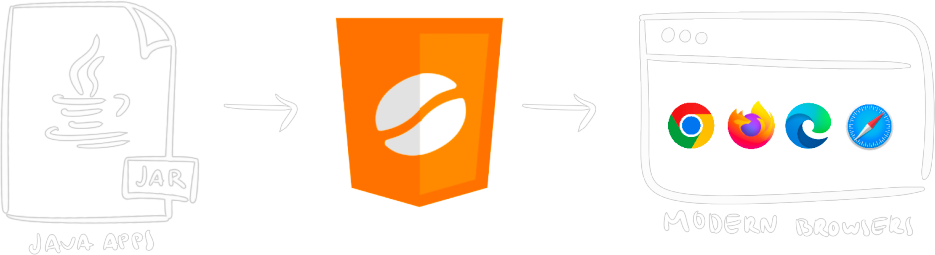

import LinkButton from "@/components/LinkButton.astro";
import { DISCORD_URL } from "@/consts.ts";

<div class="not-prose flex gap-2 mb-2">
	
	<a href="https://discord.leaningtech.com/">
		
	</a>
	<a href="https://github.com/leaningtech/cheerpj-meta/issues">
		
	</a>
</div>

<div class="text-lg">
	CheerpJ is a WebAssembly-based **Java Virtual Machine for the browser**. It is
	100% compatible with Java 8 and provides a full runtime environment for
	running Java applications, applets, libraries, and Java Web Start / JNLP
	applications in the browser without plugins.
</div>

<div class="m-4 flex justify-center">
	[Get started](/cheerpj3/getting-started) · [Examples](/cheerpj3/examples) ·
	[API Reference](/cheerpj3/reference) · [GitHub
	repository](https://github.com/leaningtech/cheerpj-meta)
</div>

```html
<script src="https://cjrtnc.leaningtech.com/3.0rc1/cj3loader.js"></script>
```

<div class="text-stone-400">
	Not a developer? Check out our [product website](https://cheerpj.com/).
</div>

<div class="mx-24"></div>

## Features

With CheerpJ, you can:

- Run existing **Java applications** in the browser with no changes
- Include **Java applets** in webpages without legacy plugins
- Migrate **Java Web Start / JNLP** applications to work on modern systems
- Use **Java libraries** in JavaScript/TypeScript seamlessly
- Interoperate between Java and JavaScript libraries

CheerpJ is based on a full OpenJDK runtime environment. It supports reflection, custom classloaders, networking, file access, clipboard, audio, printing, Swing, and AWT.

<LinkButton
	label="Get started"
	type="primary"
	href="/cheerpj3/getting-started"
/>

## Getting started

{/* TODO: move to getting-started */}

Know what you're building? Jump straight to the relevant tutorial:

<div class="not-prose grid grid-cols-2 font-medium gap-2 text-stone-100">
	<a
		href="/cheerpj3/getting-started/Java-app"
		class="px-8 py-6 bg-stone-800 hover:bg-stone-700 text-lg"
	>
		Application
	</a>
	<a
		href="/cheerpj3/getting-started/Java-applet"
		class="px-8 py-6 bg-stone-800 hover:bg-stone-700 text-lg"
	>
		Applet
	</a>
	<a
		href="/cheerpj3/getting-started/Java-library"
		class="px-8 py-6 bg-stone-800 hover:bg-stone-700 text-lg"
	>
		Library
	</a>
</div>

## How does CheerpJ work?

CheerpJ is a combination of two components:

1. An optimising Java-to-JavaScript JIT compiler.
2. A full Java SE 8 runtime based on OpenJDK.

Both are written in C++ and are compiled to WebAssembly & JavaScript using [Cheerp](/cheerp).

## What's unique about CheerpJ?

1. CheerpJ can handle 100% of Java 8, including Swing, reflection and dynamic class loading with no manual intervention on the code.
2. CheerpJ works directly on Java bytecode, and does not require access to the Java source code.
3. CheerpJ comes with a full Java SE runtime, inclusive of Swing/AWT. It supports audio, printing, and any other Java SE features. The runtime supports WebAssembly for optimal performance and size.
4. The JavaScript code generated by the CheerpJ JIT is highly optimised and garbage-collectible.
5. CheerpJ enables bidirectional Java-JavaScript interoperability. JavaScript libraries, as well as the DOM, can be called and manipulated from Java. Also, Java modules can be invoked from JavaScript.
6. CheerpJ supports Java multi-threading. In addition, you can create concurrent applications by using Web Workers.

## Licensing

CheerpJ is free for technical evaluation and non-commercial use. For commercial use, see <a href="https://cheerpj.com/licensing" target="_blank">licensing options</a>.

## Demos

Several demos of CheerpJ can be found [here](https://leaningtech.com/demo/).

You can also see CheerpJ in action in [JavaFiddle](https://javafiddle.leaningtech.com/):

<iframe
	src="https://javafiddle.leaningtech.com/N4IgLglmA2CmIC4QAlbWgewAQHcMCdoATXKACywGUcIA7AcxABoQBXAByIEMxYjEQAJgAMggMwBaAIzCJwgKwAVKQBYEqhPOEA6MVMEAtZiABmEOAGdEAbVDseZAQFkudbQCsuANy7GAxhi0vEECEAC27ARgWJ4+2lw4YNoAYoFgANwAOrThkfjRsVwAHtoWNAzaAFLJ+FxhsFk5EVEx3sWl5fRVADJcAEZojbkthSVldF2VAApctIPZw-mtPmOd2tQTAKqQ0FAQsBZDzUujHRPafQREsPjaAKIRYACeAEJXN43ZftBcFhZYLjoWFycHqQX+ACVWLRaP04FhgNksMisOxWH1dn4sBYwDwIFivBgICQwq5aAAKShgfATawAXSwXHw9AsAEoEUiUVyNgxtuY9gdtHRCQBrWC9Xj4clzHAAsnk1msxpcgC+2U5yLRGPxWEJxKw+GhCo5tC5XOmszQqKwAF4sDKsBa5tAFcqzZrSrAwG98NcpQ6Huxnj6-eSZEwsOHI8IIzJFZ9Te7Hb0BtAsGm7Q7Kim0OTMig0JgIwBhMiwG7sSoAQnzSo1ZugnrAqSC0tgspbYDzIEoNwgJnzEc72im3QAggBJAByEZUgnj9a57HiRCI5Ogddoi5R1Vq9SwJlt9vbjpqdVg3Z59CwsCKdXYcFrbvdJhXa-Ym6TB+09j8Itd27Iq+Fhet0GB+HigQQmgeJeLAigYNKrDoJ+SbAV6ABqEAWBAGIXtSrCwKhyJqrQpEgCqdIqkAA/embed?theme=dark"
	class="border border-stone-700 rounded-md w-full h-[40rem]"
></iframe>

## Community

CheerpJ is loved by teams at NASA, Siemens, UBS, and many others. We have a Discord server where you can ask questions, share your projects, and get community support.

<LinkButton
	type="discord"
	href={DISCORD_URL}
	iconLeft="fa-brands:discord"
	label="Join the Discord community"
/>

<LinkButton
	type="secondary"
	href="https://twitter.com/leaningtech"
	iconLeft="fa-brands:twitter"
	label="Follow us on Twitter"
/>
